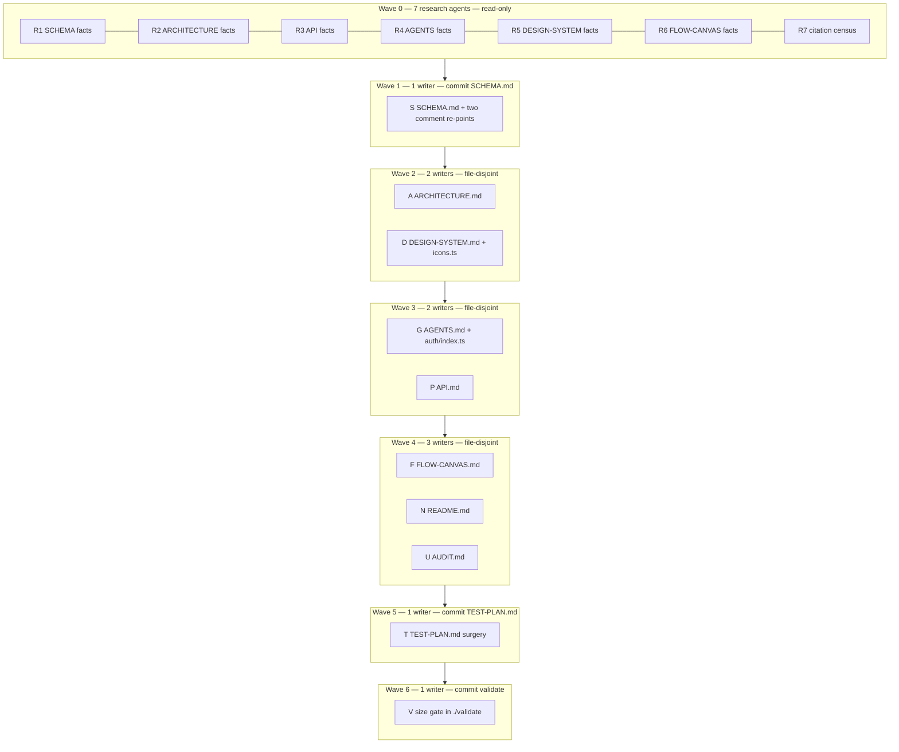

# Root Docs Rewrite Implementation Plan

> **For agentic workers:** REQUIRED SUB-SKILL: Use
> superpowers:subagent-driven-development (recommended) or
> superpowers:executing-plans to implement this plan
> task-by-task. Steps use checkbox (`- [ ]`) syntax for
> tracking.
>
> This plan is a **dependency DAG for subagents**.
> Do not serialize independent shards. Do not use git
> worktrees (repo rule). Agents share one working tree
> and MUST stay file-disjoint inside a wave.
>
> Spec:
> `docs/superpowers/specs/2026-08-22-root-docs-rewrite-design.md`

**Goal:** Nine root docs describe the system, not the
migration. AGENTS.md is a thin router; SCHEMA.md is a
one-table capability map; `./validate` gates line
counts last.

**Architecture:** Research is parallel and read-only.
SCHEMA.md is the first write and the voice lock.
Later writers receive that file plus the Voice brief
below. Content-move and heading-address edges are
real dependencies; the spec's 1–10 list is a voice-
first schedule, not a DAG. This plan follows the DAG
and still does one doc per commit.

**Tech Stack:** Root Markdown (78-char lines, four-
space indent, final newline). Citation grep over
`api/`, `web-app/`, `tests/`. `./validate` (tsc +
`./test` + width lint + schema-svg `--check` + api-
docs `--check`). No code-behavior change except
comments that cite deleted headings.

**Table name:** `TABLE_NAMES` in `api/db.ts` is still
`['pairs']`. SCHEMA.md names that table once. If the
`message_pairs` rename lands first, use the new name.

---

## Why this DAG, not the spec's 1–10 list

The spec rejected nine parallel writers (nine voices)
and listed SCHEMA → AGENTS → ARCHITECTURE → … →
size gate. Two content-move edges and two heading-
address edges make that list unsafe:

- Dialog + tab patterns live in AGENTS.md today.
  Write DESIGN-SYSTEM.md `## Components` while
  AGENTS.md still holds them.
- Claim expiry and all-see-all live in
  FLOW-CANVAS.md today. Write ARCHITECTURE.md
  `## Work orders` while FLOW-CANVAS.md still
  holds them.
- `web-app/auth/index.ts` cites
  `AGENTS.md § Mobile Responsiveness`. The
  successor is `DESIGN-SYSTEM.md § Responsive
  breakpoints`. That heading must exist before
  the AGENTS.md commit.
- AUDIT.md KNOWN list cites `§ Server-tier
  deploy blockers`. The successor is
  `ARCHITECTURE.md § Known residuals`. That
  heading must exist before the AUDIT.md
  commit.
- AGENTS.md `## Read next` must point at live
  post-rewrite headings, so ARCHITECTURE.md
  and DESIGN-SYSTEM.md land first.

Voice is still one writer in effect: SCHEMA.md locks
it; the orchestrator (Full scroll) is the voice
unifier; later agents copy SCHEMA.md cadence.

---

## Voice brief (lock after Wave 1)

Push this block into every write-agent prompt after
SCHEMA.md exists. Also attach SCHEMA.md itself.

- Happy path first: purpose paragraph, substance,
  `## How we got here` last.
- Named headings only. No numbered sections
  (`## 1.`, `§2.8`, `SP-1`).
- Every fact names a path: `` `api/…` ``,
  `` `routes[]` ``, `` `tests/…` ``. Do not
  paraphrase a table, a DDL, or a test list.
- A line survives only if `ls`, `grep`, or
  `git log` cannot answer it in ten seconds.
- History paragraph: five lines or fewer. No
  phase numbers, no task numbers, no session ids.
- Forbidden in prose (TEST-PLAN case bodies
  excepted): `RETIRED`, `Phase Final`,
  `Phase [0-9]`, `Task [0-9]`, `Session [A-Z]`,
  `A1–A6`, `Gate 6`, `shadow ledger` as a live
  name, agent session URLs.
- 78-character lines. Four-space indent. Final
  newline. No trailing whitespace.
- Do not invent helpers, extra files, or merged
  docs. The set stays at ten (nine docs + the
  one-line `CLAUDE.md` stub).

---

## How to run this DAG

The orchestrator (this session, Full scroll)
dispatches. Subagents do not read this file for
scope — the orchestrator pastes the **Shared
prompt**, the agent's **Files**, and the task
body.

Every subagent prompt begins with
`Go to Medium Church!` then the Shared prompt.

Research agents (Wave 0) write nothing. Write
agents do not commit and do not run `./validate`.
The orchestrator voice-reviews, citation-greps,
runs `./validate`, then commits one doc.

Waves do not overlap. Uncommitted work from wave
N must become a green commit (or commits) before
wave N+1 starts. Inside a write wave, agents stay
file-disjoint.

Peak concurrency is **7** (Wave 0). Write waves
peak at **3**.



Commit order inside a multi-writer wave (one doc
per commit, `./validate` green each time):

- Wave 2: ARCHITECTURE.md, then DESIGN-SYSTEM.md
- Wave 3: AGENTS.md, then API.md
- Wave 4: FLOW-CANVAS.md, then README.md, then
  AUDIT.md

---

## Shared prompt (every subagent)

```
Go to Medium Church!

Then:

- 78-character max line, 4-space indent, final
  newline, no trailing whitespace.
- Commandments: Clarity, Uniformity, Simplicity.
- Abominations this work risks: Unbidden Helper
  Code, Foreign Tongues, Obscurity, Premature
  Generalization, Internal Defense.
- Patterns: RequestContext first on adapters,
  snake_case storage / camelCase domain, HTTP-verb
  adapter naming, validators at the gate, no `any`
  from boundaries. For prose: derive from the
  ledger; cite paths; do not restate DDL.
- Do not commit. Do not run `./validate`.
- Do not touch files outside the assigned list.
- Do not rewrite docs/superpowers/ specs or plans
  (including this file). Do not change CLAUDE.md.
- Do not change code behavior. Comment re-points
  only where this task names them.
- Return: files touched, wc -l of each rewritten
  doc, headings emitted, citation re-points,
  anything skipped and why.
```

Write agents after Wave 1 also receive the Voice
brief and the committed SCHEMA.md.

---

## File map

Create/modify:

- Rewrite: `SCHEMA.md`, `AGENTS.md`,
  `ARCHITECTURE.md`, `API.md`, `DESIGN-SYSTEM.md`,
  `FLOW-CANVAS.md`, `README.md`, `AUDIT.md`,
  `TEST-PLAN.md`
- Comment re-points:
  `api/routes.ts`,
  `tests/api-pii-hard-delete.test.ts`,
  `web-app/auth/index.ts`,
  `web-app/app/icons.ts`
- Gate: `./validate`
- Untouched: `CLAUDE.md` (one-line stub),
  `docs/superpowers/**`, TEST-PLAN.md case bodies
  (except the two named wording touches plus the
  forced How-to-invoke sentence)

---

### Task R1: SCHEMA facts

**Files:** none (read-only)

- [ ] **Step 1: Dispatch R1**

Read `api/db.ts` (`TABLE_NAMES`, `MESSAGE_TABLES`),
`api/schema-postgres.ts` (table, indexes, CHECKs,
`message_body`, `schema_marker`),
`api/storage-serialize.ts` (`serializeValue`),
`api/pii-hard-delete.ts` (`replacePiiSlot`),
`api/write-authorizer.ts`, `postgres-seed` /
`postgres-wipe` headers, `tests/timestamps.test.ts`,
`tests/flow-graph-roundtrip.test.ts`,
`tests/api-pii-hard-delete.test.ts`.

Return a fact sheet:

- `TABLE_NAMES[0]` (the one table name)
- Each index name and what it buys
- Six-digit timestamp CHECK regex
- How `schema_marker` is stamped
- PII erasure function and address
- Wipe drop order
- Seed refuse-if-non-empty

---

### Task R2: ARCHITECTURE facts

**Files:** none (read-only)

- [ ] **Step 1: Dispatch R2**

Read `server/boot.ts` (required env, 413, no DDL,
no argv, `schema_marker` refusal),
`api/request-context.ts` (three context types),
`api/request-auth.ts` (`fenceRequest`,
`identityDefaultOrganization` call site),
`api/write-authorizer.ts`,
`api/derive-*.ts` filenames,
`api/work-order-claims.ts` (claim alphabet),
`web-app/app/dialog.ts` (not needed here),
FLOW-CANVAS.md lines 147–161 (workbox + claim
expiry — copy verbatim into the fact sheet),
ARCHITECTURE.md `### Residuals (named, still live)`.

For each Do-not-resurrect surface, name the pinning
test file:

- `states` table / event-append address
- flat `/records` and `/record-attributes`
- `flows/:id/versions` writes
- flat member POSTs
- org-scoped decorator stores
- token / clients / identity_providers tables
- role grants
- bulk history routes
- redo

Seeds to confirm (do not invent others):

- `tests/api-entity-history-routes.test.ts`
- `tests/api-records-verb-gaps.test.ts`
- `tests/api-flows-versions-retired.test.ts`
- `tests/api-human-members.test.ts`
- `tests/api-roster-verb-gaps.test.ts`
- `tests/api-write-authorizer.test.ts`
- `tests/api-identity-spine-verb-gaps.test.ts`
- `tests/api-work-order-history.test.ts`
- `tests/api-members-history.test.ts`
- `tests/api-objective-history.test.ts`
- `tests/api-flows-verb-gaps.test.ts`

Return: vessel field list (each set once), tenancy
rules, derive-file list, the one whole-plane scan
if any, residuals list, Do-not-resurrect lines as
`surface — pinned by tests/…`, work-order copy.

---

### Task R3: API facts

**Files:** none (read-only)

- [ ] **Step 1: Dispatch R3**

Read `api/api.ts` `handleRequest` (dispatch order),
`api/request-auth.ts` (`AUTHENTICATION_ROUTES`),
`api/message-pair.ts` (four headers, replay,
If-Match), seed pin
`tests/mock-data-pairs.test.ts`
(`EXPECTED_PAIR_COUNT`, bootstrap 8).

Compress the six dispatch steps from current
API.md §1.1 against the live function. Name the
six compositions from the spec (idea conversion,
flow undo, work-order transition + instance
revision, work-order binding, invitation accept,
token grant dispatch: grant + 401 classes +
PKCE). Confirm 1448 / 8 against the test, not
against API.md's stale 1498.

Return: six-step dispatch, bearer-exempt set,
status ladder (200, 201, 204, 400, 404, 405,
409, 412, 428), two PUT classes + instance
PATCH, six composition bullets with pair counts
and `api/` anchors, why store-level, seed
absolutes.

---

### Task R4: AGENTS facts

**Files:** none (read-only)

- [ ] **Step 1: Dispatch R4**

Diff the current AGENTS.md fenced command block
against `./build --help`, `./measure --help`,
`./postgres-seed --help` (or the script's usage).
List flags in the fence that the binaries do not
offer — those are the dead options to drop.

`ls` the repo root. One line per top-level
directory.

Collect the twelve live citations of
`AGENTS.md § Transaction bodies await only row
ops` (files + line). The heading text must stay
word for word.

Return: dead flags, directory one-liners,
verbatim transaction-body bullet (AGENTS.md
current Gotchas item), citation files, the
sandbox `TMPDIR=/tmp/claude` line, the env-var
line (`POSTGRES_URL`, `JWT_HMAC_SIGNING_KEY`,
`HTTP_SERVER_PORT`).

---

### Task R5: DESIGN-SYSTEM facts

**Files:** none (read-only)

- [ ] **Step 1: Dispatch R5**

Read `web-app/app/styles/tokens.css` (token
names only, not the scale tables),
`web-app/app/dialog.ts` (`openDialog`,
`closeDialog`, `handleDialogClick`, `initTabs`),
AGENTS.md dialog + tab paragraphs (lines
492–509 — copy verbatim), DESIGN-SYSTEM.md
`### Heat ramp (flow-stats)` (copy whole),
`## 11. Responsive Breakpoints` values,
`## 12. CSS Architecture` cascade + where-to-
add table + file rules, `## 9. Iconography`,
org switcher, invitations bell, `<optgroup>`
rule.

Return those copies and the cascade numbered
list. Do not copy the four scale tables, type /
spacing / contrast tables, Do's and Don'ts, or
the parallel-loading essay.

---

### Task R6: FLOW-CANVAS facts

**Files:** none (read-only)

- [ ] **Step 1: Dispatch R6**

Slice current FLOW-CANVAS.md into the keep
headings. Quote the MUST NOTs. Name the three
hazard call sites (`flow-graph.ts`, stats
renderer, `adapters/flow-publish.ts`). Note
which paragraphs move to ARCHITECTURE.md
(workbox all-see-all, claim expiry —
lines 147–161).

Return: heading → source-paragraph map. Do not
rewrite.

---

### Task R7: citation census

**Files:** none (read-only)

- [ ] **Step 1: Dispatch R7**

Run:

```bash
grep -rhoE '[A-Z-]+\.md § [^.;)]+' \
    api web-app tests
grep -nE 'SCHEMA\.md SP-1|§ Orphan stores' \
    api web-app tests AGENTS.md README.md \
    ARCHITECTURE.md SCHEMA.md API.md \
    DESIGN-SYSTEM.md FLOW-CANVAS.md AUDIT.md \
    TEST-PLAN.md
grep -nE '§ Mobile Responsiveness|DESIGN-SYSTEM\.md § 9' \
    api web-app tests AGENTS.md README.md \
    ARCHITECTURE.md SCHEMA.md API.md \
    DESIGN-SYSTEM.md FLOW-CANVAS.md AUDIT.md \
    TEST-PLAN.md
grep -nE '§ Server-tier deploy blockers|§ Validate semantics' \
    api web-app tests AGENTS.md README.md \
    ARCHITECTURE.md SCHEMA.md API.md \
    DESIGN-SYSTEM.md FLOW-CANVAS.md AUDIT.md \
    TEST-PLAN.md
grep -nE '§ Demo server tier|§ 12 CSS Architecture' \
    api web-app tests AGENTS.md README.md \
    ARCHITECTURE.md SCHEMA.md API.md \
    DESIGN-SYSTEM.md FLOW-CANVAS.md AUDIT.md \
    TEST-PLAN.md
grep -nE '§ Flow-graph storage seam|§ Write-path' \
    api web-app tests AGENTS.md README.md \
    ARCHITECTURE.md SCHEMA.md API.md \
    DESIGN-SYSTEM.md FLOW-CANVAS.md AUDIT.md \
    TEST-PLAN.md
```

Return every hit, the file:line, and the live
heading it must match after its owning rewrite.
Known re-points (spec):

- `api/routes.ts` `SCHEMA.md SP-1` →
  `SCHEMA.md § Secrets` (SCHEMA commit)
- `tests/api-pii-hard-delete.test.ts`
  `SCHEMA.md § Orphan stores` →
  `SCHEMA.md § PII erasure` (SCHEMA commit)
- `web-app/auth/index.ts`
  `AGENTS.md § Mobile Responsiveness` →
  `DESIGN-SYSTEM.md § Responsive breakpoints`
  (AGENTS commit; heading exists after Wave 2)
- `web-app/app/icons.ts`
  `DESIGN-SYSTEM.md § 9` →
  `DESIGN-SYSTEM.md § Iconography`
  (DESIGN-SYSTEM commit)
- AUDIT.md `§ Server-tier deploy blockers` →
  `ARCHITECTURE.md § Known residuals`
  (AUDIT commit)

Also flag AUDIT.md `AGENTS.md § Validate
semantics` → `AGENTS.md § Gates` (AUDIT
commit, after AGENTS exists).

---

### Task S: SCHEMA.md (Wave 1, voice lock)

**Files:**

- Rewrite: `SCHEMA.md`
- Modify: `api/routes.ts` (SP-1 comment)
- Modify: `tests/api-pii-hard-delete.test.ts`
  (`§ Orphan stores` comment)
- Target: ~110 lines. Gate later: 200.

- [ ] **Step 1: Dispatch S with R1 + R7 sheets**

Write exactly this document, substituting
`TABLE_NAMES[0]` for the table name if it is
not `pairs`. Keep 78-character wrap.

```markdown
# Database Schema

This file is the capability map of the one
table. Columns, keys, and indexes live in
`SCHEMA.svg` (generated from `api/db.ts`,
`api/types.ts`, and `api/schema-postgres.ts`;
`./validate` fails on drift). Families,
routes, and alphabets live in code; this file
does not restate them.

## The one table

A pair is the request wire bytes plus the
response wire bytes (`api/schema-postgres.ts`
`POSTGRES_PAIRS_TABLE`). Columns are
addressing metadata. The ledger stores writes
only — no GET rows. The table is named once,
here, and anchored to `TABLE_NAMES` in
`api/db.ts` (length 1). Today that name is
`pairs`.

The memory backend (`api/backend-memory.ts`)
holds the same rows in an in-process Map
keyed by table name.

## What the DDL buys you

1. **`message_body` plus the GIN index** —
   `POSTGRES_MESSAGE_BODY_FUNCTION` and
   `pairs_body` → `getAllWhereBody`
   (`api/db.ts`).
2. **`COLLATE "C"` plus the six-digit CHECK**
   — `pairs_request_at_chk` /
   `pairs_response_at_chk` → lexical order is
   chronological → the `(at, id)` total
   order.
3. **`pairs_address`** — head and history for
   free (`uri_collection`, `uri_id`,
   `response_at`, `id`).
4. **`pairs_version` plus the sha256 chain**
   — ETag / If-Match and tamper-evident
   lineage (`version` is 64-hex; see
   `api/message-pair.ts`).
5. **`pairs_replay`** — idempotent replay on
   `request_hash` (`shared/digest.ts`
   `sha256HexOfBytes`).
6. **The CHECK constraints** — Postgres as
   the storage-edge validator
   (`pairs_*_chk` in `api/schema-postgres.ts`).
7. **`schema_marker` stamped last** —
   `POSTGRES_SCHEMA_MARKER_TABLE`; seed stamps
   it last so a failed seed reads as empty
   (`./postgres-seed`).
8. **Tenancy rides `uri_collection`** — the
   store is global; the fence and the write
   authorizer (`api/write-authorizer.ts`)
   enforce organization.
9. **`operation_id` groups one client
   operation** — wire `Operation-ID`; the
   server never mints it for a public write.
10. **`requester_identity_id` is authorship.**
    Writes `pg_notify('fusion_events', …)`
    (`api/backend-postgres.ts`). There is no
    LISTEN and no SSE client. The memory
    backend simulates the same transaction
    semantics (`api/backend-memory.ts`).

If `TABLE_NAMES[0]` is `message_pairs`, rename
the SQL identifiers in items 1–6 to match the
live DDL (`message_pairs_body`, and so on).
Do not keep a second name.

## Document bodies

Native nested JSON on the wire and in the pair
body, never JSON-encoded strings. Domain
booleans are typed `boolean` in `api/types.ts`
and persist natively. `serializeValue`
(`api/storage-serialize.ts`) is the NOT-NULL
gate on present keys. The stored graph shape
(`positionX`, `fromNodeId`, `attribute_id`,
`isRequired`) is a pinned contract —
`tests/flow-graph-roundtrip.test.ts`.

## Timestamps

Every persisted timestamp is RFC-3339 zulu at
exactly six fraction digits. The validation
gate rejects any other width. Render to local
time for display only
(`tests/timestamps.test.ts`).

## Secrets

Reads expose existence and lifecycle, never
the hash. `withoutSecret` in `api/routes.ts`
projects the opaque `secret` out of a
credential before it crosses the API
boundary.

## PII erasure — the one hard delete

Document DELETE is a marked tombstone pair.
The sole physical hard-delete is PII erasure
(`identities/:id/pii` via `replacePiiSlot` in
`api/pii-hard-delete.ts`) — pair splice plus a
bodyless erasure tombstone. Credentials and
registration stay append-only / tombstone.

## State alphabets

`grep -n '_STATES = ' api/types.ts`

## Operator tools

`./postgres-seed` (`--bootstrap`,
`--mock-data`, `--test-plan-slices`) runs in-
process on an empty database and stamps
`schema_marker` last. Seed refuses a non-empty
database. `./postgres-wipe` drops the pair
plane (`POSTGRES_DROP_SCHEMA`) and does not
seed.

## How we got here

Tables came and went; the ledger was always
there; now it is the schema.
```

Re-point comments in the same commit:

`api/routes.ts` (today: `SCHEMA.md SP-1`):

```
// covenant in types.ts and SCHEMA.md § Secrets.
```

`tests/api-pii-hard-delete.test.ts` (today:
`SCHEMA.md § Orphan stores`):

```
// residual: SCHEMA.md § PII erasure.
```

Drop "Gate 6" from that comment.

- [ ] **Step 2: Orchestrator verify + commit**

```bash
wc -l SCHEMA.md
# expected: at or under 110; never over 200
grep -nE 'RETIRED|Phase (Final|[0-9]+)|SP-1|Orphan stores' \
    SCHEMA.md
# expected: empty
grep -n 'SCHEMA.md § Secrets' api/routes.ts
grep -n 'SCHEMA.md § PII erasure' \
    tests/api-pii-hard-delete.test.ts
grep -rhoE '[A-Z-]+\.md § [^.;)]+' api web-app tests
# every SCHEMA.md hit matches a live heading
./validate
```

Commit:

```
Rewrite SCHEMA.md as one-table map
```

Voice-review SCHEMA.md against the Voice brief.
This file is now the exemplar. Extract 5–8
cadence notes (sentence length, heading case,
anchor style) into the Voice brief before
Wave 2.

---

### Task A: ARCHITECTURE.md (Wave 2)

**Files:**

- Rewrite: `ARCHITECTURE.md`
- Target: ~280 lines. Gate later: 450.
- Depends on: Wave 1 voice lock, R2 fact sheet,
  FLOW-CANVAS.md lines 147–161 still on disk

Required `##` headings, in this order:

1. `## One origin, one ZIP`
2. `## Layers`
3. `## The request vessel`
4. `## Tenancy`
5. `## Identity, seats, invitations`
6. `## Derivation`
7. `## Flow graph`
8. `## Records`
9. `## Work orders`
10. `## Conventions`
11. `## Known residuals`
12. `## Do not resurrect`
13. `## How we got here`

Opening paragraph: what this doc is for and
what it does not repeat (SCHEMA.md owns the
table; API.md owns composition; FLOW-CANVAS.md
owns the canvas; `/api-documentation/` owns
the URI catalog).

Keep, compressed, from current ARCHITECTURE.md
plus R2:

- `## One origin, one ZIP` — artifact
  `fusion-angle-server-${SHA}.zip`;
  `server/boot.ts` env contract: required env
  never logged (`POSTGRES_URL`,
  `JWT_HMAC_SIGNING_KEY`, `HTTP_SERVER_PORT`),
  413 over 1 MiB, no DDL, no argv,
  `schema_marker` refusal, one mint process.
  Drop A1–A6 disposal text.
- `## Layers` — `api/`, `shared/` one-way,
  `web-app/`, `server/`; composition roots
  `web-app/app/server-core.ts` (product) and
  `web-app/app/adapters/init.ts` (test).
- `## The request vessel` —
  `IncomingContext` → `AuthenticatedContext`
  → `RequestContext` (`api/request-context.ts`);
  each field set once; bearer never in the
  vessel; handlers transport-free.
- `## Tenancy` — org from the VERIFIED claim,
  never the path; flat token →
  `identityDefaultOrganization`: SET default if
  a live seat, else PRIMARY, else 403; roles
  are claims; NAMED ≤15-minute covenant;
  `writeAuthorizerFor` 403 before genesis;
  foreign 403 / absent 404; path org must
  equal claim org.
- `## Identity, seats, invitations` — tenant
  root; seat = identity↔org plus `type`;
  roster = seats plus ai-agents; system
  member constant (`SYSTEM_MEMBER_ID`);
  invitation alphabet; accept writes the seat
  stamped with the invitation's org in one
  transaction; two nests over one prefix.
- `## Derivation` — every family is a fold
  over pairs at an address, `api/derive-*.ts`;
  the view-accepting convention as five rules
  (current ARCHITECTURE.md
  `### The view-accepting convention`, (a)–(e));
  name the one whole-plane scan if R2 found it.
- `## Flow graph` — body-resident graph;
  sidecars; frozen `flow_graph`; server-side
  undo replay; the route as the single divorce
  point. Current heading
  `### Flow-graph storage seam` dies; this
  heading is the successor. Update any in-repo
  citation of the old heading in this same
  commit only if it lives in `ARCHITECTURE.md`
  itself. FLOW-CANVAS.md still cites the old
  heading until Task F.
- `## Records` — type, attribute, instance;
  binding; constraints and the two enforcement
  sites; the transition gate; RESTRICT rules;
  405 / PATCH / If-Match.
- `## Work orders` — claim alphabet, claim-
  expiry materialization, all-see-all
  visibility. Copy FLOW-CANVAS.md lines 147–161
  into this section (compress, keep anchors
  `presenters/workbox-inbox.ts`,
  `getWorkOrderActiveClaim`,
  `putWorkOrderClaim`,
  `api/work-order-claims.ts`).
- `## Conventions` — page module; presenter
  read/edit split with `PageState`; imports;
  naming; adapters: ctx-first, void mutations
  plus notify channels, the named non-void
  exceptions from current
  `## Adapter Conventions`.
- `## Known residuals` — the live list from
  current `### Residuals (named, still live)`.
  AUDIT.md will point here. No "disposed A1–A6"
  narrative.
- `## Do not resurrect` — about twelve lines,
  each `surface — pinned by tests/…`, using
  R2's pins. Include: `states` table and the
  event-append address; flat `/records` and
  `/record-attributes`; `flows/:id/versions`
  writes; flat member POSTs; org-scoped
  decorator stores; the token, clients, and
  identity_providers tables; role grants;
  bulk history routes; redo.
- History, ≤5 lines: row plane, then dual-
  write, then the pair plane; decorators
  replaced by claim projection plus the write
  authorizer; six deploy blockers disposed.

Drop: decorator-era history section; Phase 14 /
15 / Final as-built; three deviations; wire-
silent claim; Gate 6 re-homes; addressability
election; exit residual; storage-tier detail;
A1–A6 disposal text.

- [ ] **Step 2: Orchestrator verify + commit**
  (after Task D returns; commit A first)

```bash
wc -l ARCHITECTURE.md
# expected: at or under 280; never over 450
grep -nE 'RETIRED|Phase (Final|[0-9]+)' \
    ARCHITECTURE.md
# expected: empty
./validate
```

Commit:

```
Rewrite ARCHITECTURE.md as capability map
```

---

### Task D: DESIGN-SYSTEM.md (Wave 2)

**Files:**

- Rewrite: `DESIGN-SYSTEM.md`
- Modify: `web-app/app/icons.ts` (`§ 9` →
  `§ Iconography`)
- Target: ~200 lines. Gate later: 300.
- Depends on: Wave 1 voice lock, R5 fact sheet,
  AGENTS.md dialog/tab paragraphs still on disk

Required `##` headings, in this order:

1. `## Tokens`
2. `## Variants`
3. `## Components`
4. `## Heat ramp`
5. `## Flow designer visuals`
6. `## Iconography`
7. `## Responsive breakpoints`
8. `## Motion and elevation`
9. `## Content`
10. `## CSS architecture`
11. `## How we got here`

Keep:

- `## Tokens` — `hsl(var(--token))`, no hex;
  semantic-role lines only; values live in
  `web-app/app/styles/tokens.css` and render at
  `/design-system/`.
- `## Variants` — `data-tone` / `data-level`.
- `## Components` — button class vocabulary,
  cards, badges; **paste** AGENTS.md dialog and
  tab paragraphs (current lines 492–509) under
  this heading; the `<optgroup>` rule; the org
  switcher; the invitations bell.
- `## Heat ramp` — the current
  `### Heat ramp (flow-stats)` section **whole**,
  heading renamed. FLOW-CANVAS.md and AGENTS.md
  already cite `§ Heat ramp`; this heading must
  match.
- `## Flow designer visuals` — short; canvas
  contract stays FLOW-CANVAS.md.
- `## Iconography` — named. Re-point
  `web-app/app/icons.ts` in this commit:

```
// --text-* typography tokens
// (DESIGN-SYSTEM.md § Iconography). The
```

- `## Responsive breakpoints` — named
  (sm 640, md 768, lg 1024, xl 1280). Drop the
  numbered `## 11.` prefix. `auth/index.ts`
  still cites AGENTS.md until Task G.
- `## Motion and elevation` — names only.
- `## Content` — em-dash, plural grammar,
  error and empty-state voice.
- `## CSS architecture` — cascade order, per-
  page bundles, the where-to-add table, file
  rules. Drop the parallel-loading essay.
  Successor of `## 12. CSS Architecture`.

Drop: the four scale tables; type, spacing,
and contrast tables; Do's and Don'ts.

History, ≤5 lines: tokens first, then variants,
then per-page bundles.

- [ ] **Step 3: Orchestrator verify + commit D**

```bash
wc -l DESIGN-SYSTEM.md
# expected: at or under 200; never over 300
grep -n 'DESIGN-SYSTEM.md § Iconography' \
    web-app/app/icons.ts
grep -nE '^## Heat ramp$|^## Responsive breakpoints$|^## Iconography$' \
    DESIGN-SYSTEM.md
./validate
```

Commit:

```
Rewrite DESIGN-SYSTEM.md named headings
```

---

### Task G: AGENTS.md (Wave 3)

**Files:**

- Rewrite: `AGENTS.md`
- Modify: `web-app/auth/index.ts`
- Target: ~180 lines. Gate later: 300.
- Depends on: DESIGN-SYSTEM.md headings live,
  ARCHITECTURE.md headings live, R4 fact sheet

Shape:

1. Opening: this file guides coding agents;
   Claude Code reads it through `CLAUDE.md`, a
   one-line `@AGENTS.md` import stub.
2. Fenced command block minus dead options
   from R4. Keep the sandbox
   `TMPDIR=/tmp/claude` line and the env-var
   line.
3. `## Gates` — what `./validate` composes
   (tsc, `./test` two TZ passes, 78-char lint,
   `org` identifier ban, schema-svg `--check`,
   api-docs `--check`); clean tree for
   `./build` and `./measure`; the
   orchestration abort rule (current
   `### Orchestration` first paragraph).
   Measurement: **six lines**, then
   `./measure --help`, then the three spec
   paths:

```
docs/superpowers/specs/2026-07-12-page-performance-measurement-design.md
docs/superpowers/specs/2026-07-12-measure-visualize-design.md
docs/superpowers/specs/2026-08-08-measure-viz-dashboard-design.md
```

   Wrap those paths to 78 chars with the
   existing broken-line style if needed.
4. `## Commit`, `## Worktrees`, `## Subagents`
   **near-verbatim** from current AGENTS.md
   (from `## Commits` through the end of
   `## Subagents`). Keep `Go to Medium
   Church!`, the Full/Medium scroll policy,
   and the push-down list. The push-down
   currently says "styling section above" —
   retarget that bullet at
   `DESIGN-SYSTEM.md`. Heading `## Commits`
   may become `## Commit` (spec name). If
   you rename it, grep for `§ Commits` and
   re-point in this commit.
5. `## Where things live` — one line per
   top-level directory from R4, then "run
   `ls`".
6. `## Invariants that bite` — each 2–4
   lines with an anchor. **Must include**
   this heading **word for word**:

```
### Transaction bodies await only row ops
```

   Body stays the current Gotchas item
   (R4 verbatim). Other invariants, each
   with an anchor: tenancy/covenant
   (ARCHITECTURE.md `## Tenancy`); write
   authorizer 403-before-genesis; HTTP
   only; operator seed/wipe; same-tab
   refresh / other browsers stale;
   field values reference attributes by
   id (`api/derive-state-field-values.ts`);
   `noUncheckedIndexedAccess`; required
   env never logged.
7. `## Read next` — a pointer table into
   live headings only:

| Doc | Go there for |
|---|---|
| README.md | product sentence, modules |
| ARCHITECTURE.md | vessel, tenancy, residuals, do-not-resurrect |
| SCHEMA.md | the one table, secrets, PII erasure |
| API.md | dispatch, compositions, seed count |
| DESIGN-SYSTEM.md | tokens, heat ramp, breakpoints, CSS |
| FLOW-CANVAS.md | canvas FSM, camera MUST NOTs, hazards |
| AUDIT.md | doctrine audit runbook |
| TEST-PLAN.md | browser regression, Protocol |

Drop: Validate-semantics prose (now Gates);
the long Measurement section; Key Layers;
UI detail (dialog/tab already in DESIGN-
SYSTEM.md); Project Structure prose; the
test-file inventory; all RETIRED narrative;
the Historical-note pointer.

History, ≤5 lines: a Claude-only file that
every migration phase appended pins to; now
a cross-tool router behind the `CLAUDE.md`
stub.

Re-point in this commit,
`web-app/auth/index.ts`:

```
// The design system's lg breakpoint
// (DESIGN-SYSTEM.md § Responsive
// breakpoints) — the one TypeScript
// viewport check.
```

- [ ] **Step 2: Orchestrator verify + commit G**
  (commit G before P)

```bash
wc -l AGENTS.md
# expected: at or under 180; never over 300
grep -n '### Transaction bodies await only row ops' \
    AGENTS.md
grep -n 'DESIGN-SYSTEM.md § Responsive' \
    web-app/auth/index.ts
grep -nE 'RETIRED|Phase (Final|[0-9]+)|Historical note' \
    AGENTS.md
# expected: empty
./validate
```

Commit:

```
Rewrite AGENTS.md as a thin router
```

---

### Task P: API.md (Wave 3)

**Files:**

- Rewrite: `API.md`
- Target: ~260 lines. Gate later: 400.
- Depends on: Wave 1 voice lock, R3 fact sheet.
  The AGENTS.md transaction heading already
  exists (Gotchas today, named heading after
  Task G). Cite
  `AGENTS.md § Transaction bodies await only
  row ops` either way.

Required `##` headings, in this order:

1. `## Dispatch order`
2. `## Bearer-exempt set`
3. `## Wire contract`
4. `## Two PUT classes`
5. `## Compositions worth knowing`
6. `## Why composition is store-level`
7. `## Seed pair formation`
8. `## How we got here`

Keep:

- Opening: this file is composition and wire
  law, not a catalog. The catalog is
  `/api-documentation/` (141 rooms, derived
  from `routes[]`). On disagreement, the
  table wins.
- `## Dispatch order` — six steps,
  compressed from live `handleRequest`
  (`api/api.ts`), R3.
- `## Bearer-exempt set` — pointer at
  `AUTHENTICATION_ROUTES` in
  `api/request-auth.ts`.
- `## Wire contract` — response rebuilt from
  the stored row; the four headers; one
  status-ladder table for 200, 201, 204,
  400, 404, 405, 409, 412, 428; replay
  returns the original; If-Match as the sole
  conflict mechanism; 409 versus 412 named.
- `## Two PUT classes` plus instance PATCH
  (405 public PUT; PATCH creates; If-Match
  ladder).
- `## Compositions worth knowing` — six
  entries of ten lines or fewer: idea
  conversion (3+N pairs, one transaction),
  flow undo, work-order transition with its
  instance revision, work-order binding,
  invitation accept, token grant dispatch
  (grant and 401 classes, PKCE).
- `## Why composition is store-level` —
  atomicity; one client call; cite the
  transaction-bodies heading.
- `## Seed pair formation` — 1448 / 8
  absolute, pinned by
  `tests/mock-data-pairs.test.ts`. Do not
  write 1498.

Drop: the URI catalog; the ten retired POST
entries; every phase aside; shadow-ledger
sections 5.5 through 5.20; any leaked
session id.

History, ≤5 lines: a catalog and a migration
instrument — the actual-versus-doctrinal
decomposition proved each POST composable
before the tables went; now every write is a
pair append and the instrument retired with
its subject. (That last sentence is history;
do not use `RETIRED` as a live label.)

- [ ] **Step 3: Orchestrator verify + commit P**

```bash
wc -l API.md
# expected: at or under 260; never over 400
grep -nE 'RETIRED|Phase (Final|[0-9]+)|1498' API.md
# expected: empty
./validate
```

Commit:

```
Rewrite API.md as composition guide
```

---

### Task F: FLOW-CANVAS.md (Wave 4)

**Files:**

- Rewrite: `FLOW-CANVAS.md`
- Target: ~150 lines. Gate later: 250.
- Depends on: ARCHITECTURE.md `## Work orders`
  and `## Flow graph` live; R6 map

Required `##` headings, in this order:

1. `## Layers`
2. `## The FSM seam`
3. `## Gesture rendering`
4. `## Camera rules`
5. `## Special nodes`
6. `## Members and attributes`
7. `## Hazards`
8. `## Publish gate`
9. `## Stats variant`
10. `## How we got here`

Same substance as today under those headings.
Camera rules keep the MUST NOTs. Hazards: one
predicate, three call sites. Claim expiry and
workbox visibility are gone from this file
(ARCHITECTURE.md `## Work orders`). Replace the
citation `ARCHITECTURE.md § Flow-graph storage
seam` with `ARCHITECTURE.md § Flow graph`.

History, ≤5 lines: canvas contract; stats is a
separate renderer on purpose.

- [ ] **Step 2: Orchestrator verify + commit F**
  (commit F, then N, then U)

```bash
wc -l FLOW-CANVAS.md
# expected: at or under 150; never over 250
grep -nE 'claim_expired|all-see-all|Flow-graph storage seam' \
    FLOW-CANVAS.md
# expected: empty
./validate
```

Commit:

```
Rewrite FLOW-CANVAS.md under named headings
```

---

### Task N: README.md (Wave 4)

**Files:**

- Rewrite: `README.md`
- Target: ~70 lines. Gate later: 150.
- Depends on: ARCHITECTURE.md live (drop
  A1–A6 / `§ Demo server tier`)

Keep: the product sentence; the module list
(the one user-vocabulary description); getting
started (`git clone`, `npm ci`, the postgres.js
named-exception sentence once); a one-table
doc map; the Church install and the
`claude --effort max 'Go to Church!'` line.

Drop: the A1–A6 sentence; the duplicated
postgres.js paragraph (Tech Stack currently
repeats Getting Started).

Doc map table:

| Doc | What |
|---|---|
| AGENTS.md | commands, gates, invariants |
| ARCHITECTURE.md | layers, tenancy, residuals |
| SCHEMA.md | the one table |
| API.md | dispatch and compositions |
| DESIGN-SYSTEM.md | tokens and CSS |
| FLOW-CANVAS.md | designer canvas |
| AUDIT.md | doctrine audit |
| TEST-PLAN.md | browser regression |

History, ≤5 lines: optional; keep under five
if present.

- [ ] **Step 3: Orchestrator verify + commit N**

```bash
wc -l README.md
# expected: at or under 70; never over 150
grep -nE 'A1–A6|Demo server tier' README.md
# expected: empty
./validate
```

Commit:

```
Rewrite README.md as the front door
```

---

### Task U: AUDIT.md (Wave 4)

**Files:**

- Rewrite: `AUDIT.md`
- Target: ~220 lines. Gate later: 350.
- Depends on: ARCHITECTURE.md `## Known
  residuals`, AGENTS.md `## Gates`

The runbook, the hunter prompt, and both
schemas stay verbatim. Trim repetition only.

Required re-points in this commit:

- `[ARCHITECTURE.md](ARCHITECTURE.md)
  § Server-tier deploy blockers` →
  `[ARCHITECTURE.md](ARCHITECTURE.md)
  § Known residuals`
- `AGENTS.md § Validate semantics` →
  `AGENTS.md § Gates`

Do not retarget `AGENTS.md § Subagents`,
`AUDIT.md § The Rule of Evidence`,
`§ Failure modes`, or `§ Security: KNOWN vs
NEW`.

- [ ] **Step 4: Orchestrator verify + commit U**

```bash
wc -l AUDIT.md
# expected: at or under 220; never over 350
grep -n 'Server-tier deploy blockers' AUDIT.md
grep -n 'Validate semantics' AUDIT.md
# expected: both empty
grep -n 'Known residuals' AUDIT.md
grep -n 'AGENTS.md § Gates' AUDIT.md
./validate
```

Commit:

```
Repoint AUDIT.md at live headings
```

---

### Task T: TEST-PLAN.md (Wave 5)

**Files:**

- Modify: `TEST-PLAN.md` only, and only the
  named regions
- Target: ~2,860 lines (from 3,016). Exempt
  from the later size gate.
- Depends on: AGENTS.md no longer has
  `## Testing`; Historical note about to die
- Rebase this commit onto whatever test-plan
  remediation has landed. The regions are
  disjoint (front matter versus case bodies).

Out, delete wholesale:

1. `### Historical note (not the scheduler)`
   through the end of
   `#### Entity mutation domain scoping`
   (stop before `### Execution Order`). Keep
   `#### Serial single-tester mode`.
2. `### Retired pages` and its blockquote
   (the G9 Organization case stays).

`### Scope`: replace the current body with
about eight lines:

```markdown
### Scope

UI behavior: DOM, CSS, gestures, visual
rendering. Pure transitions, adapters, and
HTTP routing live in `./test` / `./validate`.
Section **SV** is the default origin (A3
**is** SV1): two cookie jars, two identities,
one Postgres. Leftover `≥ N` in a case body
is doc debt, not protocol. Where a case is
the browser counterpart of an automated area
it carries an inline pointer at the test
file.
```

Two wording touches the spec names, plus one
forced by the deletion:

- Protocol: `No Phase-1 UI rebuild` becomes
  `No UI rebuild`.
- Known MCP limitations:
  `Phase 5 teardown's **J1**` becomes
  `teardown's **J1**`.
- How to invoke item 1: delete the sentence
  `The Historical note is not scheduler law.`

Nothing else. Do not touch `##` section names,
four-field headers, case lines, the hunter
prompt, Protocol (except the one wording
touch), DAG edges, Known MCP limitations
(except J1), Execution Order, Summary, or
Summary Format.

- [ ] **Step 2: Orchestrator verify + commit T**

```bash
wc -l TEST-PLAN.md
# expected: about 2860; no gate
grep -nE 'Historical note|Six-phase parallel' \
    TEST-PLAN.md
grep -nE 'Entity mutation domain|Retired pages' \
    TEST-PLAN.md
grep -nE 'Phase-1 UI|Phase 5 teardown' \
    TEST-PLAN.md
# expected: empty in front matter; case bodies
# may still say Phase — that is allowed
./validate
```

Commit:

```
Drop TEST-PLAN.md historical machinery
```

---

### Task V: size gate in `./validate` (Wave 6)

**Files:**

- Modify: `./validate`
- Depends on: every rewritten doc already
  under its **target**. Adding the gate first
  would red every earlier commit — that is why
  this is last.

- [ ] **Step 1: Dispatch V**

Insert this block in `./validate` **beside**
the 78-character awk (after the long-line
failure, before the `org` abbreviation
check). Failure line format is mandatory:
`FILE: N lines (max M)`.

```bash
# Root-doc line-count ceilings (target × 1.5,
# rounded up to the nearest 50). TEST-PLAN.md
# is exempt: cases grow. CLAUDE.md is the
# one-line stub and is not gated.
DOC_LINE_FAIL=
while read -r FILE MAX; do
    [ -z "${FILE}" ] && continue
    N=$(wc -l < "${FILE}" | tr -d ' ')
    if [ "${N}" -gt "${MAX}" ]; then
        DOC_LINE_FAIL="${DOC_LINE_FAIL}${FILE}: ${N} lines (max ${MAX})
"
    fi
done <<'EOF'
AGENTS.md 300
README.md 150
ARCHITECTURE.md 450
SCHEMA.md 200
API.md 400
DESIGN-SYSTEM.md 300
FLOW-CANVAS.md 250
AUDIT.md 350
EOF

if [ -n "${DOC_LINE_FAIL}" ]; then
    echo "Error: root doc line count exceeds gate:" >&2
    printf '%s' "${DOC_LINE_FAIL}" >&2
    exit 1
fi
```

Do not gate `TEST-PLAN.md`. Do not gate
`CLAUDE.md`. Do not change the width lint.

- [ ] **Step 2: Orchestrator verify + commit V**

```bash
./validate
# expected: green
# If red on a FILE: N lines (max M) line, the
# owning rewrite drifted — fix that doc, do
# not raise the gate.
```

Commit:

```
Gate root doc line counts in validate
```

---

## Orchestrator protocol (every write commit)

Before `git commit`:

```bash
grep -rhoE '[A-Z-]+\.md § [^.;)]+' \
    api web-app tests
```

Every hit must match a live `##` / `###`
heading in the named file. That grep is the
hard gate. Root-doc `§` links that R7
flagged wait for the citing doc's own
rewrite, except the five known re-points,
which land in the same commit as the
heading they name.

```bash
./validate
wc -l <the doc>
```

`wc -l` at or under the **target**. The gate
column is the later ceiling, not the aim.

Subject: one line ≈50 characters, present-
tense imperative. Trailer:
`Co-Authored-By` only, as AGENTS.md mandates.
No session URL.

After all waves, run the final grep:

```bash
grep -nE 'RETIRED|Phase (Final|[0-9]+)' \
    AGENTS.md README.md ARCHITECTURE.md \
    SCHEMA.md API.md DESIGN-SYSTEM.md \
    FLOW-CANVAS.md AUDIT.md
# expected: empty

grep -nE 'claude\.ai/code/session' \
    AGENTS.md README.md ARCHITECTURE.md \
    SCHEMA.md API.md DESIGN-SYSTEM.md \
    FLOW-CANVAS.md AUDIT.md TEST-PLAN.md
# expected: empty
```

Confirm every cross-doc `§` link resolves to
a live heading.

---

## Budgets (copy of the spec)

| doc              | now  | target | gate   |
|------------------|------|--------|--------|
| AGENTS.md        | 838  | ~180   | 300    |
| README.md        | 90   | ~70    | 150    |
| ARCHITECTURE.md  | 1077 | ~280   | 450    |
| SCHEMA.md        | 360  | ~110   | 200    |
| API.md           | 3667 | ~260   | 400    |
| DESIGN-SYSTEM.md | 726  | ~200   | 300    |
| FLOW-CANVAS.md   | 217  | ~150   | 250    |
| AUDIT.md         | 289  | ~220   | 350    |
| TEST-PLAN.md     | 3016 | ~2860  | exempt |

Prose docs (all but TEST-PLAN.md):
7,264 → ~1,470 lines.

---

## Spec coverage

| Spec requirement | Task |
|---|---|
| SCHEMA.md exemplar + SP-1 / Orphan stores | S |
| AGENTS.md router + transaction heading + Read next | G |
| ARCHITECTURE.md residuals / do-not-resurrect / work orders | A |
| API.md compositions, drop catalog and retired POSTs | P |
| DESIGN-SYSTEM.md named headings + icons.ts | D |
| FLOW-CANVAS.md named headings; work orders leave | F |
| README.md front door | N |
| AUDIT.md re-point | U |
| TEST-PLAN.md surgery | T |
| Size gate last | V |
| Citation rule | orchestrator protocol |
| One doc per commit, validate green | orchestrator protocol |
| No subagent voice drift | SCHEMA lock + voice review |
| TEST-PLAN machinery otherwise untouched | T |
| `message_pairs` if rename landed | S reads `TABLE_NAMES` |
| `docs/superpowers/` not rewritten | Shared prompt |

Divergences from the spec's numbered order are
the content-move and heading-address edges in
"Why this DAG". Voice remains serial in effect.
