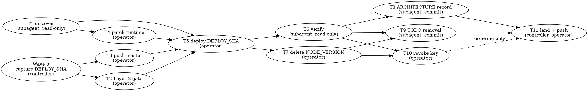

# Render Docker Runtime — Implementation Plan

> **For agentic workers:** REQUIRED SUB-SKILL: Use
> superpowers:subagent-driven-development to implement this
> plan task-by-task. Steps use checkbox (`- [ ]`) syntax for
> tracking. Ride this spec's worktree (AGENTS.md
> § Worktrees). The plan is a dependency graph: dispatch by
> the graph, not by the numbering.

**Goal:** Switch the one Render web service from the retired
Node runtime to the Docker runtime in place, deploy master's
pushed head by sha, verify it over the four custom domains,
and record the outcome in two doc commits.

**Architecture:** Eleven tasks across seven waves (Wave 0 is
the controller's one-line capture of the sha). Six are
operator steps against Render and GitHub — push, patch,
deploy, env var delete, key revocation, the final push; two
are read-only subagent tasks that discover and verify through
the Render API; two are one-file doc commits; one lands the
branch. Product code, tests, `Dockerfile`, and `compose.yaml`
are untouched. Every Render call rides `postgres-lib`'s
`http_json` adapter, the repository's existing Render seam.

**Tech Stack:** Bash, `curl`, `postgres-lib`, Render API v1,
`git`, Docker (Render's build), Deno 2.9.6 (inline JSON
programs), Markdown.

**Spec:** `docs/superpowers/specs/2026-09-01-render-docker-runtime-design.md`

## Global Constraints

- **Worktree.** Commits land in
  `.worktrees/2026-09-01-render-docker-runtime` on branch
  `2026-09-01-render-docker-runtime`, two commits ahead of
  master once this plan is committed. Operator steps run in
  the operator's own terminal from the main checkout root,
  `/Users/tmornini/code/fusion-angle`, on `master`.
- **Credentials.** The Render API key lives at
  `~/render-api-key`, mode 600, outside the repository. It is
  read only as `export RENDER_API_KEY="$(< ~/render-api-key)"`
  inside the subshell that does the work, so its lifetime is
  the block. It is never printed, never `cat`'d, never
  committed, never pasted into the session. Env var listings
  print keys only. The operator revokes the key when the work
  closes (Task 10).
- **Untouched, by decision:** product code, tests,
  `Dockerfile`, `compose.yaml`. No new repository script, no
  `render.yaml`, no `ARG` in the Dockerfile, no
  dependency-warm layer. The branch carries exactly four
  commits: the spec, this plan, the ARCHITECTURE.md record,
  the TODO.md removal.
- **The deploy names a sha.** `DEPLOY_SHA` is captured once
  (Wave 0) as `git rev-parse master`, and every later step
  names it. Nothing relies on "latest on branch".
- **Auto-deploy stays `off`.** The push deploys nothing; the
  patch deploys nothing; Task 5's explicit deploy call is
  Layer 2's gate made literal.
- **Patch body, verbatim:**
  `{"serviceDetails":{"runtime":"docker","envSpecificDetails":{"dockerfilePath":"./Dockerfile","dockerContext":".","dockerCommand":""}}}`
- **Deploy body, verbatim:**
  `{"clearCache":"do_not_clear","commitId":"<DEPLOY_SHA>"}`.
  Poll every 15 s; stop on `build_failed`, `update_failed`,
  `canceled`, `pre_deploy_failed`, or `deactivated`; cap at
  30 min (120 polls).
- **Health check path stays `/`.** Render's `PORT` is 10000;
  the image `CMD` maps it onto `HTTP_SERVER_PORT`.
- **Layer 2 before the deploy.** `./test-all` green on
  `DEPLOY_SHA` (TEST-PLAN.md's operator gate) is a
  precondition of Task 5.
- **Commit discipline** (AGENTS.md § Commit): one concern per
  commit; subject a single present-tense imperative line of
  ≈50 chars; no prose body beyond the `Co-Authored-By:
  Claude Fable 5.1 <noreply@anthropic.com>` trailer and the
  `Claude-Session:` trailer the harness names; never
  move/rename and change content together; linear history.
- **Markdown voice.** `.md` files are not 78-char linted;
  `ARCHITECTURE.md` and `TODO.md` wrap at ≤ 58 — match the
  surrounding paragraph. `./validate` greps every root `.md`
  for deferral prose (`later work`, `(later)`, `not built`,
  `coming soon`, `later session`, `will be added when`,
  case-insensitive); the ARCHITECTURE.md text must contain
  none of it.
- **Never force-push, never merge.** `git push origin
  master` must be a fast-forward from `c25cd8c3`.
- **Out of scope** (spec): a `render.yaml` Blueprint; the
  `/status` health endpoint (TODO item 5); the
  `TRUSTED_PROXY_HOPS` throttle seam and the database's
  `0.0.0.0/0` allowlist (TODO item 10); the old deploy's
  intermittent 500 on `/` (replaced, not diagnosed).

## Dispatch Protocol

`AGENTS.md § Subagents` binds every dispatch in this plan.

1. Every subagent prompt MUST begin with the literal phrase
   `Go to Medium Church!` — it loads the Medium scroll.
2. Then push down the codebase-specific brief the scripture
   cannot know:
   - **Voice.** Markdown prose matches its neighbors' wrap
     (≤ 58 in `ARCHITECTURE.md` and `TODO.md`). Shell blocks
     keep 78 columns and 4-space indent. Present-tense
     imperative commit subjects with the trailers above.
   - **Commandments touched.** II Security (the key never
     leaves its subshell; env var values never leave
     `$TMP`), V Clarity (record what was measured in words
     that say what it measures: `createdAt` to
     `finishedAt`), VII Idempotency (read, then patch only
     when `node`; every block re-runs safely), IX Generality
     (reuse `postgres-lib`; no second Render adapter), and
     the Article on measurement (the build time is a number
     from the API, never an estimate).
   - **Abominations risked.** Unbidden Helper Code — no
     repository script, no `render.yaml`, no Dockerfile
     "improvement", no extra doc paragraph. Swallowed
     Failures — every non-2xx leaves the block through
     `fail_http`; no `|| true` around an oracle. Default
     Values — ids come from the ledger through `${VAR:?}`,
     never `${VAR:-}`. Magical Values — the poll interval
     and cap are named (`POLL_SEC`, `MAX_POLLS`). Premature
     Optimization — the dependency-warm layer waits for the
     measurement this plan produces.
   - **Patterns to match.** `postgres-lib`'s `http_json
     METHOD PATH OUTFILE [BODYFILE]` for every Render call;
     inline Deno programs piped to `deno run --frozen -` for
     JSON arithmetic (never `jq`); `Error: …` to stderr and
     `exit 1`.
3. Subagents work in this worktree and never create their
   own. Never pass the Agent tool `isolation: "worktree"`.
4. **Who does what.** Tasks 1 and 6 are read-only and go to
   a subagent. Tasks 8 and 9 commit and go to a subagent —
   one dispatch carrying both briefs, two commits, one review
   package (the skill's "batch small same-shape work").
   Tasks 2, 3, 4, 5, 7, and 10 write to production, push to
   the shared branch, or revoke a credential: they are the
   operator's, run in the operator's terminal — the
   subagent-driven-development skill's own stop list. The
   controller prepares each block, the operator runs it and
   pastes the printed lines (never a JSON file) back into
   the session, and the controller records the values in the
   ledger. If the operator instead says `go` in the session,
   the controller may run that one block itself — approval
   is per block, never blanket. Task 11 is the controller's
   landing, with the operator's final push.
5. **Models.** Task 1 and Task 6: standard tier (`sonnet`).
   Tasks 8 and 9: the text is verbatim in the brief —
   cheapest tier (`haiku`). Task reviews: `sonnet`. The final
   whole-branch review: the most capable available, `opus`
   at the floor.
6. **Parallelism.** The graph says what is unblocked; the
   skill says at most one committing subagent at a time. A
   read-only subagent (Task 1, Task 6) may run while the
   operator performs a wave-mate. Tasks 8 and 9 share one
   dispatch, so they never race.
7. **Sandbox.** Under the Claude Code sandbox, prefix any
   block that reaches `deno` with
   `export DENO_DIR="$TMPDIR/deno-dir"` (`postgres-lib`'s
   error path and log flattening run `deno`). If a
   subagent's call to `api.render.com` or `github.com` comes
   back in a `<sandbox_violations>` block, the same block
   becomes an operator command: the operator runs it and
   pastes the printed lines. Never retry a denied host.

## Dependency Graph



Read it as waves. A wave starts when every task it depends
on has a `complete` line in the ledger; tasks inside a wave
are independent of each other.

| Wave | Task | Executor | Runs alongside |
|---|---|---|---|
| 0 | capture `DEPLOY_SHA` | controller | — |
| 1 | T1 discover the service | subagent | T2, T3 |
| 1 | T2 Layer 2 gate on `DEPLOY_SHA` | operator | T1, T3 |
| 1 | T3 push master | operator | T1, T2 |
| 2 | T4 patch the runtime | operator | — |
| 3 | T5 deploy `DEPLOY_SHA` | operator | — |
| 4 | T6 verify | subagent | T7 |
| 4 | T7 delete `NODE_VERSION` | operator | T6 |
| 5 | T8 + T9 record, remove | one subagent, two commits | T10 |
| 5 | T10 revoke the key | operator | T8 + T9 |
| 6 | T11 land the branch, push | controller, operator | — |

Edges that carry data are in `## Shared Values`. Two edges
carry only order: T7 → T9 (the bullet leaves TODO.md after
Render's cleanup, not before) and T10 → T11 (the key is dead
before the last push).

## Shared Values

Values cross tasks through the ledger
(`<workspace>/progress.md`), one line each, written by the
controller the moment a task reports them:
`Value: NAME=…`. A consuming task's executor sets the shell
variable from that line before running a block; every block
reads it through `${NAME:?set from the ledger}`, which fails
loudly when it is missing.

| Name | Producer | Consumers | Shape |
|---|---|---|---|
| `DEPLOY_SHA` | Wave 0 | T2, T3, T5 | 40 hex chars |
| `SERVICE_ID` | T1 | T4, T5, T6, T7 | `srv-…` |
| `OWNER_ID` | T1 | T6 | `tea-…` or `usr-…` |
| `DEPLOY_ID` | T5 | T6, T7 | `dep-…` |
| `CREATED_AT` | T5 | T6 | RFC-3339 zulu |
| `FINISHED_AT` | T5 | T6 | RFC-3339 zulu |
| `BUILD_SECONDS` | T5 | T8 | decimal seconds |
| `ENV_DEPLOY_ID` | T7, only if Render redeployed | — | `dep-…` |

## The Render Block

Every Render API block in this plan has one shape. It runs
in `bash`, from a repository root (either checkout has
`postgres-lib`), inside a subshell:

```bash
( set -euo pipefail
  export RENDER_API_KEY="$(< ~/render-api-key)"
  source ./postgres-lib
  TMP=$(mktemp -d "${TMPDIR:-/tmp}/render-switch.XXXXXX")
  trap 'rm -rf "$TMP"' EXIT
  # … the task's calls …
)
```

- The subshell bounds the key's lifetime and absorbs
  `postgres-lib`'s `exit 1`, which would otherwise close an
  interactive shell.
- `http_json METHOD PATH OUTFILE [BODYFILE]` returns on
  2xx; on anything else `fail_http` prints
  `Error: Render HTTP <code>: <message>` to stderr and
  leaves the subshell with status 1. Nothing after a failed
  call runs.
- `$TMP` holds the raw responses. `env-vars.json` holds
  values, so it is only ever `grep`'d for `"key"`, and the
  trap deletes the directory on every exit.
- Projections are `grep -oE '"field": *"[^"]*"'` on the
  response — readable by eye, no helper, string fields only.
  Long field lists build a `FIELDS` pattern the way
  `./validate` builds `PATTERN`.

## File Structure

| File | Responsibility | Task |
|---|---|---|
| `docs/superpowers/plans/2026-09-01-render-docker-runtime.md` | this plan (commit 2) | — |
| `ARCHITECTURE.md:54-55` | the "Render builds from the Dockerfile" paragraph (commit 3) | 8 |
| `TODO.md:1306-1330` | the Render bullet under `## Later work` (commit 4) | 9 |
| `.superpowers/sdd/2026-09-01-render-docker-runtime/` | ledger, briefs, reports — git-ignored | all |

No other file changes.

## Spec Coverage

| Spec section | Where it lands |
|---|---|
| §0 Credentials | The Render Block; Task 1 step 1; Task 10 |
| §1 Push | Task 3 |
| §2 Runtime patch | Task 4 |
| §3 Deploy | Task 5 |
| §4 Verify | Task 6; Task 2 is the Layer 2 gate §2 cites |
| §5 Cleanup on Render | Task 7, Task 10 |
| §6 Docs | Task 8, Task 9 |
| Hazard: `.git` in Render's context | Task 5, the `build_failed` branch |
| Hazard: env vars as build args, no `ARG` | Global Constraints; Task 6 step 1 |
| Hazard: build time | Task 5 `BUILD_SECONDS`; Task 8 records it |
| Hazard: `USER deno`, port 10000 | Task 6 step 1, the `listening` line |
| Hazard: starter-plan memory | Task 6 step 3, the watch |
| Hazard: dashboard runtime dialog | Task 4 uses the API; its failure branch |
| Rollback | Task 5 failure branch: inaction |
| Commit sequence 1-4 | spec (landed), this plan, Task 8, Task 9 |
| Out of scope | Global Constraints |

---

### Wave 0: Capture `DEPLOY_SHA`

Controller-executed, before any dispatch. No file changes.

- [ ] **Step 1: Read master's head and record it**

```bash
git rev-parse master
git status --short
```

Expected: one 40-hex line —
`7f98026a0b5d552ee452fc5cbccaedaf09ee5200` at plan-writing
time, newer if another branch landed since — and an empty
status. Write `Value: DEPLOY_SHA=<the line>` to the ledger.
If master moves after this line is written (Task 2 or Task 3
sees a different `git rev-parse master`), return here:
re-capture, then re-run Task 2 on the new sha before Task 3
pushes it.

---

### Task 1: Discover the service

**Read-only. Subagent (`sonnet`).** Confirms the spec's
premises against the live account and produces the ids every
Render step needs. No file in the repository changes.

**Files:**
- Create: `<workspace>/task-1-report.md` (git-ignored)

**Interfaces:**
- Consumes: nothing from earlier tasks.
- Produces: `SERVICE_ID` (`srv-…`), `OWNER_ID`, the current
  `runtime` (`node` or `docker`), and confirmation of the
  spec's premises: exactly one web service,
  `autoDeployTrigger` `off`, four env var keys, four verified
  custom domains.

**Depends on:** nothing. **Unblocks:** Task 4, Task 5.

- [ ] **Step 1: Local premises**

```bash
stat -f '%Lp' ~/render-api-key
git rev-list --count c25cd8c3..master
git merge-base --is-ancestor c25cd8c3 master && echo ancestor
git ls-remote origin refs/heads/master
```

Expected, line by line: `600`; a count ≥ 662; `ancestor`; a
line starting `c25cd8c3`. The last needs GitHub — if the
sandbox denies it, the operator runs that one line and pastes
it. Any other mode, a count below 662, a missing `ancestor`,
or a remote head other than `c25cd8c3…` is a STOP: the spec's
premises have changed and the plan is stale.

- [ ] **Step 2: Discover the ids and read the service**

`discover_render_ids` is `postgres-lib`'s own check that the
key sees exactly one Postgres and exactly one web service; it
sets `OWNER_ID` and `SERVICE_ID`.

```bash
( set -euo pipefail
  export RENDER_API_KEY="$(< ~/render-api-key)"
  source ./postgres-lib
  TMP=$(mktemp -d "${TMPDIR:-/tmp}/render-switch.XXXXXX")
  trap 'rm -rf "$TMP"' EXIT
  discover_render_ids
  echo "OWNER_ID=${OWNER_ID}"
  echo "SERVICE_ID=${SERVICE_ID}"
  http_json GET "/services/${SERVICE_ID}" "$TMP/service.json"
  FIELDS='name|branch|repo|autoDeployTrigger|runtime'
  FIELDS="${FIELDS}|healthCheckPath|plan|region|buildCommand"
  FIELDS="${FIELDS}|startCommand|dockerfilePath|dockerContext"
  FIELDS="${FIELDS}|dockerCommand"
  grep -oE "\"(${FIELDS})\": *\"[^\"]*\"" "$TMP/service.json"
)
```

Expected: the two id lines, then one line per field. The
oracle fields: `"runtime":"node"`, `"autoDeployTrigger":"off"`,
`"healthCheckPath":"/"`, `"branch":"master"`,
`"plan":"starter"`, `"region":"oregon"`,
`"buildCommand":"npm ci --include=dev && git checkout -- . && ./build --no-zip ./render-out/"`,
`"startCommand":"node server.mjs"`. A `runtime` of `docker`
is not a stop — Task 4 exits clean on it — but record it.
Any other `runtime`, or an `autoDeployTrigger` other than
`off`, is a STOP.

- [ ] **Step 3: Env var keys, custom domains, recent deploys**

```bash
( set -euo pipefail
  export RENDER_API_KEY="$(< ~/render-api-key)"
  source ./postgres-lib
  TMP=$(mktemp -d "${TMPDIR:-/tmp}/render-switch.XXXXXX")
  trap 'rm -rf "$TMP"' EXIT
  SERVICE_ID="${SERVICE_ID:?set from step 2}"
  http_json GET "/services/${SERVICE_ID}/env-vars?limit=100" \
      "$TMP/env-vars.json"
  grep -oE '"key": *"[A-Za-z0-9_]+"' "$TMP/env-vars.json"
  http_json GET "/services/${SERVICE_ID}/custom-domains?limit=20" \
      "$TMP/domains.json"
  grep -oE '"(name|verificationStatus)": *"[^"]*"' \
      "$TMP/domains.json"
  http_json GET "/services/${SERVICE_ID}/deploys?limit=5" \
      "$TMP/deploys.json"
  grep -oE '"(id|status)": *"[^"]*"' "$TMP/deploys.json"
)
```

Expected: exactly four `"key"` lines — `JWT_HMAC_SIGNING_KEY`,
`NODE_VERSION`, `POSTGRES_URL`, `TRUSTED_PROXY_HOPS` in any
order — and never a value; four domain names —
`fusionangle.com`, `fusionangle.ai`, `www.fusionangle.com`,
`www.fusionangle.ai` — each followed by
`"verificationStatus":"verified"`; and deploy triplets
(`"id":"dep-…"`, `"id":"<commit sha>"`, `"status":"…"`), the
`live` one carrying commit `971df2a1…` and any failed ones
carrying `c25cd8c3…`. A fifth key, an unverified domain, or
a `live` deploy of another commit is a STOP.

- [ ] **Step 4: Write the report**

Write `<workspace>/task-1-report.md`: the two ids, the
service fields, the key names, the domain lines, the deploy
triplets, and each oracle's verdict. No JSON file, no value.
Return `DONE` with `SERVICE_ID`, `OWNER_ID`, and `runtime` in
the one-line summary; the controller writes
`Value: SERVICE_ID=…` and `Value: OWNER_ID=…` to the ledger.

---

### Task 2: Layer 2 gate on `DEPLOY_SHA`

**Operator.** TEST-PLAN.md names `./test-all` as the
operator's gate before a deploy; the spec makes Task 5's
explicit deploy call that gate made literal. Runs in the
main checkout, on master, at `DEPLOY_SHA`. No file changes.

**Interfaces:**
- Consumes: `DEPLOY_SHA` (Wave 0).
- Produces: a green Layer 2 on `DEPLOY_SHA`, recorded in the
  ledger as `Task 2: complete (test-all green on <sha>)`.

**Depends on:** Wave 0. **Unblocks:** Task 5.

- [ ] **Step 1: Confirm the checkout is the sha**

```bash
cd /Users/tmornini/code/fusion-angle
git status --short
git rev-parse HEAD
```

Expected: empty status; the sha equals `DEPLOY_SHA`. A
different sha means master moved — back to Wave 0.

- [ ] **Step 2: Run Layer 2**

```bash
./test-all
```

Expected: `./validate` ends green (type check, `./test` in
both TZ passes, lint, the `org` ban, both generator checks),
then `./test-browser` ends with every file passed and
`0 failed`. Red anywhere is a STOP: nothing deploys on a red
Layer 2, and the fix is its own spec.

- [ ] **Step 3: The TODO oracle's first clause**

The Render bullet this plan retires names
"`docker compose build` green locally at HEAD" as its first
oracle clause; the Dockerfile it builds is what Render will
build.

```bash
docker compose build
```

Expected: both `server` and `seed` images build, the
`builder` stage printing
`Executable created: fusion-angle (… bytes)`, no error. A
clean tree is the precondition (step 1): the in-image
`./build` refuses a dirty one.

---

### Task 3: Push master

**Operator.** Auto-deploy is off, so the push deploys
nothing; Task 5 proves that before deploying. No file
changes.

**Interfaces:**
- Consumes: `DEPLOY_SHA` (Wave 0).
- Produces: `refs/heads/master` on `origin` at `DEPLOY_SHA`.

**Depends on:** Wave 0. **Unblocks:** Task 5.

- [ ] **Step 1: Confirm the fast-forward**

```bash
cd /Users/tmornini/code/fusion-angle
git rev-parse master
git ls-remote origin refs/heads/master
git merge-base --is-ancestor c25cd8c3 master && echo fast-forward
```

Expected: `DEPLOY_SHA`; a line starting `c25cd8c3`;
`fast-forward`. A remote head that is not `c25cd8c3…` means
someone else pushed — STOP, never force.

- [ ] **Step 2: Push**

```bash
git push origin master
```

Expected: `c25cd8c3..<abbreviated DEPLOY_SHA>  master ->
master`. No `--force`, no `-f`, under any circumstances.

- [ ] **Step 3: Confirm the remote**

```bash
git ls-remote origin refs/heads/master
```

Expected: `DEPLOY_SHA` followed by `refs/heads/master`. Record
`Task 3: complete (origin/master = <sha>)` in the ledger.

---

### Task 4: Patch the runtime to Docker

**Operator.** Read first; patch only when the runtime is
`node`; exit clean when it is already `docker`; stop on
anything else. The patch does not deploy. No file changes.

**Interfaces:**
- Consumes: `SERVICE_ID` (Task 1).
- Produces: `serviceDetails.runtime` = `docker` with
  `dockerfilePath` `./Dockerfile`, `dockerContext` `.`,
  `dockerCommand` empty; build and start commands gone.

**Depends on:** Task 1. **Unblocks:** Task 5.

- [ ] **Step 1: Read, decide, patch**

Set `SERVICE_ID=srv-…` from the ledger in the shell first.

```bash
( set -euo pipefail
  export RENDER_API_KEY="$(< ~/render-api-key)"
  source ./postgres-lib
  TMP=$(mktemp -d "${TMPDIR:-/tmp}/render-switch.XXXXXX")
  trap 'rm -rf "$TMP"' EXIT
  SERVICE_ID="${SERVICE_ID:?set from the ledger}"
  http_json GET "/services/${SERVICE_ID}" "$TMP/service.json"
  runtime=$(grep -oE '"runtime": *"[a-z]+"' "$TMP/service.json" \
      | head -1 | sed -E 's/.*"([a-z]+)"$/\1/')
  case "$runtime" in
      docker)
          echo "runtime is already docker; nothing to patch"
          exit 0
          ;;
      node)
          echo "runtime is node; patching"
          ;;
      *)
          echo "Error: unexpected runtime '${runtime}'" >&2
          exit 1
          ;;
  esac
  printf '%s' '{"serviceDetails":{"runtime":"docker",' \
      '"envSpecificDetails":{"dockerfilePath":"./Dockerfile",' \
      '"dockerContext":".","dockerCommand":""}}}' \
      > "$TMP/patch.json"
  http_json PATCH "/services/${SERVICE_ID}" \
      "$TMP/patched.json" "$TMP/patch.json"
  echo "patched"
)
```

Expected: `runtime is node; patching` then `patched`. An
`Error: Render HTTP 4xx: <message>` means Render refused the
runtime edit for this service; nothing changed. STOP and
report the message verbatim — the fallback (a new Docker
service) is outside this plan and is the operator's decision.

- [ ] **Step 2: Read it back**

```bash
( set -euo pipefail
  export RENDER_API_KEY="$(< ~/render-api-key)"
  source ./postgres-lib
  TMP=$(mktemp -d "${TMPDIR:-/tmp}/render-switch.XXXXXX")
  trap 'rm -rf "$TMP"' EXIT
  SERVICE_ID="${SERVICE_ID:?set from the ledger}"
  http_json GET "/services/${SERVICE_ID}" "$TMP/service.json"
  FIELDS='runtime|autoDeployTrigger|healthCheckPath'
  FIELDS="${FIELDS}|dockerfilePath|dockerContext|dockerCommand"
  FIELDS="${FIELDS}|buildCommand|startCommand"
  grep -oE "\"(${FIELDS})\": *\"[^\"]*\"" "$TMP/service.json"
  http_json GET "/services/${SERVICE_ID}/env-vars?limit=100" \
      "$TMP/env-vars.json"
  grep -oE '"key": *"[A-Za-z0-9_]+"' "$TMP/env-vars.json"
)
```

Expected: `"runtime":"docker"`, `"autoDeployTrigger":"off"`,
`"healthCheckPath":"/"`, `"dockerfilePath":"./Dockerfile"`,
`"dockerContext":"."`, `"dockerCommand":""`; no
`buildCommand` or `startCommand` line; the same four env var
keys as Task 1. Record `Task 4: complete (runtime docker)`.

---

### Task 5: Deploy `DEPLOY_SHA`

**Operator.** One explicit deploy of the pushed sha, polled
to `live`. Render keeps the current deploy serving until the
new one passes the health check, so a failure changes nothing
in production. No file changes.

**Interfaces:**
- Consumes: `SERVICE_ID` (Task 1), `DEPLOY_SHA` (Wave 0),
  Task 2 green, Task 3 pushed, Task 4 patched.
- Produces: `DEPLOY_ID`, `CREATED_AT`, `FINISHED_AT`,
  `BUILD_SECONDS`.

**Depends on:** Tasks 1, 2, 3, 4. **Unblocks:** Tasks 6, 7.

- [ ] **Step 1: Confirm the ledger before touching Render**

The ledger must hold `Task 2: complete`, `Task 3: complete`,
and `Task 4: complete`. If any is missing, this task is not
unblocked.

- [ ] **Step 2: Prove nothing deployed the sha, then deploy**

Set `SERVICE_ID` and `DEPLOY_SHA` from the ledger first.

```bash
( set -euo pipefail
  export RENDER_API_KEY="$(< ~/render-api-key)"
  source ./postgres-lib
  TMP=$(mktemp -d "${TMPDIR:-/tmp}/render-switch.XXXXXX")
  trap 'rm -rf "$TMP"' EXIT
  SERVICE_ID="${SERVICE_ID:?set from the ledger}"
  DEPLOY_SHA="${DEPLOY_SHA:?set from the ledger}"
  POLL_SEC=15
  MAX_POLLS=120
  http_json GET "/services/${SERVICE_ID}/deploys?limit=20" \
      "$TMP/deploys.json"
  if grep -q "\"id\": *\"${DEPLOY_SHA}\"" "$TMP/deploys.json"; then
      echo "Error: a deploy of ${DEPLOY_SHA} already exists" >&2
      exit 1
  fi
  printf '{"clearCache":"do_not_clear","commitId":"%s"}' \
      "$DEPLOY_SHA" > "$TMP/deploy-body.json"
  http_json POST "/services/${SERVICE_ID}/deploys" \
      "$TMP/deploy-created.json" "$TMP/deploy-body.json"
  DEPLOY_ID=$(grep -oE '"id": *"dep-[A-Za-z0-9]+"' \
      "$TMP/deploy-created.json" | head -1 \
      | sed -E 's/.*"(dep-[A-Za-z0-9]+)"$/\1/')
  echo "DEPLOY_ID=${DEPLOY_ID}"
  status=''
  for _ in $(seq 1 "$MAX_POLLS"); do
      http_json GET "/services/${SERVICE_ID}/deploys/${DEPLOY_ID}" \
          "$TMP/deploy.json"
      status=$(grep -oE '"status": *"[a-z_]+"' "$TMP/deploy.json" \
          | head -1 | sed -E 's/.*"([a-z_]+)"$/\1/')
      echo "$(date -u +%H:%M:%SZ) ${status}"
      case "$status" in
          live)
              printf '%s' '
                  const deploy = JSON.parse(
                      Deno.readTextFileSync(Deno.args[0]),
                  );
                  const seconds = (Date.parse(deploy.finishedAt)
                      - Date.parse(deploy.createdAt)) / 1000;
                  console.log("CREATED_AT=" + deploy.createdAt);
                  console.log("FINISHED_AT=" + deploy.finishedAt);
                  console.log("BUILD_SECONDS=" + String(seconds));
              ' | deno run --frozen --allow-read="$TMP/deploy.json" \
                  - "$TMP/deploy.json"
              exit 0
              ;;
          build_failed|update_failed|canceled|pre_deploy_failed|deactivated)
              echo "Error: deploy ${DEPLOY_ID} ${status}" >&2
              exit 1
              ;;
      esac
      sleep "$POLL_SEC"
  done
  echo "Error: deploy ${DEPLOY_ID} not live after" \
      "$((POLL_SEC * MAX_POLLS / 60)) min (${status})" >&2
  exit 1
)
```

Expected: `DEPLOY_ID=dep-…`, then one timestamped status line
per poll — `created`, `build_in_progress`,
`update_in_progress`, `live` — ending with three lines
`CREATED_AT=…`, `FINISHED_AT=…`, `BUILD_SECONDS=…`. Record all
four as `Value:` lines in the ledger; the seconds go in
verbatim, unrounded.

A terminal failure prints `Error: deploy dep-… <status>` and
exits 1: production is unchanged (the 2026-08-18 deploy still
serves), and the report names that status as the failing
step. Read the build log in the dashboard (Events → the
deploy → Logs) before deciding anything; the rollback is
inaction. A `build_failed` at `./build`'s clean-tree gate
would mean Render's context differs from a fresh clone —
report it; do not edit the Dockerfile.

- [ ] **Step 3: If `live` printed but the three lines did not**

The deploy is live either way; only the measurement is
missing. Set `DEPLOY_ID` from the printed line and re-run the
projection alone:

```bash
( set -euo pipefail
  export RENDER_API_KEY="$(< ~/render-api-key)"
  source ./postgres-lib
  TMP=$(mktemp -d "${TMPDIR:-/tmp}/render-switch.XXXXXX")
  trap 'rm -rf "$TMP"' EXIT
  SERVICE_ID="${SERVICE_ID:?set from the ledger}"
  DEPLOY_ID="${DEPLOY_ID:?set from the ledger}"
  http_json GET "/services/${SERVICE_ID}/deploys/${DEPLOY_ID}" \
      "$TMP/deploy.json"
  printf '%s' '
      const deploy = JSON.parse(
          Deno.readTextFileSync(Deno.args[0]),
      );
      const seconds = (Date.parse(deploy.finishedAt)
          - Date.parse(deploy.createdAt)) / 1000;
      console.log("CREATED_AT=" + deploy.createdAt);
      console.log("FINISHED_AT=" + deploy.finishedAt);
      console.log("BUILD_SECONDS=" + String(seconds));
  ' | deno run --frozen --allow-read="$TMP/deploy.json" \
      - "$TMP/deploy.json"
)
```

Expected: the same three lines.

---

### Task 6: Verify the Docker deploy

**Read-only. Subagent (`sonnet`).** The spec's §4 oracles:
the build log, the app's `listening` line, the four domains.
No file in the repository changes.

**Files:**
- Create: `<workspace>/task-6-report.md` (git-ignored)

**Interfaces:**
- Consumes: `SERVICE_ID`, `OWNER_ID` (Task 1); `DEPLOY_ID`,
  `CREATED_AT`, `FINISHED_AT`, `BUILD_SECONDS` (Task 5).
- Produces: a verdict per oracle, and the confirmed
  `BUILD_SECONDS` that Task 8 writes into ARCHITECTURE.md.

**Depends on:** Task 5. **Unblocks:** Tasks 8, 9, 10.

- [ ] **Step 1: The build log and the `listening` line**

Render's `/logs` takes a `type`: `build` for the Docker
build, `app` for the process. The head of the build window
holds the `builder` stage; its tail holds the `runtime`
stage and `./build`'s `Executable created` line. The binary
prints one JSON line at boot,
`{"at":…,"level":"info","message":"listening","port":…}`
(`server/boot.ts:158`), inside the deploy window and shortly
before the health check passed — so the app log is read
backward from `FINISHED_AT`.

```bash
( set -euo pipefail
  export RENDER_API_KEY="$(< ~/render-api-key)"
  source ./postgres-lib
  TMP=$(mktemp -d "${TMPDIR:-/tmp}/render-switch.XXXXXX")
  trap 'rm -rf "$TMP"' EXIT
  OWNER_ID="${OWNER_ID:?set from the ledger}"
  SERVICE_ID="${SERVICE_ID:?set from the ledger}"
  CREATED_AT="${CREATED_AT:?set from the ledger}"
  FINISHED_AT="${FINISHED_AT:?set from the ledger}"
  render_logs() {
      local kind="$1" direction="$2" out="$3" code
      code=$(curl -sS -o "$out" -w '%{http_code}' --get \
          --data-urlencode "ownerId=${OWNER_ID}" \
          --data-urlencode "resource=${SERVICE_ID}" \
          --data-urlencode "type=${kind}" \
          --data-urlencode "startTime=${CREATED_AT}" \
          --data-urlencode "endTime=${FINISHED_AT}" \
          --data-urlencode "limit=100" \
          --data-urlencode "direction=${direction}" \
          -H "Authorization: Bearer ${RENDER_API_KEY}" \
          -H "Accept: application/json" \
          "${API}/logs")
      case "$code" in
          2??) ;;
          *) fail_http "$code" "$out" ;;
      esac
  }
  render_logs build forward "$TMP/build-head.json"
  render_logs build backward "$TMP/build-tail.json"
  render_logs app backward "$TMP/app.json"
  flatten_render_logs "$TMP/build-head.json" "$TMP/build-head.txt"
  flatten_render_logs "$TMP/build-tail.json" "$TMP/build-tail.txt"
  flatten_render_logs "$TMP/app.json" "$TMP/app.txt"
  echo "--- build log tail ---"
  tail -15 "$TMP/build-tail.txt"
  echo "--- oracles ---"
  echo "builder stage lines: $(grep -c '\[builder ' "$TMP/build-head.txt")"
  echo "runtime stage lines: $(grep -c '\[runtime ' "$TMP/build-tail.txt")"
  grep 'Executable created' "$TMP/build-tail.txt"
  grep '"message":"listening"' "$TMP/app.txt"
)
```

Expected: the log tail, then a `builder` count ≥ 1, a
`runtime` count ≥ 1, one
`Executable created: fusion-angle (… bytes)` line, and one
`listening` line carrying `"port":10000` — Render's `PORT`,
mapped by the image `CMD` onto `HTTP_SERVER_PORT`. A missing
marker ends the block with status 1 at that `grep`: that
oracle failed. The build log carries no secret: the
Dockerfile declares no `ARG`, so no build step ever saw an
env var.

If a `logs` array comes back empty, or the call 400s, the
operator reads the same log in the dashboard (the deploy's
Logs, or the service's Logs filtered on `listening`) and
pastes the marker lines; the oracle is the same.

- [ ] **Step 2: The four domains**

No key. Plain HTTPS from anywhere.

```bash
for host in fusionangle.com fusionangle.ai; do
    for path in / /landing/index.html /api/organizations; do
        curl -sS -o /dev/null -w "${host} ${path} %{http_code}\n" \
            "https://${host}${path}"
    done
done
for host in www.fusionangle.com www.fusionangle.ai; do
    curl -sS -o /dev/null \
        -w "${host} / %{http_code} %{redirect_url}\n" \
        "https://${host}/"
done
```

Expected, exactly:

```
fusionangle.com / 200
fusionangle.com /landing/index.html 200
fusionangle.com /api/organizations 401
fusionangle.ai / 200
fusionangle.ai /landing/index.html 200
fusionangle.ai /api/organizations 401
www.fusionangle.com / 301 https://fusionangle.com/
www.fusionangle.ai / 301 https://fusionangle.ai/
```

- [ ] **Step 3: Report, and name the watch**

Write `<workspace>/task-6-report.md`: each oracle with its
printed evidence, `BUILD_SECONDS` restated from the ledger,
and the build log tail. Return `DONE` if every oracle held;
`DONE_WITH_CONCERNS` naming the oracle otherwise — the
controller rules on whether production is acceptable and
ledgers the ruling before Wave 5 starts.

Not a gate, but named: the starter plan's memory held the
Node instance; the compiled binary is the same program. The
operator glances at the dashboard's Metrics → Memory within
the first hour; a restart in the Events feed is reported, not
fixed here.

---

### Task 7: Delete `NODE_VERSION`

**Operator.** The env var dies with the runtime. Render may
redeploy a service on an env var change; the block reads the
deploy list afterward so that is seen, not assumed, and polls
any redeploy to `live`. No file changes.

**Interfaces:**
- Consumes: `SERVICE_ID` (Task 1), `DEPLOY_ID` (Task 5).
- Produces: three env var keys on the service; if Render
  redeployed, a second `live` deploy and a ledger line
  `Value: ENV_DEPLOY_ID=…`.

**Depends on:** Task 5. **Unblocks:** Tasks 9, 10.

- [ ] **Step 1: Delete, read back, watch for a redeploy**

Set `SERVICE_ID` and `DEPLOY_ID` from the ledger first.

```bash
( set -euo pipefail
  export RENDER_API_KEY="$(< ~/render-api-key)"
  source ./postgres-lib
  TMP=$(mktemp -d "${TMPDIR:-/tmp}/render-switch.XXXXXX")
  trap 'rm -rf "$TMP"' EXIT
  SERVICE_ID="${SERVICE_ID:?set from the ledger}"
  DEPLOY_ID="${DEPLOY_ID:?set from the ledger}"
  POLL_SEC=15
  MAX_POLLS=120
  http_json DELETE "/services/${SERVICE_ID}/env-vars/NODE_VERSION" \
      "$TMP/deleted.json"
  echo "deleted NODE_VERSION"
  http_json GET "/services/${SERVICE_ID}/env-vars?limit=100" \
      "$TMP/env-vars.json"
  grep -oE '"key": *"[A-Za-z0-9_]+"' "$TMP/env-vars.json"
  http_json GET "/services/${SERVICE_ID}/deploys?limit=3" \
      "$TMP/deploys.json"
  newest=$(grep -oE '"id": *"dep-[A-Za-z0-9]+"' "$TMP/deploys.json" \
      | head -1 | sed -E 's/.*"(dep-[A-Za-z0-9]+)"$/\1/')
  if [ "$newest" = "$DEPLOY_ID" ]; then
      echo "no redeploy; newest deploy is still ${DEPLOY_ID}"
      exit 0
  fi
  echo "ENV_DEPLOY_ID=${newest}"
  status=''
  for _ in $(seq 1 "$MAX_POLLS"); do
      http_json GET "/services/${SERVICE_ID}/deploys/${newest}" \
          "$TMP/deploy.json"
      status=$(grep -oE '"status": *"[a-z_]+"' "$TMP/deploy.json" \
          | head -1 | sed -E 's/.*"([a-z_]+)"$/\1/')
      echo "$(date -u +%H:%M:%SZ) ${status}"
      case "$status" in
          live)
              exit 0
              ;;
          build_failed|update_failed|canceled|pre_deploy_failed|deactivated)
              echo "Error: deploy ${newest} ${status}" >&2
              exit 1
              ;;
      esac
      sleep "$POLL_SEC"
  done
  echo "Error: deploy ${newest} not live after" \
      "$((POLL_SEC * MAX_POLLS / 60)) min (${status})" >&2
  exit 1
)
```

Expected: `deleted NODE_VERSION`; exactly three keys —
`JWT_HMAC_SIGNING_KEY`, `POSTGRES_URL`, `TRUSTED_PROXY_HOPS`;
then either `no redeploy; newest deploy is still dep-…` or an
`ENV_DEPLOY_ID=dep-…` line followed by status lines ending in
`live`. A fourth key, or a redeploy that ends in a failure
status, is a STOP: the env var change is what to report.

- [ ] **Step 2: If Render redeployed, re-check the domains**

Only when step 1 printed `ENV_DEPLOY_ID`. Record
`Value: ENV_DEPLOY_ID=…` in the ledger and run the domain
oracle again:

```bash
for host in fusionangle.com fusionangle.ai; do
    for path in / /landing/index.html /api/organizations; do
        curl -sS -o /dev/null -w "${host} ${path} %{http_code}\n" \
            "https://${host}${path}"
    done
done
for host in www.fusionangle.com www.fusionangle.ai; do
    curl -sS -o /dev/null \
        -w "${host} / %{http_code} %{redirect_url}\n" \
        "https://${host}/"
done
```

Expected: the same eight lines as Task 6 step 2 — `200`,
`200`, `401` per apex; `301` to the apex per `www`. Record
`Task 7: complete (3 keys)` either way.

---

### Task 8: Record the switch in ARCHITECTURE.md

**Subagent (`haiku`), batched with Task 9 in one dispatch —
two commits.** The spec's §6: the existing service switched
runtime in place; the measured build time closes the
build-artifact spec's "measured at the first deploy" risk;
the Docker build runs no tests and sees no env vars.

**Files:**
- Modify: `ARCHITECTURE.md:54-55` (2 lines → 13 lines)

**Interfaces:**
- Consumes: `BUILD_SECONDS` (Task 5, confirmed by Task 6),
  carried in the dispatch as the value to substitute for
  `<BUILD_SECONDS>` below, verbatim.
- Produces: commit 3 of the branch.

**Depends on:** Task 6. **Unblocks:** Task 11.

- [ ] **Step 1: Confirm the paragraph**

```bash
sed -n '53,56p' ARCHITECTURE.md
```

Expected, exactly: a blank line, then

```
Render builds from the Dockerfile. The compose-stack
spec's "no Render config change" is retired.
```

then a blank line. If it differs, STOP — the anchor moved.

- [ ] **Step 2: Replace lines 54-55**

Put these thirteen lines in place of the two, substituting
the ledger's `BUILD_SECONDS` for `<BUILD_SECONDS>` — the
number as printed, unrounded (the neighboring paragraph's
rule: "do not round away"):

```
Render builds from the Dockerfile. The compose-stack
spec's "no Render config change" is retired. The one
web service switched runtime in place — Render's
runtime is editable after creation, by
`PATCH /v1/services/{id}` with `serviceDetails.runtime`
— so no service was created and no domain moved. The
first Docker deploy measured <BUILD_SECONDS> s from the
deploy's `createdAt` to its `finishedAt`, the
build-artifact spec's "measured at the first deploy"
risk, closed. The Docker build runs no tests and sees
no env vars (the Dockerfile declares no `ARG`), unlike
the retired native build, whose `./validate` step saw
the build-time `POSTGRES_URL`.
```

- [ ] **Step 3: Verify**

```bash
sed -n '54,66p' ARCHITECTURE.md | awk 'length > 58'
grep -c 'measured at the first deploy' ARCHITECTURE.md
LATER='later work|\(later\)|not built|coming soon'
LATER="${LATER}|later session|will be added when"
grep -nEi "$LATER" ARCHITECTURE.md
git diff --stat
./validate
```

Expected: no line over 58 (the `awk` prints nothing); `1`;
no deferral prose (the `grep` prints nothing and exits 1,
which is the no-match); `1 file changed, 12 insertions(+),
1 deletion(-)` — the first line of the paragraph is
unchanged; `./validate` green (under the sandbox, `export
DENO_DIR="$TMPDIR/deno-dir"` first).

- [ ] **Step 4: Commit**

```bash
git add ARCHITECTURE.md
git commit -m "Record the Render runtime switch and build time"
```

---

### Task 9: Remove the Render bullet from TODO.md

**Subagent (`haiku`), same dispatch as Task 8 — its own
commit.** The work shipped; the close protocol applies: the
bullet leaves, nothing else changes. It names no `file:line`
comment and no KNOWN seam, and no `## Sequencing` line
references it.

**Files:**
- Modify: `TODO.md:1306-1330` (25 lines removed)

**Interfaces:**
- Consumes: Task 6 verified, Task 7 cleaned up.
- Produces: commit 4 of the branch; `TODO.md` at 1329 lines.

**Depends on:** Tasks 6, 7. **Unblocks:** Task 11.

- [ ] **Step 1: Confirm the bullet's bounds**

```bash
wc -l < TODO.md
sed -n '1306p;1330p;1331p;1332p' TODO.md
```

Expected: `1354`; then exactly

```
- Render still runs the retired Node runtime. Its build
  service deleted.

## Sequencing
```

If the numbers differ, locate the same two lines with
`grep -n 'Render still runs the retired Node runtime' TODO.md`
and the `  service deleted.` line that follows it, and use
that range in step 2.

- [ ] **Step 2: Delete the twenty-five lines**

```bash
sed -i '' '1306,1330d' TODO.md
```

- [ ] **Step 3: Verify**

```bash
wc -l < TODO.md
grep -c 'Render still runs' TODO.md
sed -n '1304,1307p' TODO.md
git diff --stat
./validate
```

Expected: `1329`; `0`; then exactly these four lines —

```
  `./test-postgres` 52 passed; `./measure --check` green
  against the committed budgets.

## Sequencing
```

— then `1 file changed, 25 deletions(-)`; `./validate` green.

- [ ] **Step 4: Commit**

```bash
git add TODO.md
git commit -m "Remove the Render runtime bullet from TODO"
```

---

### Task 10: Revoke the API key

**Operator.** The last Render call was Task 7's (or Task 6's,
whichever finished later). Revocation is a dashboard action;
no API revokes its own key. No file changes.

**Interfaces:**
- Consumes: Tasks 6 and 7 complete.
- Produces: a dead key, a `401` to prove it, no file at
  `~/render-api-key`.

**Depends on:** Tasks 6, 7. **Unblocks:** Task 11 (order).

- [ ] **Step 1: Revoke in the dashboard**

Open `https://dashboard.render.com/u/settings?add-api-key`
and revoke the key created for this work.

- [ ] **Step 2: Prove it dead**

```bash
( export RENDER_API_KEY="$(< ~/render-api-key)"
  curl -sS -o /dev/null -w '%{http_code}\n' \
      -H "Authorization: Bearer ${RENDER_API_KEY}" \
      "https://api.render.com/v1/services?limit=1" )
```

Expected: `401`. A `200` means a different key was revoked —
return to step 1.

- [ ] **Step 3: Remove the file**

```bash
rm ~/render-api-key
```

Record `Task 10: complete (key revoked, 401)`.

---

### Task 11: Land the branch and push

**Controller-executed. Do not dispatch a subagent.** Steps 2-4
run in the main checkout at
`/Users/tmornini/code/fusion-angle`; step 4 deletes the
worktree a subagent would be living in. Step 5 is the
operator's.

**Files:** none. This task changes no file.

**Interfaces:**
- Consumes: four green commits on
  `2026-09-01-render-docker-runtime` — the spec, this plan,
  Task 8's record, Task 9's removal.

**Depends on:** Tasks 8, 9 (and 10, for order).

- [ ] **Step 1: Rebase onto master, from the worktree**

```bash
git rebase master
./validate
```

If master has not moved, the rebase is a no-op. If it has,
amend until every commit is green before continuing.

- [ ] **Step 2: Fast-forward master**

```bash
cd /Users/tmornini/code/fusion-angle
git merge --ff-only 2026-09-01-render-docker-runtime
```

Expected: `Fast-forward`. A failure means master moved after
the rebase — return to step 1. Never merge.

- [ ] **Step 3: Confirm the landing**

```bash
git status --short
git log --oneline -4
```

Expected: empty status; the four subjects, newest first:
`Remove the Render runtime bullet from TODO`,
`Record the Render runtime switch and build time`,
`Add the Render Docker runtime switch plan`,
`Add the Render Docker runtime switch spec`.

- [ ] **Step 4: Remove the worktree and the branch**

```bash
git worktree remove .worktrees/2026-09-01-render-docker-runtime
git branch -d 2026-09-01-render-docker-runtime
```

`-d` refuses if anything is stranded; never `-D`.

- [ ] **Step 5: Push master (operator)**

Auto-deploy is off — Task 5 step 2 proved the first push had
deployed nothing — so this push deploys nothing.

```bash
git push origin master
git ls-remote origin refs/heads/master
```

Expected: a fast-forward from `DEPLOY_SHA`; the remote head
equals `git rev-parse master`. Master is pushed past
`c25cd8c3` and stays pushed.
