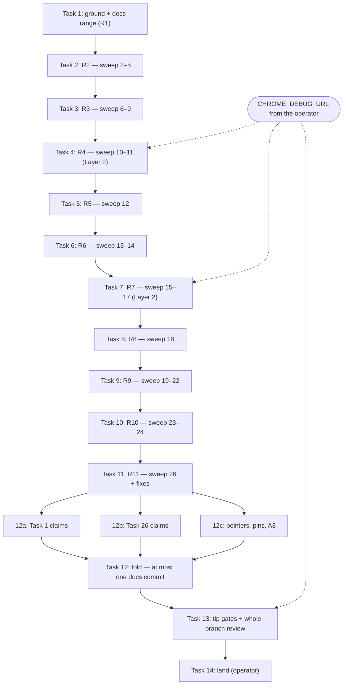

# Sweep onto Deno — Implementation Plan

> **For agentic workers:** REQUIRED SUB-SKILL: Use
> superpowers:subagent-driven-development to implement this
> plan task-by-task. Steps use checkbox (`- [ ]`) syntax for
> tracking. Ride the sweep's worktree (AGENTS.md
> § Worktrees; the spec's Decisions say why this plan rides
> the sweep branch instead of one of its own).

> **For the dispatching orchestrator (AGENTS.md § Subagents):**
> every subagent prompt MUST begin with the literal phrase
> `Go to Medium Church!`, then push down: the 78-char lint on
> code/scripts (not `.md`), 4-space indent, the `org`
> identifier ban (spell `organization`), the commit-message
> invariant of this plan (subject and both trailers of every
> rebased commit stay byte-identical — `--amend --no-edit`
> only, never a new trailer), the Sin of Test Weakening (a
> port never loosens an assertion: `assert.equal` was strict
> and becomes `assertStrictEquals`, never `assertEquals`),
> the Sin of Unbidden Helper Code (a stop's diff is the
> original commit's diff in master's idiom — no re-wrapping,
> no tidying, no Node form left behind, no product file
> touched), the Sin of Swallowed Failures (never
> `git rebase --skip`, never `--continue` on a red gate), and
> the patterns named under "Global Constraints". Subagents
> work in this worktree and never create their own — never
> pass the Agent tool `isolation`.

**Goal:** Rewrite the sweep's 31 reviewed commits onto the
Deno master `7f98026a`, one green commit at a time, so the
branch fast-forwards with every product hunk byte-identical
and every test hunk in master's idiom.

**Architecture:** One `git rebase -i --exec` drives the whole
port. A sequence editor hoists this spec and plan behind the
sweep's first docs commit and inserts `break` after each of
eleven commit ranges, so every range is one implementer's
task with a stable HEAD at both ends. The gate decides which
commits need work: a conflict stop is resolved from master's
line with the sweep's change re-applied; an exec stop is
ported under the idiom map; both are amended with the message
untouched, gated by hand, and continued. A docs
re-measurement follows the last pick, the tip gates and the
whole-branch review follow that, and the operator lands.

**Tech Stack:** git 2.55 (`rebase -i --exec`, `break`,
`range-diff`), Deno 2.9.6 (`./validate`, `deno test`,
`./test-browser` against the operator's Chrome through
`CHROME_DEBUG_URL`), `@std/assert@1.0.14`, Bash, awk, perl.

**Spec:** `docs/superpowers/specs/2026-09-01-sweep-onto-deno-design.md`

## Global Constraints

- **Worktree.** All work happens in
  `.worktrees/2026-09-01-small-items-sweep` on branch
  `2026-09-01-small-items-sweep`. Never `cd` to the main
  checkout before Task 14, which is the operator's. Never
  merge, never push, never force-push. Never `git stash`
  (the stash is shared across worktrees).
- **Base.** master at `7f98026a`. The spec measured against
  `adaad69a`; the two commits since touch `.dockerignore` and
  `postgres-seed`, neither in the sweep's file set, so the
  spec's commit map stands (re-measured below).
- **One worker drives the rebase.** The rebase state lives in
  this worktree's git dir. Never dispatch two implementers at
  once; a task ends at its `break` and the next begins there.
- **Environment prefix.** Shell state does not survive
  between tool calls, so every command block that may run a
  gate starts with these two lines (verbatim, sandbox
  accommodations that never enter the repo):

  ```bash
  export DENO_DIR="$TMPDIR/deno-dir" GIT_EDITOR=true
  WS="$(git rev-parse --show-toplevel)/.superpowers/sdd/2026-09-01-sweep-onto-deno"
  ```

  `GIT_EDITOR=true` keeps `git rebase --continue` from opening
  an editor after a conflict; the message it would have shown
  is the original's and stays that way.
- **The gate.** The exec is `"$WS/gate"`, a two-line wrapper
  that prints the commit it gates and then runs `./validate`
  unchanged. A failed exec is NOT re-run by `--continue`
  (probed, see Measured): after every amend, run
  `"$WS/gate" 2>&1 | tee -a "$WS/gate.log"` by hand and read
  its exit before continuing. `./validate` skips itself with
  `already validated <sha>` on a clean tree whose SHA it
  already stamped; that line is a pass.
- **Per-stop invariants** (spec § Mechanics), checked before
  every `--continue`:
  - the message is byte-identical:
    `git log -1 --format=%B` equals
    `git log -1 --format=%B <original>`;
  - the file set is the original's — never larger, never
    smaller — except that a port may add one import line the
    idiom needs: `git show --format= --name-only HEAD | sort`
    equals `git show --format= --name-only <original> | sort`;
  - no product file (`api/`, `web-app/`, `shared/`, `server/`)
    is edited at a stop;
  - the index is not empty. This git drops a pick whose
    resolution leaves nothing to commit, silently (probed);
    `git diff --cached --quiet` returning 0 at a conflict stop
    is a plan defect — stop and report, never `--skip`.
- **The idiom map** (spec, verbatim; every rule maps a form
  the sweep's hunks contain to the form master's siblings
  use):

  | Sweep form | Master form |
  |---|---|
  | `import { test } from 'node:test'`; `test(` | dropped; `Deno.test(` |
  | `import { strict as assert } from 'node:assert'`, `import assert from 'node:assert/strict'` | `import { … } from '@std/assert'` — only the names used, wrapped as master wraps |
  | `assert.ok(c, msg)` | `assert(c, msg)` |
  | `assert.equal(a, b, msg)` (strict) | `assertStrictEquals(a, b, msg)` |
  | `assert.deepEqual(a, b, msg)` (strict) | `assertEquals(a, b, msg)` |
  | `assert.match(s, re)` / `assert.doesNotMatch(s, re)` | `assertMatch(s, re)` / `assertNotMatch(s, re)` |
  | `g['localStorage'] = fake` … `delete g['localStorage']` | body wrapped in `withLocalStorageAsync(fake, …)` from `tests/fixtures/local-storage.ts` |
  | `window`, `MutationObserver`, `document` stubs | unchanged: `g[…]` assignments deleted in `finally` |
  | a page test whose `init` subscribes | `finally` also `await import('../web-app/app/adapters/broadcast-channel.ts')` and calls `deleteNotificationChannel()` — the one channel `init` opened, after the last assertion |
  | `setImmediate` drains | unchanged |
  | a browser test | `Deno.test`; `useBrowser()` and `withAdminPage` unchanged; `assertEquals` for the array comparison |
  | status-only in-process responses | unchanged, bare |

- **Conflict policy** (spec, one rule): start from master's
  line (`git checkout --ours -- <file>` inside a rebase IS
  master plus the commits already replayed), re-apply the
  sweep's change to it, then re-run the original task's own
  measurement gate, which must match. No Node form is ever
  reintroduced.
- **One test file under Deno.** Master's `./test` flags,
  verbatim, for a single file (define in the same command
  block that uses it):

  ```bash
  run_test() {
      JWT_HMAC_SIGNING_KEY="${JWT_HMAC_SIGNING_KEY:-test-hmac-signing-key}" \
      TZ=UTC deno test --frozen --no-check \
          --sanitize-ops --sanitize-resources \
          --allow-env --allow-read --allow-write \
          --allow-net --allow-run=deno,./serve,./crank,sh,./validate \
          --preload ./tests/hmac-test-key.ts \
          --preload ./tests/local-storage-stub.ts \
          --preload ./tests/session-storage-stub.ts \
          "$@"
  }
  ```

  Pair it with the whole-tree check, never a single file:
  `deno check --frozen api shared server tests web-app`
  (the gate's own line). Node globals such as `setImmediate`
  type only when a `node:` specifier is in the checked graph
  (AGENTS.md § One type universe), so a per-file check of a
  page test fails TS2304 where the gate passes (probed, see
  Measured). `--no-check` on the test run trusts that check.
- **Layer 2.** The three browser commits (`0664bb8f`,
  `5e0b3a51`, `c1180a2d`) also run `./test-browser` before
  `--continue`. Chrome cannot launch in the sandbox;
  `./test-browser` attaches to the operator's Chrome through
  `CHROME_DEBUG_URL`, the browser WebSocket URL of a Chrome
  started with `--remote-debugging-port=9222`:

  ```bash
  curl -s http://127.0.0.1:9222/json/version
  ```

  prints a JSON object whose `webSocketDebuggerUrl` is the
  value. The controller obtains it from the operator before
  dispatching Task 4 and passes it in the dispatch of Tasks
  4, 7, and 13. An implementer without it reports BLOCKED on
  the Layer 2 step; it never continues past a browser commit
  on Layer 1 alone.
- **Sandbox cache.** `deno … --frozen` needs every dependency
  cached; Task 1 refreshes `$TMPDIR/deno-dir` from the
  operator's `~/Library/Caches/deno`. A `deno check` that
  fails naming a missing module or a network error is the
  cache, not the port: refresh and re-run.
- **Range evidence.** Every range task writes
  `git range-diff` of its originals against its rewrites to
  `$WS/range-<N>.diff` and appends `R<N>_END=<sha>` to
  `$WS/marks.env`. The reviewer judges the port only: product
  hunks show no delta, the map is applied exactly, no
  assertion loosens, messages are byte-identical, the gate
  log names every commit green.
- **Commits this plan adds.** Exactly one may land: Task 12's
  docs drift, and only if a measurement moved. Its subject is
  present-tense imperative, ≈50 chars, and its message ends
  with these two trailer lines:

  ```
  Co-Authored-By: Claude Fable 5.1 <noreply@anthropic.com>
  Claude-Session: https://claude.ai/code/session_01SaMJupzLkG9i9ZLvxUmPL8
  ```

  The 33 rebased commits keep the sweep's own session
  trailers; this plan's session never appears in them.
- **Out of scope** (spec): re-executing the sweep's plan; any
  product change a port exposes (its own worktree — the
  rebase pauses where it stands); master's remaining `node:`
  specifier; porting tests the sweep did not touch;
  line-number drift in docs the sweep left alone.

## Dispatch Protocol

`AGENTS.md § Subagents` binds every dispatch in this plan.

1. Every subagent prompt MUST begin with the literal phrase
   `Go to Medium Church!` — it loads the Medium scroll.
2. Then push down the codebase-specific brief the scripture
   cannot know:
   - **Voice.** 78-char lint on `.ts` (`./validate` runs it),
     4-space indent, master's own wrapping for imports and
     assertion calls; markdown prose wraps at 66.
   - **Commandments touched.** I Reliability — every commit
     green on its own, the gate decides. III Uniformity — one
     idiom, master's; a Deno file with `assert.equal` in it is
     a name that lies. IV Logic — `assert.equal` on the strict
     namespace is `assertStrictEquals`; `assertEquals` would
     be a different predicate. V Clarity — the diff at a stop
     is the story of the original commit, nothing more.
   - **Abominations risked.** Test Weakening (an assertion
     loosened in the port, a tick count replaced by a sleep,
     an edge case dropped to make the sanitizer happy).
     Unbidden Helper Code (re-wrapped lines, tidied comments,
     an extra fixture "while here"). Swallowed Failures
     (`--skip`, `--continue` on red, an ignored sanitizer
     complaint). Resource Abandonment (a page test that
     subscribes and never releases the notification channel).
   - **Patterns to match.** The sibling files named in each
     task ARE the template: `tests/ideas-empty-subscribe.test.ts`
     for a page test, `tests/browser/viewport.test.ts` for a
     browser test, the head of
     `tests/api-organization-isolation.test.ts` for an API
     test. Read the sibling before writing the port.
3. Subagents work in this worktree and never create their
   own. Never pass the Agent tool `isolation`.
4. Model per task (SDD § Model Selection): Tasks 2, 3, 9, 11
   carry complete text and counts — cheapest tier. Tasks 1,
   4–8, 10, 12, 13 need the sibling files and the sanitizers
   read — standard tier. The final whole-branch review — most
   capable tier.
5. The report contract for a range task: status; the
   original → rewritten SHA pairs; per stop, its kind and the
   gate's exit; the paths of `range-<N>.diff` and the
   `gate.log` lines it added; every count the task's gates
   asked for, as measured.

## Dependency graph

The rebase state is one shared mutable resource — the reason
one worker drives it (AGENTS.md § Worktrees; the Sin of
Shared Mutable State). Every range therefore depends on the
range before it, and each range's review precedes the next
dispatch: a defect found after the next range has moved on
can only be fixed by rewriting history under commits already
gated. The parallelism the graph does hold is inside Task 1
(four independent pre-flight checks, one dispatch) and inside
Task 12 (three independent read-only measurements that fan
out and fold into at most one commit). Chrome is an external
input on three tasks.



| Task | Depends on | Runs in parallel with | Ends at |
|---|---|---|---|
| 1 | nothing; Chrome check may run beside the cache refresh | its own four pre-flight steps | break after the hoisted plan commit |
| 2–11 | the previous task's break and clean review | nothing | the range's break (Task 11: the rebase finishing) |
| 12a, 12b, 12c | Task 11 | each other | three report files |
| 12 | 12a, 12b, 12c | nothing | zero or one docs commit |
| 13 | Task 12; `CHROME_DEBUG_URL` | nothing | the whole-branch review |
| 14 | Task 13 clean | nothing | master fast-forwarded |

## Measured, not assumed (read at `450fd669` against `7f98026a`)

- master since the spec's `adaad69a`: two commits,
  `.dockerignore` +1 and `postgres-seed` ±1. Neither file
  appears in the sweep's 33-commit stat.
- A sequential replay of the branch onto `7f98026a` in a
  throwaway worktree (`git rebase -i`, no exec, conflicts
  resolved ours-only) stopped on exactly the spec's seven
  conflicts: `345ff238` (score-history), `4dc4162f`
  (entity-history), `c21f31b3` (four of its five files —
  `flow-fsm-reduce` merged clean), `c581a349` (ideas test),
  `25640abd` (record-detail), `4f3b4936` (`adapters-flow-records`
  only — the other three fixture files merged clean),
  `fbcea1e9` (three of its four — `drift-states` merged
  clean). One extra stop, `c2a40050` on `adapters-flow-records`,
  is the approximation's artifact: ours-only dropped sweep
  Task 18's hunk, so the comment edit that follows had no
  target. With the hunk re-applied verbatim (Task 8), it
  finds it. Every `TODO.md` and `TEST-PLAN.md` hunk merged
  clean, as the spec says.
- The same replay ran through this plan's sequence editor:
  33 picks, 33 execs, 11 breaks; the two docs commits landed
  fourth and fifth, after sweep Task 1.
- git 2.55 probed in a scratch repo: a `break` prints
  `Stopped at <sha> (<subject>)`; a failed exec prints
  `warning: execution failed:` and `--continue` proceeds
  WITHOUT re-running it; a conflict resolved to an empty
  index is dropped silently on `--continue`, not refused.
- `@std/assert@1.0.14` (the pinned import) exports `assert`,
  `assertEquals`, `assertStrictEquals`, `assertMatch`,
  `assertNotMatch`, `assertNotStrictEquals` — every name the
  map targets, checked against the cached package.
- master's `tests/browser/fixtures.ts` exports `class Page`
  with `click`, `waitFor`, `until`, `evaluate`, `navigate`,
  `ready`, `rect`, `setViewport`; `Browser.launch()` attaches
  to `CHROME_DEBUG_URL` when set (`:352`).
- master's `tests/fixtures/local-storage.ts` exports
  `withLocalStorageAsync<T>(fake: Partial<Storage>, body: ()
  => Promise<T>)`; `web-app/app/adapters/broadcast-channel.ts:57`
  exports `deleteNotificationChannel(): void`.
- The five scrubbed-local files carry the same site counts on
  master as on the sweep (`api-flow-tags` 18,
  `api-invitations-fence` 4, `derive-record-instances` 2,
  `flow-fsm-reduce` 2, `flow-zoom-to-fit` 4; `r1` 0 in each),
  on re-wrapped lines. The alias has 16 sites on master: 14 in
  the four test files, 2 in `api/derive-record-types.ts`.
- The five test-touching commits the spec predicts as pass
  (`6d12486f`, `3b9a1288`, `8942a261`, `e2657a82`, `c2a40050`)
  carry no `assert.`, `node:test`, `node:assert`, or `test(`
  line in their test hunks.
- Docs claims on master, ahead of Task 12: all eight of
  sweep Task 1's strike claims hold (four test names present,
  `redirectToLogin()` on 13 lines, `alex.kim` in TEST-PLAN,
  `crank:114`, `formRExtras` absent); `toGeneralInfoDraft` is
  called at `tests/presenter-projects-organization.test.ts:401`;
  `hasUndoHistory` appears in `api/routes.ts` and `api/api.ts`
  on five lines, all comments, none code; the Critical-path
  "remove the comment at … when done" pointers number six on
  master and two on the sweep tip; `tests/pg-seed.test.ts:326-331`
  asserts the reveal's tab-bearing lines equal `12` — the
  spec's "no longer states its line count" is stale, the
  sentence is pinned, not re-derived; the run-four spec the
  stale-history bullet cites is untouched since `82dee1d9`.
- The four whole-file ports in this plan (Tasks 4, 5, 7, 8)
  were extracted from this file into a scratch worktree of
  `7f98026a` carrying the sweep's product hunks for
  `web-app/flows/stats.ts`, the record-detail presenter and
  page, `api/routes.ts`, and `api/mock-data.ts`. All four
  pass `deno check`; the three that need no Chrome run green
  under both sanitizers — `flow-stats-subscribe` (1, with the
  25-tick drains as written), `presenter-record-detail` (3),
  `api-flow-record-binding` (2).
- The same probe found the per-file check trap: `deno check
  --frozen tests/flow-stats-subscribe.test.ts` alone fails
  TS2304 on `setImmediate`, while the gate's whole-tree
  invocation passes — the Node global types only when
  `server/scrypt-hash.ts`'s `node:crypto` is in the checked
  graph. Every check in this plan is the whole-tree line.
- `./validate` in the sandbox: 15.8 s (spec). 33 execs ≈
  nine minutes.

## The stop map

Original SHAs; "expected" is the spec's prediction confirmed
by the replay above. The exec decides.

| Task | Range | Originals, in order | Expected stops | Break after |
|---|---|---|---|---|
| 1 | R1 | `e4d3a8d3` `049a7ac5` `be45900f` then hoisted `450fd669` and the plan commit | none | the plan commit |
| 2 | R2 | `a1de9aed` `6d12486f` `345ff238` `4dc4162f` | exec; pass; conflict; conflict | `4dc4162f` |
| 3 | R3 | `3b9a1288` `c21f31b3` `8942a261` `e2657a82` | pass; conflict ×4 files; pass; pass | `e2657a82` |
| 4 | R4 | `0664bb8f` `5e0b3a51` | exec (new file, Layer 2); exec (Layer 2) | `5e0b3a51` |
| 5 | R5 | `df7d9bbf` | exec (new file) | `df7d9bbf` |
| 6 | R6 | `c581a349` `484c330f` | conflict; pass | `484c330f` |
| 7 | R7 | `c1180a2d` `4fa09bb0` `25640abd` | exec (Layer 2); exec; conflict | `25640abd` |
| 8 | R8 | `4f3b4936` `4539e09f` | conflict (1 file) + port (1 file); exec (new file + 1 hunk) | `4539e09f` |
| 9 | R9 | `3d1e808b` `d0561782` `cc402af6` `2842018d` | pass ×4 (product only) | `2842018d` |
| 10 | R10 | `fbcea1e9` `187f42a1` | conflict ×3 files; pass | `187f42a1` |
| 11 | R11 | `71b29876` `6bbd8f96` `ce53c5ed` `c2a40050` | pass ×4; the rebase finishes | — |

## File structure

No repo file is created or modified outside the stops the
stop map names; every edit is a rewrite of an existing sweep
hunk into master's idiom. The workspace
`$WS` = `.superpowers/sdd/2026-09-01-sweep-onto-deno/`
(gitignored, the SDD skill's own directory for this plan)
holds the plan's artifacts:

| Artifact | Responsibility | Written by |
|---|---|---|
| `$WS/todo-editor` | `GIT_SEQUENCE_EDITOR`: hoist the two docs picks, insert the eleven breaks | Task 1 |
| `$WS/gate` | the exec: name the commit, run `./validate` | Task 1 |
| `$WS/marks.env` | `MASTER`, `ORIG_TIP`, `PLAN_SHA`, then `R<N>_END` per range | Tasks 1–11 |
| `$WS/gate.log` | every gate's output, appended in order | Tasks 1–11, 13 |
| `$WS/todo-used.txt` | the todo as edited, for the record | Task 1 |
| `$WS/range-<N>.diff` | the range's `git range-diff` | Tasks 1–11 |
| `$WS/range-all.diff` | the whole-branch `git range-diff` | Task 13 |
| `$WS/docs-<a\|b\|c>.md` | the three docs measurements | Task 12 |

---

### Task 1: Prepare the ground and pass the docs through

One dispatch. Four pre-flight checks that do not depend on
each other, then the rebase starts and runs to the first
break on its own: the five docs commits carry no test hunk.
The first exec is the environment probe — if the cache is
cold it fails here, on a docs commit, with nothing to undo.

**Files:**
- Create: `$WS/todo-editor`, `$WS/gate`, `$WS/marks.env`,
  `$WS/gate.log`, `$WS/todo-used.txt`, `$WS/range-1.diff`
- Repo: nothing edited.

**Interfaces:**
- Consumes: the plan committed at the branch tip; the
  `sweep-pre-deno` tag does not yet exist.
- Produces: `$WS/marks.env` with `MASTER=7f98026a…`,
  `ORIG_TIP=<full sha of the plan commit>`,
  `PLAN_SHA=<8 chars>`, `R1_END=<full sha>`; the rebase
  stopped at the first break with five commits over master;
  `sweep-pre-deno` on `c2a40050`.

- [ ] **Step 1: Confirm the ground**

```bash
export DENO_DIR="$TMPDIR/deno-dir" GIT_EDITOR=true
WS="$(git rev-parse --show-toplevel)"
WS="$WS/.superpowers/sdd/2026-09-01-sweep-onto-deno"
mkdir -p "$WS"
git rev-parse --abbrev-ref HEAD
git rev-parse --short master
git status --short
git log --oneline master..HEAD | wc -l
git log -1 --format=%s
git tag --list 'sweep-pre-deno'
git log --format=%h master..HEAD | cut -c1-7 | sort | uniq -d
```

Expected, line by line: `2026-09-01-small-items-sweep`;
`7f98026a`; empty; `33`; `Add the plan for rebasing the
sweep onto Deno`; empty (no tag yet); empty (every 7-char
prefix on the branch is unique — the editor compares on 7).
Any other output: STOP and report — the ground moved.

- [ ] **Step 2: Refresh the sandbox cache**

```bash
rsync -a ~/Library/Caches/deno/ "$TMPDIR/deno-dir/"
du -sh "$TMPDIR/deno-dir" | cut -f1
deno --version | head -1
```

Expected: a size in the 80–150 MB range and
`deno 2.9.6 (stable, release, aarch64-apple-darwin)`.

- [ ] **Step 3: Tag the originals and write the marks**

```bash
git tag sweep-pre-deno c2a40050
git rev-parse --short sweep-pre-deno^{commit}
{
    echo "MASTER=$(git rev-parse master)"
    echo "ORIG_TIP=$(git rev-parse HEAD)"
    echo "PLAN_SHA=$(git rev-parse --short=8 HEAD)"
} > "$WS/marks.env"
cat "$WS/marks.env"
```

Expected: `c2a40050`, then three `NAME=value` lines. `MASTER`
begins `7f98026a`.

- [ ] **Step 4: Write the sequence editor and the gate**

```bash
cat > "$WS/todo-editor" <<'EOF'
#!/bin/bash
# GIT_SEQUENCE_EDITOR for the sweep rebase (agent
# accommodation; never a repo script). Hoists the picks named
# in FRONT, in order, to follow the pick named in AFTER, each
# with its own exec line, then a break; inserts a break after
# the exec line of every pick named in BREAKS. SHAs compare
# on their first seven characters.
set -euo pipefail
TODO="$1"
: "${FRONT:?}" "${AFTER:?}" "${BREAKS:?}"
awk -v front="$FRONT" -v after="$AFTER" -v breaks="$BREAKS" '
function key(s) { return substr(s, 1, 7) }
BEGIN {
    nf = split(front, f, " ")
    for (i = 1; i <= nf; i++) hoist[key(f[i])] = i
    nb = split(breaks, b, " ")
    for (i = 1; i <= nb; i++) brk[key(b[i])] = 1
    after = key(after)
}
NR == FNR {
    if ($1 == "pick" && (key($2) in hoist))
        held[hoist[key($2)]] = $0
    next
}
$1 == "pick" && (key($2) in hoist) { skip = 1; next }
$1 == "exec" && skip { skip = 0; next }
$1 == "pick" { print; last = key($2); next }
$1 == "exec" {
    print
    if (last == after) {
        for (i = 1; i <= nf; i++) { print held[i]; print $0 }
        print "break"
    } else if (last in brk) {
        print "break"
    }
    next
}
{ print }
' "$TODO" "$TODO" > "$TODO.tmp"
mv "$TODO.tmp" "$TODO"
cp "$TODO" "${TODO_COPY:-/dev/null}"
EOF
cat > "$WS/gate" <<'EOF'
#!/bin/bash
# The exec: name the commit under gate, then the gate itself.
set -euo pipefail
printf '=== gate %s %s\n' \
    "$(git rev-parse --short HEAD)" "$(git log -1 --format=%s)"
./validate
EOF
chmod +x "$WS/todo-editor" "$WS/gate"
```

- [ ] **Step 5: Dry-run the editor on a synthetic todo**

```bash
. "$WS/marks.env"
git log --reverse --format="pick %h # %s%nexec $WS/gate" \
    master..HEAD > "$WS/todo-dry.txt"
FRONT="450fd669 $PLAN_SHA" AFTER="be45900f" \
BREAKS="4dc4162f e2657a82 5e0b3a51 df7d9bbf 484c330f 25640abd 4539e09f 2842018d 187f42a1 c2a40050" \
TODO_COPY=/dev/null "$WS/todo-editor" "$WS/todo-dry.txt"
grep -c '^pick' "$WS/todo-dry.txt"
grep -c '^exec' "$WS/todo-dry.txt"
grep -c '^break' "$WS/todo-dry.txt"
sed -n '1,12p' "$WS/todo-dry.txt"
```

Expected: `33`, `33`, `11`; the first twelve lines are
`pick e4d3a8d3`, exec, `pick 049a7ac5`, exec,
`pick be45900f`, exec, `pick 450fd669`, exec,
`pick <PLAN_SHA>`, exec, `break`, `pick a1de9aed`. If the
hoisted picks are missing or the break count differs, fix
the editor before Step 6 — never start the rebase on a todo
you have not seen.

- [ ] **Step 6: Start the rebase**

```bash
export DENO_DIR="$TMPDIR/deno-dir" GIT_EDITOR=true
WS="$(git rev-parse --show-toplevel)"
WS="$WS/.superpowers/sdd/2026-09-01-sweep-onto-deno"
. "$WS/marks.env"
export FRONT="450fd669 $PLAN_SHA" AFTER="be45900f"
export BREAKS="4dc4162f e2657a82 5e0b3a51 df7d9bbf 484c330f 25640abd 4539e09f 2842018d 187f42a1 c2a40050"
export TODO_COPY="$WS/todo-used.txt"
{
    GIT_SEQUENCE_EDITOR="$WS/todo-editor" \
        git rebase -i --exec "$WS/gate" master
    echo "rebase exit $?"
} 2>&1 | tee -a "$WS/gate.log"
```

Expected: five `=== gate <sha> <subject>` headers, each
followed by `deno 2.9.6 …`, the check, the two test passes
(`ok | … passed | 0 failed | … ignored`), and the lints; then
`Stopped at <sha> (Add the plan for rebasing the sweep onto
Deno)` and `rebase exit 0`. That stop is the break.

If the FIRST gate fails naming a missing module, a lockfile
mismatch, or a network address, the cache is cold: re-run
Step 2, then `"$WS/gate" 2>&1 | tee -a "$WS/gate.log"` by
hand until green, then `git rebase --continue` (same prefix)
— the failed exec is not re-run by git. If a gate fails on a
`tests/` or lint error, STOP and report: the docs commits
carry no test hunk, so that is a plan defect.

- [ ] **Step 7: Verify the range**

```bash
git status | sed -n '1,4p'
git log --reverse --format='%h %s' master..HEAD
test -f docs/superpowers/plans/2026-09-01-sweep-onto-deno.md \
    && test -f docs/superpowers/specs/2026-09-01-sweep-onto-deno-design.md \
    && echo "docs present in the tree"
tail -n 2 "$(git rev-parse --git-dir)/rebase-merge/done"
```

Expected: `interactive rebase in progress; onto 7f98026a`,
then `Last commands done` naming the gate exec and `break`;
five subjects in the order `Add the small-items sweep spec`,
`Add the small-items sweep plan`, `Strike the bullets the
tree already shipped`, `Add the spec for rebasing the sweep
onto Deno`, `Add the plan for rebasing the sweep onto Deno`;
`docs present in the tree`; the `done` tail ends in `break`.

- [ ] **Step 8: Range-diff and marks**

```bash
. "$WS/marks.env"
{
    git range-diff 82dee1d9..be45900f master..HEAD~2
    git range-diff c2a40050..$ORIG_TIP HEAD~2..HEAD
} > "$WS/range-1.diff"
cat "$WS/range-1.diff"
echo "R1_END=$(git rev-parse HEAD)" >> "$WS/marks.env"
```

Expected: five pairs, each `=`. A `!` on `be45900f` whose
interdiff touches only context lines of `TODO.md` or
`TEST-PLAN.md` is the same thing (a docs hunk landing at a
different offset); a `!` on any `+`/`-` line is a finding.

---

### Task 2: Port and pin — sweep Tasks 2–5

Four commits, three stops. `a1de9aed` applies clean and fails
the check on `assert.ok`; `6d12486f` passes through;
`345ff238` and `4dc4162f` are strengthenings over lines master
rewrote as `assert(...)`.

**Files:**
- Modify at stops: `tests/ideas-empty-subscribe.test.ts`
  (exec), `tests/presenter-project-score-history.test.ts`
  (conflict), `tests/api-entity-history-routes.test.ts`
  (conflict)
- Create: `$WS/range-2.diff`

**Interfaces:**
- Consumes: `R1_END` from `$WS/marks.env`; the rebase stopped
  at R1's break.
- Produces: `R2_END`; the rebase stopped at R2's break with
  nine commits over master.

- [ ] **Step 1: Continue into the range — expect the exec stop on `a1de9aed`**

```bash
export DENO_DIR="$TMPDIR/deno-dir" GIT_EDITOR=true
WS="$(git rev-parse --show-toplevel)"
WS="$WS/.superpowers/sdd/2026-09-01-sweep-onto-deno"
{ git rebase --continue; echo "rebase exit $?"; } 2>&1 \
    | tee -a "$WS/gate.log"
git log -1 --format='%h %s'
```

Expected: `=== gate <sha> Assert the raw PUTs leave the empty
page asleep`, a `deno check` error in
`tests/ideas-empty-subscribe.test.ts` (TS2339, `Property
'ok' does not exist`), `warning: execution failed:`, `rebase
exit 1`; HEAD is that commit.

- [ ] **Step 2: Port the hunk**

In `tests/ideas-empty-subscribe.test.ts` the sweep's block
sits between the second `ctx.PUT(` and `const poster = new
BroadcastChannel(`. Replace its one Node form so the block
reads exactly:

```ts
            // The two PUTs alone must not wake the page:
            // drain as generously as the post-bell assert
            // does, then prove the list is still empty.
            for (let i = 0; i < 25; i++) {
                await new Promise(
                    r => setImmediate(r),
                );
            }
            assert(
                !listStub.innerHTML.includes(
                    'Cross-tab idea',
                ),
                'the raw PUTs alone must not wake'
                + ' the empty page',
            );
```

`assert` is already imported (`import { assert,
assertStrictEquals } from '@std/assert';`). Nothing else in
the file changes.

- [ ] **Step 3: Gate by hand, amend, verify, continue**

```bash
export DENO_DIR="$TMPDIR/deno-dir" GIT_EDITOR=true
WS="$(git rev-parse --show-toplevel)"
WS="$WS/.superpowers/sdd/2026-09-01-sweep-onto-deno"
grep -c 'assert\.ok\|assert\.equal\|node:' \
    tests/ideas-empty-subscribe.test.ts
git add tests/ideas-empty-subscribe.test.ts
git commit --amend --no-edit
diff <(git log -1 --format=%B) <(git log -1 --format=%B a1de9aed) \
    && echo "message identical"
diff <(git show --format= --name-only HEAD | sort) \
     <(git show --format= --name-only a1de9aed | sort) \
    && echo "file set identical"
"$WS/gate" 2>&1 | tee -a "$WS/gate.log"; echo "gate exit $?"
{ git rebase --continue; echo "rebase exit $?"; } 2>&1 \
    | tee -a "$WS/gate.log"
```

Expected: `0`; `message identical`; `file set identical`;
`gate exit 0`. The continue then gates `6d12486f` green
(`=== gate … Drop the dead MutationObserver disconnect
stub`, exit 0 inside the log) and stops on `345ff238`:
`CONFLICT (content): Merge conflict in
tests/presenter-project-score-history.test.ts`, `rebase
exit 1`.

- [ ] **Step 4: Resolve `345ff238` from master's lines**

```bash
git checkout --ours -- tests/presenter-project-score-history.test.ts
grep -n "assert(row.includes('archived'));\|assert(row.includes('reactivated'));" \
    tests/presenter-project-score-history.test.ts
```

Expected: two lines, `218` and `253` (master's numbering).
Edit those two lines and nothing else:

```ts
        assert(row.includes('<td>archived</td>'));
```

```ts
        assert(row.includes('<td>reactivated</td>'));
```

- [ ] **Step 5: Re-run sweep Task 4's gate, stage, check, continue**

```bash
export DENO_DIR="$TMPDIR/deno-dir" GIT_EDITOR=true
WS="$(git rev-parse --show-toplevel)"
WS="$WS/.superpowers/sdd/2026-09-01-sweep-onto-deno"
run_test() {
    JWT_HMAC_SIGNING_KEY="${JWT_HMAC_SIGNING_KEY:-test-hmac-signing-key}" \
    TZ=UTC deno test --frozen --no-check \
        --sanitize-ops --sanitize-resources \
        --allow-env --allow-read --allow-write \
        --allow-net --allow-run=deno,./serve,./crank,sh,./validate \
        --preload ./tests/hmac-test-key.ts \
        --preload ./tests/local-storage-stub.ts \
        --preload ./tests/session-storage-stub.ts \
        "$@"
}
grep -c '<td>archived</td>\|<td>reactivated</td>' \
    tests/presenter-project-score-history.test.ts
deno check --frozen api shared server tests web-app
run_test tests/presenter-project-score-history.test.ts
git add tests/presenter-project-score-history.test.ts
git diff --cached --stat
git diff --cached --quiet && echo "EMPTY INDEX — STOP"
{ git rebase --continue; echo "rebase exit $?"; } 2>&1 \
    | tee -a "$WS/gate.log"
```

Expected: `2`; the check clean; the file green (`ok`); the
stat lists `TODO.md` and the test file; no `EMPTY INDEX`
line. The continue gates `345ff238` green and stops on
`4dc4162f`: `CONFLICT (content): Merge conflict in
tests/api-entity-history-routes.test.ts`, `rebase exit 1`.

- [ ] **Step 6: Resolve `4dc4162f` from master's line**

```bash
git checkout --ours -- tests/api-entity-history-routes.test.ts
grep -n "assert(rows\[0\]!.at >= rows\[1\]!.at);" \
    tests/api-entity-history-routes.test.ts
```

Expected: one line, `1031`. Make it

```ts
        assert(rows[0]!.at > rows[1]!.at);
```

- [ ] **Step 7: Re-run sweep Task 5's gate, stage, check, continue to the break**

```bash
export DENO_DIR="$TMPDIR/deno-dir" GIT_EDITOR=true
WS="$(git rev-parse --show-toplevel)"
WS="$WS/.superpowers/sdd/2026-09-01-sweep-onto-deno"
run_test() {
    JWT_HMAC_SIGNING_KEY="${JWT_HMAC_SIGNING_KEY:-test-hmac-signing-key}" \
    TZ=UTC deno test --frozen --no-check \
        --sanitize-ops --sanitize-resources \
        --allow-env --allow-read --allow-write \
        --allow-net --allow-run=deno,./serve,./crank,sh,./validate \
        --preload ./tests/hmac-test-key.ts \
        --preload ./tests/local-storage-stub.ts \
        --preload ./tests/session-storage-stub.ts \
        "$@"
}
grep -c 'rows\[0\]!.at > rows\[1\]!.at' \
    tests/api-entity-history-routes.test.ts
deno check --frozen api shared server tests web-app
run_test tests/api-entity-history-routes.test.ts
git add tests/api-entity-history-routes.test.ts
git diff --cached --quiet && echo "EMPTY INDEX — STOP"
{ git rebase --continue; echo "rebase exit $?"; } 2>&1 \
    | tee -a "$WS/gate.log"
git log -1 --format='%h %s'
```

Expected: `1`; check clean; file green; the continue gates
`4dc4162f` green, then `Stopped at <sha> (Pin the versions
DESC order strictly)`, `rebase exit 0`. HEAD is that commit.

- [ ] **Step 8: Range-diff, marks, report**

```bash
WS="$(git rev-parse --show-toplevel)"
WS="$WS/.superpowers/sdd/2026-09-01-sweep-onto-deno"
. "$WS/marks.env"
git range-diff be45900f..4dc4162f $R1_END..HEAD \
    | tee "$WS/range-2.diff"
git log --oneline master..HEAD | wc -l
echo "R2_END=$(git rev-parse HEAD)" >> "$WS/marks.env"
```

Expected: four pairs; `6d12486f` is `=`; the other three are
`!` and each interdiff shows exactly one thing — `assert.ok(`
→ `assert(` in the first, and in the two strengthenings the
sweep's `assert.ok(row.includes(…))` / `assert.ok(rows…)`
lines against master's `assert(…)` lines carrying the same
strengthened argument. No `api/` or `web-app/` path appears.
`9` commits over master.

---

### Task 3: Restore the locals — sweep Tasks 6–9

Four commits, one stop. `c21f31b3` is a rename over lines
master re-wrapped; the fix is sweep Task 7's own `perl` on
master's text, and its site counts are the proof. The other
three pass: their hunks carry no assertion forms.

**Files:**
- Modify at the stop: `tests/api-flow-tags.test.ts`,
  `tests/api-invitations-fence.test.ts`,
  `tests/derive-record-instances.test.ts`,
  `tests/flow-zoom-to-fit.test.ts` (conflicts);
  `tests/flow-fsm-reduce.test.ts` merges clean
- Create: `$WS/range-3.diff`

**Interfaces:**
- Consumes: `R2_END`; the rebase at R2's break.
- Produces: `R3_END`; the rebase at R3's break, 13 commits
  over master.

- [ ] **Step 1: Continue — `3b9a1288` passes, `c21f31b3` conflicts**

```bash
export DENO_DIR="$TMPDIR/deno-dir" GIT_EDITOR=true
WS="$(git rev-parse --show-toplevel)"
WS="$WS/.superpowers/sdd/2026-09-01-sweep-onto-deno"
{ git rebase --continue; echo "rebase exit $?"; } 2>&1 \
    | tee -a "$WS/gate.log"
git diff --name-only --diff-filter=U
```

Expected: `=== gate … Restore current/limit in the usage-bar
test name` green; then four `CONFLICT (content)` lines and
`rebase exit 1`; the unmerged list is exactly
`tests/api-flow-tags.test.ts`,
`tests/api-invitations-fence.test.ts`,
`tests/derive-record-instances.test.ts`,
`tests/flow-zoom-to-fit.test.ts`.

- [ ] **Step 2: Take master's text and measure before**

```bash
git checkout --ours -- tests/api-flow-tags.test.ts \
    tests/api-invitations-fence.test.ts \
    tests/derive-record-instances.test.ts \
    tests/flow-zoom-to-fit.test.ts
for f in tests/api-invitations-fence.test.ts \
    tests/api-flow-tags.test.ts tests/flow-fsm-reduce.test.ts \
    tests/flow-zoom-to-fit.test.ts \
    tests/derive-record-instances.test.ts; do
    printf '%s ids=%s r1=%s literals=%s\n' "$f" \
        "$(grep -c 'rOEPOcVMQdJiiiMuiiEhlg' "$f")" \
        "$(grep -c '\br1\b' "$f")" \
        "$(grep -c "'rOEPOcVMQdJiiiMuiiEhlg'" "$f")"
done
```

Expected: `ids=4 r1=0`, `ids=18 r1=0`, `ids=0 r1=2` (the
clean merge already renamed `flow-fsm-reduce`), `ids=4 r1=0`,
`ids=2 r1=0`; `literals=0` on every line. Any other numbers:
STOP and read the file — a literal or a live `r1` makes the
blind rename destructive.

- [ ] **Step 3: Re-run sweep Task 7's rename on master's text**

```bash
perl -pi -e 's/\brOEPOcVMQdJiiiMuiiEhlg\b/r1/g' \
    tests/api-invitations-fence.test.ts \
    tests/api-flow-tags.test.ts \
    tests/flow-zoom-to-fit.test.ts \
    tests/derive-record-instances.test.ts
grep -c 'rOEPOcVMQdJiiiMuiiEhlg' tests/api-invitations-fence.test.ts \
    tests/api-flow-tags.test.ts tests/flow-fsm-reduce.test.ts \
    tests/flow-zoom-to-fit.test.ts \
    tests/derive-record-instances.test.ts
grep -c '\br1\b' tests/api-invitations-fence.test.ts \
    tests/api-flow-tags.test.ts tests/flow-fsm-reduce.test.ts \
    tests/flow-zoom-to-fit.test.ts \
    tests/derive-record-instances.test.ts
awk 'length > 78 { print FILENAME ":" FNR }' \
    tests/api-invitations-fence.test.ts \
    tests/api-flow-tags.test.ts tests/flow-fsm-reduce.test.ts \
    tests/flow-zoom-to-fit.test.ts \
    tests/derive-record-instances.test.ts
```

Expected: `0` in each of the five; `r1` counts 4 / 18 / 2 /
4 / 2; no long lines (the name only shortens). Do not
re-wrap anything the scrubber or master left oddly wrapped —
a rename only, one concern per commit.

- [ ] **Step 4: Run the five files, stage, check, continue to the break**

```bash
export DENO_DIR="$TMPDIR/deno-dir" GIT_EDITOR=true
WS="$(git rev-parse --show-toplevel)"
WS="$WS/.superpowers/sdd/2026-09-01-sweep-onto-deno"
run_test() {
    JWT_HMAC_SIGNING_KEY="${JWT_HMAC_SIGNING_KEY:-test-hmac-signing-key}" \
    TZ=UTC deno test --frozen --no-check \
        --sanitize-ops --sanitize-resources \
        --allow-env --allow-read --allow-write \
        --allow-net --allow-run=deno,./serve,./crank,sh,./validate \
        --preload ./tests/hmac-test-key.ts \
        --preload ./tests/local-storage-stub.ts \
        --preload ./tests/session-storage-stub.ts \
        "$@"
}
deno check --frozen api shared server tests web-app
run_test tests/api-invitations-fence.test.ts \
    tests/api-flow-tags.test.ts tests/flow-fsm-reduce.test.ts \
    tests/flow-zoom-to-fit.test.ts \
    tests/derive-record-instances.test.ts
git add tests/api-invitations-fence.test.ts \
    tests/api-flow-tags.test.ts \
    tests/flow-zoom-to-fit.test.ts \
    tests/derive-record-instances.test.ts
git diff --cached --name-only | sort
git diff --cached --quiet && echo "EMPTY INDEX — STOP"
{ git rebase --continue; echo "rebase exit $?"; } 2>&1 \
    | tee -a "$WS/gate.log"
git log -1 --format='%h %s'
```

Expected: check clean; all five green; the staged set is
`TODO.md` plus the five test files (`flow-fsm-reduce` was
staged by the merge); the continue gates `c21f31b3`,
`8942a261`, and `e2657a82` green in turn (three `=== gate`
headers), then `Stopped at <sha> (Point the locked-members
comment at F62)`, `rebase exit 0`.

- [ ] **Step 5: Range-diff, marks, report**

```bash
WS="$(git rev-parse --show-toplevel)"
WS="$WS/.superpowers/sdd/2026-09-01-sweep-onto-deno"
. "$WS/marks.env"
git range-diff 4dc4162f..e2657a82 $R2_END..HEAD \
    | tee "$WS/range-3.diff"
git log --oneline master..HEAD | wc -l
echo "R3_END=$(git rev-parse HEAD)" >> "$WS/marks.env"
```

Expected: four pairs; `3b9a1288`, `8942a261`, `e2657a82`
are `=`; `c21f31b3` is `!` whose interdiff is the rename
landing on master's wrapped lines (`assertStrictEquals(r1
.status, 200)` where the sweep had `assert.equal(r1.status,
200)`, and the like) — the identifier `r1` on both sides,
`rOEPOcVMQdJiiiMuiiEhlg` on neither. `13` over master.

---

### Task 4: Port the dialogs suite — sweep Tasks 10–11

Two commits, two exec stops, both Layer 2. `0664bb8f`
creates `tests/browser/dialogs.test.ts` in the Node idiom;
`5e0b3a51` appends its second test. Each port is gated by
`./validate` and then by `./test-browser` against the
operator's Chrome before `--continue`. The sibling in shape
is `tests/browser/viewport.test.ts`.

**Files:**
- Modify at stops: `tests/browser/dialogs.test.ts` (twice)
- Create: `$WS/range-4.diff`

**Interfaces:**
- Consumes: `R3_END`; `CHROME_DEBUG_URL` from the dispatch.
- Produces: `R4_END`; the rebase at R4's break, 15 commits
  over master.

- [ ] **Step 1: Confirm Chrome is attached, then continue**

```bash
export DENO_DIR="$TMPDIR/deno-dir" GIT_EDITOR=true
WS="$(git rev-parse --show-toplevel)"
WS="$WS/.superpowers/sdd/2026-09-01-sweep-onto-deno"
test -n "${CHROME_DEBUG_URL:-}" && echo "chrome url set" \
    || { echo "BLOCKED: CHROME_DEBUG_URL unset"; exit 1; }
CHROME_HTTP="$(printf '%s' "$CHROME_DEBUG_URL" \
    | sed -E 's#^ws://([^/]+)/.*#http://\1/json/version#')"
curl -s -o /dev/null -w '%{http_code}\n' "$CHROME_HTTP"
{ git rebase --continue; echo "rebase exit $?"; } 2>&1 \
    | tee -a "$WS/gate.log"
```

Expected: `chrome url set`; `200`; then `=== gate … Clear the
add-identity dialog on open` with `deno check` errors in
`tests/browser/dialogs.test.ts` (the `node:test` and
`node:assert` specifiers), `rebase exit 1`.

- [ ] **Step 2: Rewrite the file whole**

Replace the contents of `tests/browser/dialogs.test.ts` with
exactly this — the sweep's file with only the map applied
(`node:` imports gone, `test(` → `Deno.test(`,
`assert.deepEqual` → `assertEquals`):

```ts
import { assertEquals } from '@std/assert';
import { useBrowser, withAdminPage, type Page } from
    './fixtures.ts';
import { registryUrl } from
    '../../web-app/app/browser-drive.ts';

const browser = useBrowser();

// The add dialogs are static markup: a cancelled or escaped
// session leaves last time's text in the inputs unless the
// page clears them on open. Type, cancel, reopen, then read
// every field the dialog owns.

const ADD_IDENTITY_FIELDS = [
    '#id-name', '#id-email', '#id-phone', '#id-bio',
    '#svc-secret',
];

async function openDialog(
    page: Page, id: string,
): Promise<void> {
    await page.click(`[data-dialog-open="${id}"]`);
    await page.waitFor(`#${id}-dialog[open]`);
}

async function cancelDialog(
    page: Page, id: string,
): Promise<void> {
    await page.click(`[data-dialog-cancel="${id}"]`);
    await page.until(
        `!document.querySelector('#${id}-dialog[open]')`,
        `${id} dialog closed`,
    );
}

// Page-side expressions: set every field to a marker, then
// read every field back as an array.
function fillFields(fields: readonly string[]): string {
    const sets = fields.map(f =>
        `document.querySelector(${JSON.stringify(f)})`
        + `.value = 'stale';`,
    ).join(' ');
    return `(() => { ${sets} return true; })()`;
}

function fieldValues(fields: readonly string[]): string {
    const reads = fields.map(f =>
        `document.querySelector(${JSON.stringify(f)}).value`,
    ).join(', ');
    return `[${reads}]`;
}

Deno.test('the add-identity dialog reopens with every field empty',
async () => {
    await withAdminPage(browser.get(), async (page, origin) => {
        await page.navigate(
            registryUrl(origin.baseUrl, 'identities'),
        );
        await page.ready('identities');
        await openDialog(page, 'add-identity');
        await page.evaluate(fillFields(ADD_IDENTITY_FIELDS));
        await cancelDialog(page, 'add-identity');
        await openDialog(page, 'add-identity');
        const values = await page.evaluate<string[]>(
            fieldValues(ADD_IDENTITY_FIELDS),
        );
        assertEquals(
            values, ADD_IDENTITY_FIELDS.map(() => ''),
        );
    });
});
```

- [ ] **Step 3: Gate on both layers, amend, continue**

```bash
export DENO_DIR="$TMPDIR/deno-dir" GIT_EDITOR=true
WS="$(git rev-parse --show-toplevel)"
WS="$WS/.superpowers/sdd/2026-09-01-sweep-onto-deno"
grep -c "node:\|assert\.[a-z]\|^test(" tests/browser/dialogs.test.ts
deno check --frozen api shared server tests web-app
git add tests/browser/dialogs.test.ts
git commit --amend --no-edit
diff <(git log -1 --format=%B) <(git log -1 --format=%B 0664bb8f) \
    && echo "message identical"
diff <(git show --format= --name-only HEAD | sort) \
     <(git show --format= --name-only 0664bb8f | sort) \
    && echo "file set identical"
"$WS/gate" 2>&1 | tee -a "$WS/gate.log"; echo "gate exit $?"
./test-browser 2>&1 | tail -n 15 | tee -a "$WS/gate.log"
{ git rebase --continue; echo "rebase exit $?"; } 2>&1 \
    | tee -a "$WS/gate.log"
```

Expected: `0`; check clean; both `identical` lines; `gate
exit 0`; `./test-browser` ends `ok | … passed | 0 failed`
with `dialogs.test.ts` contributing one pass; the continue
picks `5e0b3a51` clean and its gate fails the check on the
same file (`assert.deepEqual`, `test(`), `rebase exit 1`.

- [ ] **Step 4: Port the appended test**

`5e0b3a51` added a constant after `ADD_IDENTITY_FIELDS` and
a test at the end of the file. Make the two additions read:

```ts
const ADD_MEMBER_FIELDS = [
    '#hw-name', '#hw-email', '#hw-title', '#hw-phone',
    '#hw-bio', '#ai-name', '#ai-description',
    '#ai-skill-focus',
];
```

```ts
Deno.test('the add-member dialog reopens with every field empty',
async () => {
    await withAdminPage(browser.get(), async (page, origin) => {
        await page.navigate(
            registryUrl(origin.baseUrl, 'members'),
        );
        await page.ready('members');
        await openDialog(page, 'add-member');
        await page.evaluate(fillFields(ADD_MEMBER_FIELDS));
        await cancelDialog(page, 'add-member');
        await openDialog(page, 'add-member');
        const values = await page.evaluate<string[]>(
            fieldValues(ADD_MEMBER_FIELDS),
        );
        assertEquals(
            values, ADD_MEMBER_FIELDS.map(() => ''),
        );
    });
});
```

- [ ] **Step 5: Gate on both layers, amend, continue to the break**

```bash
export DENO_DIR="$TMPDIR/deno-dir" GIT_EDITOR=true
WS="$(git rev-parse --show-toplevel)"
WS="$WS/.superpowers/sdd/2026-09-01-sweep-onto-deno"
grep -c "node:\|assert\.[a-z]\|^test(" tests/browser/dialogs.test.ts
grep -c '^Deno.test(' tests/browser/dialogs.test.ts
deno check --frozen api shared server tests web-app
git add tests/browser/dialogs.test.ts
git commit --amend --no-edit
diff <(git log -1 --format=%B) <(git log -1 --format=%B 5e0b3a51) \
    && echo "message identical"
diff <(git show --format= --name-only HEAD | sort) \
     <(git show --format= --name-only 5e0b3a51 | sort) \
    && echo "file set identical"
"$WS/gate" 2>&1 | tee -a "$WS/gate.log"; echo "gate exit $?"
./test-browser 2>&1 | tail -n 15 | tee -a "$WS/gate.log"
{ git rebase --continue; echo "rebase exit $?"; } 2>&1 \
    | tee -a "$WS/gate.log"
git log -1 --format='%h %s'
```

Expected: `0`; `2`; check clean; both `identical`; `gate
exit 0`; the browser suite green with two dialogs passes;
`Stopped at <sha> (Clear the add-member dialog on open)`,
`rebase exit 0`.

- [ ] **Step 6: Range-diff, marks, report**

```bash
WS="$(git rev-parse --show-toplevel)"
WS="$WS/.superpowers/sdd/2026-09-01-sweep-onto-deno"
. "$WS/marks.env"
git range-diff e2657a82..5e0b3a51 $R3_END..HEAD \
    | tee "$WS/range-4.diff"
git log --oneline master..HEAD | wc -l
echo "R4_END=$(git rev-parse HEAD)" >> "$WS/marks.env"
```

Expected: two `!` pairs whose interdiffs touch only
`tests/browser/dialogs.test.ts` — the two import lines, the
two `test(` lines, and the two `assert.deepEqual(` lines —
and never `web-app/identities/index.ts` or
`web-app/members/index.ts`. `15` over master.

---

### Task 5: Port the stats subscription test — sweep Task 12

One commit, one exec stop, and the port with the most idiom
in it: the raw `localStorage` stub becomes the
`withLocalStorageAsync` wrapper, `init` subscribes so the
notification channel is released in `finally`, four
`assert.equal` become `assertStrictEquals`. The sibling is
`tests/ideas-empty-subscribe.test.ts` on master — read it
first; the wrapper's indentation below is its.

**Files:**
- Modify at the stop: `tests/flow-stats-subscribe.test.ts`
- Create: `$WS/range-5.diff`

**Interfaces:**
- Consumes: `R4_END`.
- Produces: `R5_END`; 16 commits over master.

- [ ] **Step 1: Continue — expect the exec stop**

```bash
export DENO_DIR="$TMPDIR/deno-dir" GIT_EDITOR=true
WS="$(git rev-parse --show-toplevel)"
WS="$WS/.superpowers/sdd/2026-09-01-sweep-onto-deno"
{ git rebase --continue; echo "rebase exit $?"; } 2>&1 \
    | tee -a "$WS/gate.log"
```

Expected: `=== gate … Subscribe the flow stats page to flow
changes`, `deno check` errors in
`tests/flow-stats-subscribe.test.ts`, `rebase exit 1`.

- [ ] **Step 2: Rewrite the file whole**

Replace the contents of `tests/flow-stats-subscribe.test.ts`
with exactly this:

```ts
import { assertStrictEquals } from '@std/assert';
import './hmac-test-key.ts';
import { memoryDbAdapter } from '../api/db-memory.ts';
import { withLocalStorageAsync } from
    './fixtures/local-storage.ts';
import { seedAdminSchema } from './test-fixtures.ts';
import { seedHumanMember } from './member-fixtures.ts';
import { organizationToken } from './token-fixtures.ts';
import { generateIdentifier } from
    '../shared/identifier.ts';
import {
    DEFAULT_LOCK_TIMEOUT,
    nowUtc,
    type FlowWithGraph,
} from '../api/types.ts';

const CHANNEL_NAME = 'fusion-angle:data';
const MEMBER_ID = 'XXZruirZyAOoRpNxaDnpSA';
const FLOW_NAME = 'Stats flow';
const RENAMED = 'Stats flow, renamed in another tab';

// The stats page has no edit mode, so the only flow change it
// can ever see is another tab's: it must hear the cross-tab
// fusion-angle:data bell and re-read the server. Stubs land
// before any web-app import — the module graph reads
// theme/session state at load.

function makeHostStub(): {
    id: string;
    innerHTML: string;
    nameEl: { textContent: string };
    addEventListener: () => void;
    querySelector: (selector: string) => unknown;
} {
    const nameEl = { textContent: '' };
    // renderCard requires the card slot on every render and
    // only toggles its hidden class while nothing is pinned.
    const cardEl = {
        innerHTML: '',
        classList: { add: () => {}, remove: () => {} },
    };
    return {
        id: 'flow-stats',
        innerHTML: '',
        nameEl,
        addEventListener: () => {},
        querySelector: (selector: string) => {
            if (selector === '.flow-stats-flow-name') {
                return nameEl;
            }
            if (selector === '#flow-stats-card') {
                return cardEl;
            }
            return null;
        },
    };
}

Deno.test(
    'the flow stats page re-reads the flow on the'
    + ' cross-tab bell',
    () => withLocalStorageAsync(
        (() => {
            const storage = new Map<string, string>();
            return {
                getItem: (k: string) =>
                    storage.get(k) ?? null,
                setItem: (k: string, v: string) => {
                    storage.set(k, v);
                },
                removeItem: (k: string) => {
                    storage.delete(k);
                },
            };
        })(),
        async () => {
        const g = globalThis as Record<
            string, unknown
        >;
        const host = makeHostStub();
        g['window'] = {
            matchMedia: () => ({
                matches: false,
                addEventListener: () => {},
                removeEventListener: () => {},
            }),
            addEventListener: () => {},
        };
        g['MutationObserver'] = class {
            observe(): void {}
        };
        g['document'] = {
            addEventListener: () => {},
            createElement: () => ({
                className: '',
                setAttribute: () => {},
            }),
            querySelector: (sel: string) =>
                sel === '#flow-stats' ? host : null,
        };
        try {
            await import('./in-page-facade.ts');
            const { initAdapter, putSessionToken } =
                await import(
                    '../web-app/app/adapters/init.ts'
                );
            const db = memoryDbAdapter();
            await seedAdminSchema(db);
            await seedHumanMember(
                db, MEMBER_ID, 'Demo Test',
            );
            const hasSchema = await initAdapter(
                () => db,
            );
            assertStrictEquals(hasSchema, true);
            putSessionToken(
                await organizationToken(),
            );
            const {
                createRequestContext,
                organizationItem,
            } = await import(
                '../web-app/app/adapters/shared.ts'
            );
            const { postFlowCreation } = await import(
                '../web-app/app/adapters/flow-mutations.ts'
            );
            const ctx = createRequestContext(
                db, await organizationToken(),
            );
            const flowId = generateIdentifier();
            await postFlowCreation(ctx, {
                flowId,
                linkId: generateIdentifier(),
                projectId: generateIdentifier(),
                name: FLOW_NAME,
            });
            const { init } = await import(
                '../web-app/flows/stats.ts'
            );
            await init({ flowId });
            assertStrictEquals(
                host.nameEl.textContent, FLOW_NAME,
                'precondition: the first load names'
                + ' the flow',
            );
            // Another tab renames the flow. The raw
            // document PUT is the wire putFlow drives —
            // the same graph back, a new name and trio —
            // minus the same-tab notify, so only the
            // BroadcastChannel below can wake this page.
            const { body: current, etag } =
                await ctx.GETWithEtag<FlowWithGraph>(
                    organizationItem(
                        ctx, 'flows', flowId,
                    ),
                );
            await ctx.PUT(
                organizationItem(ctx, 'flows', flowId),
                {
                    name: RENAMED,
                    is_locked: false,
                    is_auto_layout: false,
                    is_auto_fit: false,
                    lock_timeout: DEFAULT_LOCK_TIMEOUT,
                    state: 'updated',
                    state_at: nowUtc(),
                    state_event_id: generateIdentifier(),
                    graph: current.graph,
                    graphDelta: {
                        nodes: [],
                        edges: [],
                        deletions: [],
                        memberEvents: [],
                        attributeEvents: [],
                    },
                    revivals: [],
                },
                [['if-match', '"' + etag + '"']],
            );
            for (let i = 0; i < 25; i++) {
                await new Promise(
                    r => setImmediate(r),
                );
            }
            assertStrictEquals(
                host.nameEl.textContent, FLOW_NAME,
                'the raw PUT alone must not wake'
                + ' the page',
            );
            const poster = new BroadcastChannel(
                CHANNEL_NAME,
            );
            poster.postMessage({ kind: 'full' });
            // BroadcastChannel delivery and the re-run
            // load's fetch/render pipeline are
            // asynchronous; drain generously.
            for (let i = 0; i < 25; i++) {
                await new Promise(
                    r => setImmediate(r),
                );
            }
            poster.close();
            assertStrictEquals(
                host.nameEl.textContent, RENAMED,
                'the stats page must re-read the flow'
                + ' on the cross-tab bell',
            );
        } finally {
            // The divorce point opened ONE channel per
            // process when init subscribed; a test process
            // has no unload to reclaim it, so release it
            // here — after the assertion above.
            const { deleteNotificationChannel } =
                await import(
                    '../web-app/app/adapters/broadcast-channel.ts'
                );
            deleteNotificationChannel();
            delete g['window'];
            delete g['MutationObserver'];
            delete g['document'];
        }
    }),
);
```

- [ ] **Step 3: Run it under both sanitizers**

```bash
export DENO_DIR="$TMPDIR/deno-dir" GIT_EDITOR=true
run_test() {
    JWT_HMAC_SIGNING_KEY="${JWT_HMAC_SIGNING_KEY:-test-hmac-signing-key}" \
    TZ=UTC deno test --frozen --no-check \
        --sanitize-ops --sanitize-resources \
        --allow-env --allow-read --allow-write \
        --allow-net --allow-run=deno,./serve,./crank,sh,./validate \
        --preload ./tests/hmac-test-key.ts \
        --preload ./tests/local-storage-stub.ts \
        --preload ./tests/session-storage-stub.ts \
        "$@"
}
grep -c "node:\|assert\.[a-z]\|localStorage'\] =" \
    tests/flow-stats-subscribe.test.ts
deno check --frozen api shared server tests web-app
run_test tests/flow-stats-subscribe.test.ts
```

Expected: `0`; check clean; `ok | 1 passed | 0 failed` —
measured green at plan time with these exact drains on a
scratch tree of master plus the commit's product hunk.
Three failures have names (spec § Sanitizer hygiene):

- the third assertion fails with `Stats flow` where
  `Stats flow, renamed in another tab` was expected — the
  post-bell drain is short under Deno. Raise the second
  loop's `25` (and only it) by 25 until green; never a sleep;
  report the count used.
- the ops sanitizer names a pending op after the body — the
  first symptom of the same short drain; same fix.
- the resource sanitizer names a `BroadcastChannel` — the
  channel `init` opened is not released; the `finally` above
  releases it, so this means the product opened a second one.
  That is a product change: STOP and report, the rebase
  pauses here (spec § Decisions).

- [ ] **Step 4: Gate, amend, continue to the break**

```bash
export DENO_DIR="$TMPDIR/deno-dir" GIT_EDITOR=true
WS="$(git rev-parse --show-toplevel)"
WS="$WS/.superpowers/sdd/2026-09-01-sweep-onto-deno"
git add tests/flow-stats-subscribe.test.ts
git commit --amend --no-edit
diff <(git log -1 --format=%B) <(git log -1 --format=%B df7d9bbf) \
    && echo "message identical"
diff <(git show --format= --name-only HEAD | sort) \
     <(git show --format= --name-only df7d9bbf | sort) \
    && echo "file set identical"
git diff df7d9bbf HEAD -- web-app/flows/stats.ts | wc -l
"$WS/gate" 2>&1 | tee -a "$WS/gate.log"; echo "gate exit $?"
{ git rebase --continue; echo "rebase exit $?"; } 2>&1 \
    | tee -a "$WS/gate.log"
git log -1 --format='%h %s'
```

Expected: both `identical`; `0` (the product hunk is
byte-identical to the original's tree); `gate exit 0`;
`Stopped at <sha> (Subscribe the flow stats page to flow
changes)`, `rebase exit 0`.

- [ ] **Step 5: Range-diff, marks, report**

```bash
WS="$(git rev-parse --show-toplevel)"
WS="$WS/.superpowers/sdd/2026-09-01-sweep-onto-deno"
. "$WS/marks.env"
git range-diff 5e0b3a51..df7d9bbf $R4_END..HEAD \
    | tee "$WS/range-5.diff"
git log --oneline master..HEAD | wc -l
echo "R5_END=$(git rev-parse HEAD)" >> "$WS/marks.env"
```

Expected: one `!` pair; the interdiff is confined to
`tests/flow-stats-subscribe.test.ts` and shows the imports,
the wrapper, the four assertions, and the `finally` release
— `web-app/flows/stats.ts` and `TODO.md` absent from it.
`16` over master.

---

### Task 6: Serve the create-button stub — sweep Tasks 13–14

Two commits, one stop. `c581a349` edits the ideas test in
four places over a file master restructured; the stub and
its two assertions go into master's wrapped version.
`484c330f` is product-only and passes.

**Files:**
- Modify at the stop: `tests/ideas-empty-subscribe.test.ts`
- Create: `$WS/range-6.diff`

**Interfaces:**
- Consumes: `R5_END`.
- Produces: `R6_END`; 18 commits over master.

- [ ] **Step 1: Continue — expect the conflict**

```bash
export DENO_DIR="$TMPDIR/deno-dir" GIT_EDITOR=true
WS="$(git rev-parse --show-toplevel)"
WS="$WS/.superpowers/sdd/2026-09-01-sweep-onto-deno"
{ git rebase --continue; echo "rebase exit $?"; } 2>&1 \
    | tee -a "$WS/gate.log"
git diff --name-only --diff-filter=U
git checkout --ours -- tests/ideas-empty-subscribe.test.ts
```

Expected: `CONFLICT (content): Merge conflict in
tests/ideas-empty-subscribe.test.ts`, `rebase exit 1`; the
unmerged list is that one file.

- [ ] **Step 2: Re-apply the four hunks to master's text**

Four edits, in file order. Insert the stub factory after
`makeListStub`'s closing `}` and before `Deno.test(`:

```ts
function makeCreateButtonStub(): {
    classList: {
        add: (c: string) => void;
        remove: (c: string) => void;
        contains: (c: string) => boolean;
    };
    addEventListener: () => void;
} {
    const classes = new Set<string>();
    return {
        classList: {
            add: (c: string) => { classes.add(c); },
            remove: (c: string) => { classes.delete(c); },
            contains: (c: string) => classes.has(c),
        },
        addEventListener: () => {},
    };
}
```

Directly after `const listStub = makeListStub();` add:

```ts
        const createButton = makeCreateButtonStub();
```

In `g['document']`, replace the `querySelector` arrow

```ts
            querySelector: (sel: string) =>
                sel === '#ideas-list'
                    ? listStub
                    : null,
```

with

```ts
            querySelector: (sel: string) => {
                if (sel === '#ideas-list') return listStub;
                if (sel === '#create-idea-btn') {
                    return createButton;
                }
                return null;
            },
```

After the assertion whose message is `'precondition: empty
state' + ' rendered'` add:

```ts
            assert(
                createButton.classList.contains('hidden'),
                'the empty render hides the header'
                + ' create button',
            );
```

After the assertion whose message is `'the empty page must
re-init on' + ' the first cross-tab bell'` — the last
statement before `} finally {` — add:

```ts
            assert(
                !createButton.classList.contains('hidden'),
                'the populated re-init shows the header'
                + ' create button again',
            );
```

- [ ] **Step 3: Re-run sweep Task 13's gate, stage, check, continue to the break**

```bash
export DENO_DIR="$TMPDIR/deno-dir" GIT_EDITOR=true
WS="$(git rev-parse --show-toplevel)"
WS="$WS/.superpowers/sdd/2026-09-01-sweep-onto-deno"
run_test() {
    JWT_HMAC_SIGNING_KEY="${JWT_HMAC_SIGNING_KEY:-test-hmac-signing-key}" \
    TZ=UTC deno test --frozen --no-check \
        --sanitize-ops --sanitize-resources \
        --allow-env --allow-read --allow-write \
        --allow-net --allow-run=deno,./serve,./crank,sh,./validate \
        --preload ./tests/hmac-test-key.ts \
        --preload ./tests/local-storage-stub.ts \
        --preload ./tests/session-storage-stub.ts \
        "$@"
}
grep -c 'createButton' tests/ideas-empty-subscribe.test.ts
grep -c "assert\.ok\|assert\.equal" tests/ideas-empty-subscribe.test.ts
deno check --frozen api shared server tests web-app
run_test tests/ideas-empty-subscribe.test.ts
git add tests/ideas-empty-subscribe.test.ts
diff <(git show c581a349 -- tests/ideas-empty-subscribe.test.ts \
        | grep '^[-+][^-+]' | sort) \
     <(git diff --cached -- tests/ideas-empty-subscribe.test.ts \
        | grep '^[-+][^-+]' | sort)
git diff --cached --quiet && echo "EMPTY INDEX — STOP"
{ git rebase --continue; echo "rebase exit $?"; } 2>&1 \
    | tee -a "$WS/gate.log"
git log -1 --format='%h %s'
```

Expected: `4`; `0`; check clean; `ok | 1 passed`; the
same-lines diff shows exactly two pairs — the sweep's
`+            assert.ok(` lines against this port's
`+            assert(` lines — and nothing else; the continue
gates `c581a349` and `484c330f` green, then `Stopped at <sha>
(Collapse the four definition lookups into one)`, `rebase
exit 0`.

- [ ] **Step 4: Range-diff, marks, report**

```bash
WS="$(git rev-parse --show-toplevel)"
WS="$WS/.superpowers/sdd/2026-09-01-sweep-onto-deno"
. "$WS/marks.env"
git range-diff df7d9bbf..484c330f $R5_END..HEAD \
    | tee "$WS/range-6.diff"
git log --oneline master..HEAD | wc -l
echo "R6_END=$(git rev-parse HEAD)" >> "$WS/marks.env"
```

Expected: `484c330f` is `=`; `c581a349` is `!` with the two
assertion lines and master's wrapper context in the
interdiff, never `web-app/ideas/index.ts` or
`web-app/records/index.ts`. `18` over master.

---

### Task 7: Port the viewport, binding-list, and roles tests — sweep Tasks 15–17

Three commits, three stops: an exec on the browser test
(Layer 2), an exec on `assert.deepEqual`, and a conflict on
a widened test signature.

**Files:**
- Modify at stops: `tests/browser/viewport.test.ts` (exec),
  `tests/presenter-misc.test.ts` (exec),
  `tests/presenter-record-detail.test.ts` (conflict)
- Create: `$WS/range-7.diff`

**Interfaces:**
- Consumes: `R6_END`; `CHROME_DEBUG_URL` from the dispatch.
- Produces: `R7_END`; 21 commits over master.

- [ ] **Step 1: Confirm Chrome, continue — expect the exec stop on `c1180a2d`**

```bash
export DENO_DIR="$TMPDIR/deno-dir" GIT_EDITOR=true
WS="$(git rev-parse --show-toplevel)"
WS="$WS/.superpowers/sdd/2026-09-01-sweep-onto-deno"
test -n "${CHROME_DEBUG_URL:-}" && echo "chrome url set" \
    || { echo "BLOCKED: CHROME_DEBUG_URL unset"; exit 1; }
{ git rebase --continue; echo "rebase exit $?"; } 2>&1 \
    | tee -a "$WS/gate.log"
```

Expected: `chrome url set`; `=== gate … Stack the aggregates
row on narrow viewports`, `deno check` errors in
`tests/browser/viewport.test.ts` (`test` and `assert.ok`),
`rebase exit 1`.

- [ ] **Step 2: Port the viewport hunk**

The file's first line becomes

```ts
import { assert, assertStrictEquals } from '@std/assert';
```

and the appended test reads exactly:

```ts
Deno.test('a narrow phone still gets a sparkline track',
async () => {
    await withAdminPage(browser.get(), async (page, origin) => {
        await page.setViewport(
            NARROW.width, NARROW.height, true,
        );
        await page.navigate(registryUrl(origin.baseUrl, 'dashboard'));
        await page.ready('dashboard');
        await page.waitFor('.score-row-sparkline');
        const track = await page.rect('.score-row-sparkline');
        assert(
            track.width > 0,
            `sparkline track collapsed to ${track.width}px`,
        );
    });
});
```

The `NARROW` constant the sweep added stays as it is.

- [ ] **Step 3: Gate on both layers, amend, continue — expect the exec stop on `4fa09bb0`**

```bash
export DENO_DIR="$TMPDIR/deno-dir" GIT_EDITOR=true
WS="$(git rev-parse --show-toplevel)"
WS="$WS/.superpowers/sdd/2026-09-01-sweep-onto-deno"
grep -c "node:\|assert\.[a-z]\|^test(" tests/browser/viewport.test.ts
grep -c '^Deno.test(' tests/browser/viewport.test.ts
deno check --frozen api shared server tests web-app
git add tests/browser/viewport.test.ts
git commit --amend --no-edit
diff <(git log -1 --format=%B) <(git log -1 --format=%B c1180a2d) \
    && echo "message identical"
diff <(git show --format= --name-only HEAD | sort) \
     <(git show --format= --name-only c1180a2d | sort) \
    && echo "file set identical"
"$WS/gate" 2>&1 | tee -a "$WS/gate.log"; echo "gate exit $?"
./test-browser 2>&1 | tail -n 15 | tee -a "$WS/gate.log"
{ git rebase --continue; echo "rebase exit $?"; } 2>&1 \
    | tee -a "$WS/gate.log"
```

Expected: `0`; `2`; check clean; both `identical`; `gate
exit 0`; the browser suite green with `viewport.test.ts`
contributing two passes; then `=== gate … Keep archived
records out of the binding list` fails the check in
`tests/presenter-misc.test.ts` (`assert.deepEqual`, `test`),
`rebase exit 1`.

- [ ] **Step 4: Port the binding-list test**

`4fa09bb0` added `bindableRecords` to the
`flow-designer-view.ts` import list and `RecordEntity` to
the `../api/types.ts` type import — both already in
master's wrapped form after the clean pick; leave them. The
appended test becomes:

```ts
Deno.test(
    'bindableRecords drops archived records but keeps'
    + ' the one currently bound',
    () => {
        const record = (
            id: string, state: string,
        ): RecordEntity => ({
            id,
            organization_id: 'AjdvjuECVZEgZoFajaIEkg',
            name: 'Record ' + id,
            description: '',
            position: 0,
            state,
        });
        const active = record(
            'rbfHGatkwQzGZJVXKJEeyw', 'active',
        );
        const archived = record(
            'dCnpryxCNwuTnCrBBDIMOw', 'archived',
        );
        const boundArchived = record(
            'aEsGMmBEFaVdWihhHXwCbw', 'archived',
        );
        assertEquals(
            bindableRecords(
                [active, archived, boundArchived],
                boundArchived.id,
            ).map(r => r.id),
            [active.id, boundArchived.id],
        );
        assertEquals(
            bindableRecords([active, archived], null)
                .map(r => r.id),
            [active.id],
        );
    },
);
```

`assertEquals` is already among the file's imports.

- [ ] **Step 5: Gate, amend, continue — expect the conflict on `25640abd`**

```bash
export DENO_DIR="$TMPDIR/deno-dir" GIT_EDITOR=true
WS="$(git rev-parse --show-toplevel)"
WS="$WS/.superpowers/sdd/2026-09-01-sweep-onto-deno"
run_test() {
    JWT_HMAC_SIGNING_KEY="${JWT_HMAC_SIGNING_KEY:-test-hmac-signing-key}" \
    TZ=UTC deno test --frozen --no-check \
        --sanitize-ops --sanitize-resources \
        --allow-env --allow-read --allow-write \
        --allow-net --allow-run=deno,./serve,./crank,sh,./validate \
        --preload ./tests/hmac-test-key.ts \
        --preload ./tests/local-storage-stub.ts \
        --preload ./tests/session-storage-stub.ts \
        "$@"
}
grep -c "assert\.[a-z]\|^test(" tests/presenter-misc.test.ts
deno check --frozen api shared server tests web-app
run_test tests/presenter-misc.test.ts
git add tests/presenter-misc.test.ts
git commit --amend --no-edit
diff <(git log -1 --format=%B) <(git log -1 --format=%B 4fa09bb0) \
    && echo "message identical"
diff <(git show --format= --name-only HEAD | sort) \
     <(git show --format= --name-only 4fa09bb0 | sort) \
    && echo "file set identical"
"$WS/gate" 2>&1 | tee -a "$WS/gate.log"; echo "gate exit $?"
{ git rebase --continue; echo "rebase exit $?"; } 2>&1 \
    | tee -a "$WS/gate.log"
git diff --name-only --diff-filter=U
```

Expected: `0`; check clean; the file green; both
`identical`; `gate exit 0`; then `CONFLICT (content): Merge
conflict in tests/presenter-record-detail.test.ts`, `rebase
exit 1`; the unmerged list is that one file.

- [ ] **Step 6: Resolve `25640abd` — the whole file, from master's**

Master's file is 66 lines; the sweep widens `pageFor`, passes
`roles`, and adds a third test. Take master's text and write
the result whole:

```bash
git checkout --ours -- tests/presenter-record-detail.test.ts
```

Then replace the file's contents with exactly:

```ts
import { assertMatch, assertNotMatch } from '@std/assert';
import {
    RecordDetailPresenter,
} from '../web-app/app/presenters/record-detail.ts';
import { RecordModel } from '../api/types.ts';
import type { RecordState } from '../api/types.ts';

function pageFor(
    state: RecordState,
    roles: readonly string[],
): string {
    const model = new RecordModel(
        {
            id: 'rbfHGatkwQzGZJVXKJEeyw',
            organization_id:
                'AjdvjuECVZEgZoFajaIEkg',
            name: 'Account Review',
            description: 'Quarterly review subject',
            position: 1,
            state,
        },
        { state },
    );
    return new RecordDetailPresenter({
        record: model,
        attributes: [],
        boundFlows: [],
        workOrders: [],
        instances: {
            instances: [],
            editing: null,
        },
        roles,
    }).buildPage().toString();
}

Deno.test(
    'an active record offers Archive through the'
    + ' house dialog',
    () => {
        const html = pageFor('active', ['admin']);
        assertMatch(
            html,
            /data-dialog-open="confirm-archive"/,
        );
        assertMatch(
            html, /id="record-archive-btn"/,
        );
        assertMatch(html, /Active/);
    },
);

Deno.test(
    'an archived record hides Archive and reads'
    + ' Archived',
    () => {
        const html = pageFor('archived', ['admin']);
        assertNotMatch(
            html,
            /data-dialog-open="confirm-archive"/,
        );
        assertNotMatch(html, /Active/);
        assertMatch(html, /Archived/);
    },
);

Deno.test(
    'Edit and Archive render for an admin and for'
    + ' nobody else',
    () => {
        const admin = pageFor('active', ['admin']);
        assertMatch(admin, /id="record-edit-btn"/);
        assertMatch(admin, /id="record-archive-btn"/);
        const member = pageFor('active', ['member']);
        assertNotMatch(
            member, /id="record-edit-btn"/,
        );
        assertNotMatch(
            member, /id="record-archive-btn"/,
        );
    },
);
```

- [ ] **Step 7: Re-run sweep Task 17's gate, stage, check, continue to the break**

```bash
export DENO_DIR="$TMPDIR/deno-dir" GIT_EDITOR=true
WS="$(git rev-parse --show-toplevel)"
WS="$WS/.superpowers/sdd/2026-09-01-sweep-onto-deno"
run_test() {
    JWT_HMAC_SIGNING_KEY="${JWT_HMAC_SIGNING_KEY:-test-hmac-signing-key}" \
    TZ=UTC deno test --frozen --no-check \
        --sanitize-ops --sanitize-resources \
        --allow-env --allow-read --allow-write \
        --allow-net --allow-run=deno,./serve,./crank,sh,./validate \
        --preload ./tests/hmac-test-key.ts \
        --preload ./tests/local-storage-stub.ts \
        --preload ./tests/session-storage-stub.ts \
        "$@"
}
grep -c "pageFor('active', \['admin'\])\|pageFor('archived', \['admin'\])\|pageFor('active', \['member'\])" \
    tests/presenter-record-detail.test.ts
grep -c '^Deno.test(' tests/presenter-record-detail.test.ts
deno check --frozen api shared server tests web-app
run_test tests/presenter-record-detail.test.ts
git add tests/presenter-record-detail.test.ts
git diff --cached --name-only | sort
git diff --cached --quiet && echo "EMPTY INDEX — STOP"
{ git rebase --continue; echo "rebase exit $?"; } 2>&1 \
    | tee -a "$WS/gate.log"
git log -1 --format='%h %s'
```

Expected: `4`; `3`; check clean; `ok | 3 passed`; the staged
set is `TODO.md`, `tests/presenter-record-detail.test.ts`,
`web-app/app/presenters/record-detail.ts`,
`web-app/records/detail.ts` (the product hunks merged
clean); the continue gates `25640abd` green, then `Stopped at
<sha> (Render record Edit and Archive for admins only)`,
`rebase exit 0`.

- [ ] **Step 8: Range-diff, marks, report**

```bash
WS="$(git rev-parse --show-toplevel)"
WS="$WS/.superpowers/sdd/2026-09-01-sweep-onto-deno"
. "$WS/marks.env"
git range-diff 484c330f..25640abd $R6_END..HEAD \
    | tee "$WS/range-7.diff"
git diff 25640abd HEAD -- web-app/app/presenters/record-detail.ts \
    web-app/records/detail.ts | wc -l
git log --oneline master..HEAD | wc -l
echo "R7_END=$(git rev-parse HEAD)" >> "$WS/marks.env"
```

Expected: three `!` pairs, each interdiff confined to its
test file; `0` (both product files identical to the
original's tree); `21` over master.

---

### Task 8: Seed the fixtures and port the probe — sweep Task 18

Two commits, two stops. `4f3b4936` conflicts in one fixture
file and merges clean in three, one of which carries an
`assert.equal` to port at the same stop. `4539e09f` creates
the probe test and asserts a status in the isolation test.
The sibling for the new file is the head of
`tests/api-organization-isolation.test.ts`.

**Files:**
- Modify at stops: `tests/adapters-flow-records.test.ts`
  (conflict), `tests/api-nested-stream.test.ts` (port),
  `tests/api-flow-record-binding.test.ts` (exec, new),
  `tests/api-organization-isolation.test.ts` (exec)
- Create: `$WS/range-8.diff`

**Interfaces:**
- Consumes: `R7_END`.
- Produces: `R8_END`; 23 commits over master. The
  `// Task 18:` comment lines land verbatim — `c2a40050`
  (Task 11) rewrites them and must find them.

- [ ] **Step 1: Continue — expect the conflict on `4f3b4936`**

```bash
export DENO_DIR="$TMPDIR/deno-dir" GIT_EDITOR=true
WS="$(git rev-parse --show-toplevel)"
WS="$WS/.superpowers/sdd/2026-09-01-sweep-onto-deno"
{ git rebase --continue; echo "rebase exit $?"; } 2>&1 \
    | tee -a "$WS/gate.log"
git diff --name-only --diff-filter=U
git checkout --ours -- tests/adapters-flow-records.test.ts
grep -n "const { ctx } = await adminContext();\|const { db, ctx } = await adminContext();" \
    tests/adapters-flow-records.test.ts
```

Expected: `CONFLICT (content): Merge conflict in
tests/adapters-flow-records.test.ts`, `rebase exit 1`; that
one file unmerged; nine `adminContext()` lines — `{ ctx }` at
`98`, `115`, `161`, `290`, `302` and `{ db, ctx }` at `138`,
`180`, `198`, `246` (master's numbering).

- [ ] **Step 2: Re-apply the sweep's hunks to master's text, verbatim**

Nine edits, in file order. The added lines are the sweep's
own, byte for byte — this hunk has no assertion, so nothing
in it changes idiom.

After the `work-orders-mutations.ts` import block add:

```ts
import { putRecord } from '../web-app/app/adapters/records.ts';
```

After `seedWorkOrder`'s closing `}` (before the first
`Deno.test(`) add, blank line first:

```ts

// Task 18: the binding PUT now probes the bound record's own
// existence, so every record_id a test binds must be seeded
// first — the SAME record-types PUT the live route serves,
// same precedent as seedFlow/seedWorkOrder above.
async function seedRecord(
    db: MemoryDbAdapter,
    id: string,
): Promise<void> {
    const ctx = createRequestContext(db, await organizationToken());
    await putRecord(ctx, id, {
        name: 'Record', description: '', position: 1,
        state: 'active',
    });
}
```

In `'putFlowRecord then getRecordForFlow round-trips the
binding'`, `'getRecordForFlow returns the bound record id, or
null if unbound'`, `'getRecordForWorkOrder returns null for a
work order with no flow link'`, and `'deleteFlowRecord
removes the binding row'` — the four whose first line is
`const { ctx } = await adminContext();` — replace that line
with these two:

```ts
        const { db, ctx } = await adminContext();
        await seedRecord(db, 'rbfHGatkwQzGZJVXKJEeyw');
```

(`'getWorkOrdersForRecord returns an empty list for an
unbound record'` also reads `const { ctx }` and is NOT
touched — it binds nothing.)

In `'getRecordForWorkOrder resolves the record via
flow_work_orders then flow_records'`, after the
`await seedWorkOrder(` call's closing `);` add:

```ts
        await seedRecord(db, 'rbfHGatkwQzGZJVXKJEeyw');
```

In `'getFlowSummariesForRecord returns id and name for every
flow bound to a record'`, after `await seedFlow(db, flowC,
'Gamma');` add:

```ts
        const otherRecord = generateIdentifier();
        await seedRecord(db, 'rbfHGatkwQzGZJVXKJEeyw');
        await seedRecord(db, otherRecord);
```

and in the same test's third `putFlowRecord` (the `flowC`
one) replace `record_id: generateIdentifier(),` with

```ts
            record_id: otherRecord,
```

In `'getWorkOrdersForRecord walks flow_records →
flow_work_orders → …'`, after `const woB =
generateIdentifier();` add:

```ts
        await seedRecord(db, 'rbfHGatkwQzGZJVXKJEeyw');
```

- [ ] **Step 3: Prove the re-application is the sweep's, line for line**

```bash
git add tests/adapters-flow-records.test.ts
diff <(git show 4f3b4936 -- tests/adapters-flow-records.test.ts \
        | grep '^[-+][^-+]' | sort) \
     <(git diff --cached -- tests/adapters-flow-records.test.ts \
        | grep '^[-+][^-+]' | sort) && echo "same lines"
grep -c 'seedRecord(' tests/adapters-flow-records.test.ts
grep -c 'const { db, ctx } = await adminContext();' \
    tests/adapters-flow-records.test.ts
```

Expected: `same lines`; `9` (one definition, eight calls);
`8`. A differing line means a hunk was re-wrapped or missed
— fix the file, not the expectation.

- [ ] **Step 4: Port the one assertion in the clean-merged fixture**

`tests/api-nested-stream.test.ts` merged clean and now holds
one Node form. In `'stored PUT body equals
flowRecordEntityOf'` make the seeded-record status line

```ts
    assertStrictEquals(seededRecord.status, 201);
```

(`assertStrictEquals` is already imported there.)
`tests/adapters-record-transitions.test.ts` and
`tests/api-records.test.ts` merged clean and carry no
assertion form — leave them.

- [ ] **Step 5: Re-run sweep Task 18's fixture gates, stage, continue — expect the exec stop on `4539e09f`**

```bash
export DENO_DIR="$TMPDIR/deno-dir" GIT_EDITOR=true
WS="$(git rev-parse --show-toplevel)"
WS="$WS/.superpowers/sdd/2026-09-01-sweep-onto-deno"
run_test() {
    JWT_HMAC_SIGNING_KEY="${JWT_HMAC_SIGNING_KEY:-test-hmac-signing-key}" \
    TZ=UTC deno test --frozen --no-check \
        --sanitize-ops --sanitize-resources \
        --allow-env --allow-read --allow-write \
        --allow-net --allow-run=deno,./serve,./crank,sh,./validate \
        --preload ./tests/hmac-test-key.ts \
        --preload ./tests/local-storage-stub.ts \
        --preload ./tests/session-storage-stub.ts \
        "$@"
}
grep -c "assert\.equal\|assert\.ok" tests/adapters-flow-records.test.ts \
    tests/adapters-record-transitions.test.ts \
    tests/api-nested-stream.test.ts tests/api-records.test.ts
deno check --frozen api shared server tests web-app
run_test tests/adapters-flow-records.test.ts \
    tests/adapters-record-transitions.test.ts \
    tests/api-nested-stream.test.ts tests/api-records.test.ts
git add tests/api-nested-stream.test.ts
git diff --cached --name-only | sort
git diff --cached --quiet && echo "EMPTY INDEX — STOP"
{ git rebase --continue; echo "rebase exit $?"; } 2>&1 \
    | tee -a "$WS/gate.log"
```

Expected: `0` for each of the four; check clean; all four
green — these fixtures pass BEFORE the probe lands, exactly
as the sweep sequenced them; the staged set is the four test
files; the continue gates `4f3b4936` green, then `=== gate …
Probe record existence on the binding PUT` fails the check
in `tests/api-flow-record-binding.test.ts` and
`tests/api-organization-isolation.test.ts`, `rebase exit 1`.

- [ ] **Step 6: Rewrite the probe test whole, port the isolation line**

Replace the contents of `tests/api-flow-record-binding.test.ts`
with exactly this:

```ts
import { assertStrictEquals } from '@std/assert';
import { generateIdentifier } from
    '../shared/identifier.ts';
import {
    memoryDbAdapter,
    type MemoryDbAdapter,
} from '../api/db-memory.ts';
import { handleRequest } from '../api/api.ts';
import { organizationToken } from './token-fixtures.ts';
import { seedAdminSchema } from './test-fixtures.ts';
import { seedCurrentMember } from './member-fixtures.ts';
import { DEFAULT_LOCK_TIMEOUT } from '../api/types.ts';
import {
    apiRequest, TEST_OPERATION_ID,
} from './http-fixtures.ts';

// PUT organizations/:id/flows/:id/records/:frid — bind a flow
// to a record. The record must exist in the caller's
// organization: a miss is 404 (EntityNotFoundError — never
// missedReadError's 403, which would be an existence oracle)
// and appends nothing.

const AT = '2026-01-01T00:00:00.000000Z';
const ORGANIZATION = 'AjdvjuECVZEgZoFajaIEkg';
const FLOW_ID = generateIdentifier();
const RECORD_ID = generateIdentifier();
const RECORD_MISSING = generateIdentifier();
const FR_ID = generateIdentifier();
const FR_MISSING = generateIdentifier();

const BINDINGS =
    '/organizations/' + ORGANIZATION
    + '/flows/' + FLOW_ID + '/records/';

function req(
    method: string,
    path: string,
    token: string,
    body?: unknown,
): Request {
    return apiRequest({
        method,
        path,
        token,
        body,
        operationId: TEST_OPERATION_ID,
    });
}

async function messagePairCount(
    db: MemoryDbAdapter,
): Promise<number> {
    return (await db.messagePairs.getAll()).length;
}

async function seedFlow(
    db: MemoryDbAdapter,
    token: string,
): Promise<void> {
    const res = await handleRequest(db, req(
        'POST',
        '/organizations/' + ORGANIZATION + '/flows/',
        token,
        {
            id: FLOW_ID,
            flow: {
                name: 'Bind Flow',
                is_locked: false,
                is_auto_layout: false,
                is_auto_fit: false,
                lock_timeout: DEFAULT_LOCK_TIMEOUT,
            },
            projectFlowId: generateIdentifier(),
            projectFlow: {
                project_id: generateIdentifier(),
                flow_id: FLOW_ID,
                at: AT,
            },
            initialState: 'active',
            initialStateEventId: generateIdentifier(),
            initialStateAt: AT,
            graphDelta: {
                nodes: [],
                edges: [],
                deletions: [],
                memberEvents: [],
                attributeEvents: [],
            },
        },
    ));
    assertStrictEquals(res.status, 201);
}

async function seedRecord(
    db: MemoryDbAdapter,
    token: string,
): Promise<void> {
    const res = await handleRequest(db, req(
        'PUT',
        '/organizations/' + ORGANIZATION
            + '/record-types/' + RECORD_ID,
        token,
        {
            name: 'Bind Record',
            description: '',
            position: 1,
            state: 'active',
        },
    ));
    assertStrictEquals(res.status, 201);
}

async function seededDb(): Promise<{
    db: MemoryDbAdapter;
    token: string;
}> {
    const db = memoryDbAdapter();
    await seedAdminSchema(db);
    await seedCurrentMember(db);
    const token = await organizationToken(
        'XXZruirZyAOoRpNxaDnpSA', ORGANIZATION,
    );
    await seedFlow(db, token);
    await seedRecord(db, token);
    return { db, token };
}

Deno.test('binding an absent record → 404 and appends nothing',
async () => {
    const { db, token } = await seededDb();
    const before = await messagePairCount(db);
    const res = await handleRequest(db, req(
        'PUT', BINDINGS + FR_MISSING, token,
        {
            flow_id: FLOW_ID,
            record_id: RECORD_MISSING,
            at: AT,
        },
    ));
    assertStrictEquals(res.status, 404);
    const body = await res.json() as { error: string };
    assertStrictEquals(
        body.error, 'Not found: records/' + RECORD_MISSING,
    );
    assertStrictEquals(await messagePairCount(db), before);
});

Deno.test('binding an existing record still 201s and reads back',
async () => {
    const { db, token } = await seededDb();
    const res = await handleRequest(db, req(
        'PUT', BINDINGS + FR_ID, token,
        { flow_id: FLOW_ID, record_id: RECORD_ID, at: AT },
    ));
    assertStrictEquals(res.status, 201);
    const read = await handleRequest(db, req(
        'GET', BINDINGS + FR_ID, token,
    ));
    assertStrictEquals(read.status, 200);
    const bound = await read.json() as { record_id: string };
    assertStrictEquals(bound.record_id, RECORD_ID);
});
```

In `tests/api-organization-isolation.test.ts`, the sweep's
line after the flow-records binding PUT in `seedChain`
becomes

```ts
    assertStrictEquals(bindingWrite.status, 201);
```

(`assertStrictEquals` is already imported there; the
`const bindingWrite = await handleRequest(db, req(` line
above it stays.)

- [ ] **Step 7: Gate, amend, continue to the break**

```bash
export DENO_DIR="$TMPDIR/deno-dir" GIT_EDITOR=true
WS="$(git rev-parse --show-toplevel)"
WS="$WS/.superpowers/sdd/2026-09-01-sweep-onto-deno"
run_test() {
    JWT_HMAC_SIGNING_KEY="${JWT_HMAC_SIGNING_KEY:-test-hmac-signing-key}" \
    TZ=UTC deno test --frozen --no-check \
        --sanitize-ops --sanitize-resources \
        --allow-env --allow-read --allow-write \
        --allow-net --allow-run=deno,./serve,./crank,sh,./validate \
        --preload ./tests/hmac-test-key.ts \
        --preload ./tests/local-storage-stub.ts \
        --preload ./tests/session-storage-stub.ts \
        "$@"
}
grep -c "node:\|assert\.[a-z]\|^test(" tests/api-flow-record-binding.test.ts \
    tests/api-organization-isolation.test.ts
deno check --frozen api shared server tests web-app
run_test tests/api-flow-record-binding.test.ts \
    tests/api-organization-isolation.test.ts
git add tests/api-flow-record-binding.test.ts \
    tests/api-organization-isolation.test.ts
git commit --amend --no-edit
diff <(git log -1 --format=%B) <(git log -1 --format=%B 4539e09f) \
    && echo "message identical"
diff <(git show --format= --name-only HEAD | sort) \
     <(git show --format= --name-only 4539e09f | sort) \
    && echo "file set identical"
git diff 4539e09f HEAD -- api/routes.ts api/mock-data.ts | wc -l
"$WS/gate" 2>&1 | tee -a "$WS/gate.log"; echo "gate exit $?"
{ git rebase --continue; echo "rebase exit $?"; } 2>&1 \
    | tee -a "$WS/gate.log"
git log -1 --format='%h %s'
```

Expected: `0` for both; check clean; both files green; both
`identical`; `0` (product hunks byte-identical); `gate exit
0`; `Stopped at <sha> (Probe record existence on the binding
PUT)`, `rebase exit 0`.

- [ ] **Step 8: Range-diff, marks, report**

```bash
WS="$(git rev-parse --show-toplevel)"
WS="$WS/.superpowers/sdd/2026-09-01-sweep-onto-deno"
. "$WS/marks.env"
git range-diff 25640abd..4539e09f $R7_END..HEAD \
    | tee "$WS/range-8.diff"
grep -c '^// Task 18:\|^    // Task 18:' \
    tests/adapters-flow-records.test.ts \
    tests/adapters-record-transitions.test.ts \
    tests/api-nested-stream.test.ts
git log --oneline master..HEAD | wc -l
echo "R8_END=$(git rev-parse HEAD)" >> "$WS/marks.env"
```

Expected: two `!` pairs — `4f3b4936`'s interdiff is master's
context in `adapters-flow-records` plus the one
`assertStrictEquals` in `api-nested-stream`; `4539e09f`'s is
the new file's imports and assertions plus the one isolation
line; the `Task 18:` comment counts are `1`, `2`, `1` (the
lines `c2a40050` will rewrite); `23` over master.

---

### Task 9: Pass the four deletions through — sweep Tasks 19–22

Four product-only commits, no stops predicted. The task
exists so the gate log, the range-diff, and the marks have an
owner; if a stop appears, it is unpredicted and the stop's
output is the report.

**Files:**
- Modify at stops: none predicted
- Create: `$WS/range-9.diff`

**Interfaces:**
- Consumes: `R8_END`.
- Produces: `R9_END`; 27 commits over master.

- [ ] **Step 1: Continue to the break**

```bash
export DENO_DIR="$TMPDIR/deno-dir" GIT_EDITOR=true
WS="$(git rev-parse --show-toplevel)"
WS="$WS/.superpowers/sdd/2026-09-01-sweep-onto-deno"
{ git rebase --continue; echo "rebase exit $?"; } 2>&1 \
    | tee -a "$WS/gate.log"
git log -1 --format='%h %s'
```

Expected: four `=== gate` headers — `Prune the unseated seed
entries`, `Narrow the version snapshot rows`, `Drop the
unreachable FK_SPECIAL map`, `Drop the callerless
organization-ids alias` — each green; then `Stopped at <sha>
(Drop the callerless organization-ids alias)`, `rebase exit
0`. Any conflict or red gate here is unpredicted: STOP and
report the stop's full output; do not resolve.

- [ ] **Step 2: Range-diff, marks, report**

```bash
WS="$(git rev-parse --show-toplevel)"
WS="$WS/.superpowers/sdd/2026-09-01-sweep-onto-deno"
. "$WS/marks.env"
git range-diff 4539e09f..2842018d $R8_END..HEAD \
    | tee "$WS/range-9.diff"
git log --oneline master..HEAD | wc -l
echo "R9_END=$(git rev-parse HEAD)" >> "$WS/marks.env"
```

Expected: four `=` pairs (a `!` confined to `TODO.md` context
is the same thing); `27` over master.

---

### Task 10: Rename the alias sites — sweep Tasks 23–24

Two commits, one stop. `fbcea1e9` renames the test-only
alias at 14 test sites and deletes it from `api/`; three of
the four test files conflict on their import lines, which
master re-wrapped. Sweep Task 23's own `perl` on master's
text, then the one import the longer name pushes past 78.
`187f42a1` passes.

**Files:**
- Modify at the stop: `tests/adapters-records.test.ts`,
  `tests/api-record-document.test.ts`,
  `tests/drift-records.test.ts` (conflicts);
  `tests/drift-states.test.ts` merges clean
- Create: `$WS/range-10.diff`

**Interfaces:**
- Consumes: `R9_END`.
- Produces: `R10_END`; 29 commits over master.

- [ ] **Step 1: Continue — expect the conflict**

```bash
export DENO_DIR="$TMPDIR/deno-dir" GIT_EDITOR=true
WS="$(git rev-parse --show-toplevel)"
WS="$WS/.superpowers/sdd/2026-09-01-sweep-onto-deno"
{ git rebase --continue; echo "rebase exit $?"; } 2>&1 \
    | tee -a "$WS/gate.log"
git diff --name-only --diff-filter=U
git checkout --ours -- tests/adapters-records.test.ts \
    tests/api-record-document.test.ts tests/drift-records.test.ts
grep -rn "deriveRecordStateHistory\b" api/ tests/ | wc -l
```

Expected: three `CONFLICT (content)` lines, `rebase exit 1`;
the unmerged list is exactly those three files; `12` — the
14 test sites minus `drift-states`'s two (already renamed by
the clean merge); the `api/` hunk merged clean, so the alias
itself is already gone.

- [ ] **Step 2: Re-run sweep Task 23's rename on master's text, re-wrap the one import**

```bash
perl -pi -e 's/\bderiveRecordStateHistory\b/deriveRecordTypeStateHistory/g' \
    tests/drift-records.test.ts tests/drift-states.test.ts \
    tests/adapters-records.test.ts tests/api-record-document.test.ts
grep -n "^import { deriveRecordTypeStateHistory } from '../api/derive-record-types.ts';" \
    tests/drift-records.test.ts
```

Expected: one line, `44`. It is 79 characters; make it the
two lines master uses elsewhere:

```ts
import { deriveRecordTypeStateHistory } from
    '../api/derive-record-types.ts';
```

- [ ] **Step 3: Measure after, run the four files, stage, continue to the break**

```bash
export DENO_DIR="$TMPDIR/deno-dir" GIT_EDITOR=true
WS="$(git rev-parse --show-toplevel)"
WS="$WS/.superpowers/sdd/2026-09-01-sweep-onto-deno"
run_test() {
    JWT_HMAC_SIGNING_KEY="${JWT_HMAC_SIGNING_KEY:-test-hmac-signing-key}" \
    TZ=UTC deno test --frozen --no-check \
        --sanitize-ops --sanitize-resources \
        --allow-env --allow-read --allow-write \
        --allow-net --allow-run=deno,./serve,./crank,sh,./validate \
        --preload ./tests/hmac-test-key.ts \
        --preload ./tests/local-storage-stub.ts \
        --preload ./tests/session-storage-stub.ts \
        "$@"
}
grep -rn "deriveRecordStateHistory\b" api/ tests/ ; echo "(empty)"
grep -c "deriveRecordTypeStateHistory" tests/drift-records.test.ts \
    tests/drift-states.test.ts tests/adapters-records.test.ts \
    tests/api-record-document.test.ts
awk 'length > 78 { print FILENAME ":" FNR }' \
    tests/drift-records.test.ts tests/drift-states.test.ts \
    tests/adapters-records.test.ts tests/api-record-document.test.ts
deno check --frozen api shared server tests web-app
run_test tests/drift-records.test.ts tests/drift-states.test.ts \
    tests/adapters-records.test.ts tests/api-record-document.test.ts
git add tests/drift-records.test.ts tests/adapters-records.test.ts \
    tests/api-record-document.test.ts
git diff --cached --name-only | sort
git diff --cached --quiet && echo "EMPTY INDEX — STOP"
{ git rebase --continue; echo "rebase exit $?"; } 2>&1 \
    | tee -a "$WS/gate.log"
git log -1 --format='%h %s'
```

Expected: `(empty)` alone; counts `3` / `2` / `3` / `6`; no
long lines; check clean; all four green; the staged set is
`TODO.md`, `api/derive-record-types.ts`, and the four test
files; the continue gates `fbcea1e9` and `187f42a1` green,
then `Stopped at <sha> (Drop the flow stats description
stub)`, `rebase exit 0`.

- [ ] **Step 4: Range-diff, marks, report**

```bash
WS="$(git rev-parse --show-toplevel)"
WS="$WS/.superpowers/sdd/2026-09-01-sweep-onto-deno"
. "$WS/marks.env"
git range-diff 2842018d..187f42a1 $R9_END..HEAD \
    | tee "$WS/range-10.diff"
git diff fbcea1e9 HEAD -- api/derive-record-types.ts | wc -l
git log --oneline master..HEAD | wc -l
echo "R10_END=$(git rev-parse HEAD)" >> "$WS/marks.env"
```

Expected: `187f42a1` is `=`; `fbcea1e9` is `!` with the
rename on master's wrapped import lines in the interdiff;
`0`; `29` over master.

---

### Task 11: Finish the rebase — sweep Task 26 and the review fixes

Four commits, no stops predicted: three `TODO.md` edits and
the fixture-comment rewrite whose targets Task 8 landed
verbatim. The rebase completes here.

**Files:**
- Modify at stops: none predicted
- Create: `$WS/range-11.diff`

**Interfaces:**
- Consumes: `R10_END`.
- Produces: `R11_END`; the rebase finished; 33 commits over
  master; the working tree clean.

- [ ] **Step 1: Continue to the end**

```bash
export DENO_DIR="$TMPDIR/deno-dir" GIT_EDITOR=true
WS="$(git rev-parse --show-toplevel)"
WS="$WS/.superpowers/sdd/2026-09-01-sweep-onto-deno"
{ git rebase --continue; echo "rebase exit $?"; } 2>&1 \
    | tee -a "$WS/gate.log"
git status --short | wc -l
test -d "$(git rev-parse --git-dir)/rebase-merge" \
    && echo "STILL REBASING" || echo "rebase finished"
```

Expected: four `=== gate` headers — `Correct the Later-work
bullets this sweep read`, `Count the remaining comment
pointers in TODO`, `Say G10's test makes no value=
assertion`, `Drop the plan-task prefix from fixture comments`
— each green; `Successfully rebased and updated
refs/heads/2026-09-01-small-items-sweep.`, `rebase exit 0`;
`0`; `rebase finished`. A conflict on `c2a40050` means Task
8's comment lines were not verbatim: STOP and report with
`git diff` of the conflicted file.

- [ ] **Step 2: Verify the branch**

```bash
WS="$(git rev-parse --show-toplevel)"
WS="$WS/.superpowers/sdd/2026-09-01-sweep-onto-deno"
. "$WS/marks.env"
git log --oneline master..HEAD | wc -l
git merge-base --is-ancestor master HEAD && echo "on master"
git rev-parse --short sweep-pre-deno
grep -c '^// Task 18:\|^    // Task 18:' \
    tests/adapters-flow-records.test.ts \
    tests/adapters-record-transitions.test.ts \
    tests/api-nested-stream.test.ts
grep -c '=== gate' "$WS/gate.log"
grep -rn "node:test\|node:assert\|assert\.ok\|assert\.equal\|assert\.deepEqual\|assert\.match\|assert\.doesNotMatch" \
    tests/ ; echo "(empty = no Node form survived)"
```

Expected: `33`; `on master`; `c2a40050` (the originals are
still reachable by name); `0` `0` `0`; at least `33` (the
by-hand re-runs add more); `(empty = …)` alone.

- [ ] **Step 3: Range-diff, marks, report**

```bash
WS="$(git rev-parse --show-toplevel)"
WS="$WS/.superpowers/sdd/2026-09-01-sweep-onto-deno"
. "$WS/marks.env"
git range-diff 187f42a1..c2a40050 $R10_END..HEAD \
    | tee "$WS/range-11.diff"
echo "R11_END=$(git rev-parse HEAD)" >> "$WS/marks.env"
```

Expected: four `=` pairs (a `!` confined to `TODO.md`
context is the same thing).

---

### Task 12: Re-measure the docs on the Deno tree

The sweep's docs commits merged clean, but their claims were
measured on the Node tree. Three independent read-only
measurements — dispatch them in parallel (Explore agents,
one report file each), then one implementer folds. Drift
lands as one commit at the branch tip; a claim that still
holds is left alone; no drift lands nothing. Every command
runs at the rebased tip with a clean tree.

**Files:**
- Create: `$WS/docs-a.md`, `$WS/docs-b.md`, `$WS/docs-c.md`
- Modify (only on drift): `TODO.md`, `TEST-PLAN.md`

**Interfaces:**
- Consumes: `R11_END`; the rebase finished.
- Produces: zero or one commit; `DOCS_END=<sha>` in
  `$WS/marks.env` either way.

- [ ] **Step 1 (12a): The eight strike claims of sweep Task 1**

Sweep Task 1 struck seven `TODO.md` bullets and named two
tests in `TEST-PLAN.md` because the tree already held what
they asked for. Each strike stands only while its claim does.
Run:

```bash
grep -n "'refresh on a logged-out but live jti is the'" \
    tests/api-token-exchange-revocation.test.ts
grep -n "presses only the active filter chip" \
    tests/state-badge.test.ts
grep -n "omits promoted" tests/presenter-idea.test.ts
grep -n "and archived" tests/presenter-idea.test.ts
grep -n "Priority and Approved carry the" \
    tests/mock-data-records.test.ts
grep -rn "redirectToLogin()" web-app/ --include='*.ts' | wc -l
grep -n "alex.kim@company.com" TEST-PLAN.md | head -3
grep -n "docker compose up -d --wait postgres" crank
grep -rn "formRExtras" api/ web-app/ tests/ ; echo "(empty = gone)"
```

Expected on the Deno tree (measured on master at
`7f98026a`): the first four each print a line — the D25 name
is two literals, `'IdeaListPresenter.renderBadges omits
promoted'` and `+ ' and archived'`, both at
`tests/presenter-idea.test.ts:742-743`; `13`
(`web-app/app/auth-redirect.ts` plus twelve call sites);
`TEST-PLAN.md:4834`; `crank:114`; `(empty = gone)` alone.
Write each command, its output, and HOLDS / MOVED to
`$WS/docs-a.md`. A MOVED claim names the struck bullet to
restore: the bullet text is in `git show be45900f -- TODO.md
TEST-PLAN.md`.

- [ ] **Step 2 (12b): The six corrections of sweep Task 26**

Each correction is a sentence in `TODO.md § Later work` (or
critical-path item 6) whose truth is a measurement. Run:

```bash
sed -n '326,331p' tests/pg-seed.test.ts
grep -n "12 printed lines\|count of 12" TODO.md
grep -n "toGeneralInfoDraft" \
    tests/presenter-projects-organization.test.ts
grep -n "makes no \`value=\` assertion" TODO.md
grep -n "hasUndoHistory" api/routes.ts api/api.ts \
    | grep -v ':[[:space:]]*//' ; echo "(empty = read by no route)"
sed -n '108p' api/derive-flows.ts
sed -n '1043,1051p' api/types.ts | head -2
grep -n "\*\*F36\*\*\|\*\*F45\*\*" TEST-PLAN.md
grep -n "read by no route" TODO.md
grep -n "R6 and" TODO.md
grep -n "A design call, not" TODO.md
grep -n "\*\*D6\*\*\|\*\*D7\*\*" TEST-PLAN.md | head -2
sed -n '911,932p' \
    docs/superpowers/specs/2026-08-23-test-plan-run-four-remediation-design.md \
    | head -3
grep -n "lists provenance, not comments" TODO.md
```

Expected: the `pg-seed` lines assert the tab-bearing line
count equals `12` (the spec's "no longer states its line
count" is stale — master's test states it); the A3 sentence
reads `12`; `toGeneralInfoDraft` is called at `:401`; the
G10 sentence present; the `hasUndoHistory` grep prints
`(empty = read by no route)` alone (five comment lines exist
in those files and are excluded — comments are not readers);
`api/derive-flows.ts:108` reads `hasUndoHistory:
(messagePairCount ?? 0) > 1,`; `api/types.ts:1043` opens
the `hasUndoHistory` comment; F36 and F45 present; the item
6 sentence present; the run-four residue bullet present; the
validation-voices bullet present with D6 and D7 in
`TEST-PLAN.md`; the run-four spec's `911-932` block starts
its Evidence provenance list; the stale-history bullet
present. Write each to `$WS/docs-b.md` with HOLDS / MOVED.
A MOVED number is replaced by the measured one in the same
sentence; a MOVED anchor (a line number the Deno tree
shifted) is replaced by the measured line; nothing else in
the sentence changes. Line numbers inside bullets the sweep
only read (`create.ts:124`, `convert.ts:356`, `admin.ts:58`)
are out of scope — report, do not correct.

- [ ] **Step 3 (12c): The pointers, the pins, and the G9 name**

```bash
sed -n '/^## Critical path/,/^## Later work/p' TODO.md \
    | tr '\n' ' ' | sed 's/  */ /g' \
    | grep -o 'remove the comment at `[^`]*` when done' | wc -l
grep -n 'two remaining "remove the comment at' TODO.md
grep -n "current/limit" TEST-PLAN.md \
    tests/presenter-projects-organization.test.ts
grep -n "stateBadge presses only the active filter chip" \
    TEST-PLAN.md tests/state-badge.test.ts
grep -n "logged-out but live jti" \
    TEST-PLAN.md tests/api-token-exchange-revocation.test.ts
grep -n "logout-everywhere does not kill" \
    TEST-PLAN.md tests/api-token-gate.test.ts
```

Expected: `2` (six on master, four removed by sweep Tasks
21–24); the counting sentence present; and each of the four
pin names present in BOTH its `TEST-PLAN.md` clause and its
test file's `Deno.test(` string. Write to `$WS/docs-c.md`.
A pin name missing from its test file is a MOVED claim: the
`TEST-PLAN.md` clause takes the name the test now carries.

- [ ] **Step 4: Fold**

Read the three reports. If every line is HOLDS:

```bash
WS="$(git rev-parse --show-toplevel)"
WS="$WS/.superpowers/sdd/2026-09-01-sweep-onto-deno"
git status --short | wc -l
echo "DOCS_END=$(git rev-parse HEAD)" >> "$WS/marks.env"
```

Expected: `0`; report "no drift; nothing landed". Otherwise
apply every MOVED correction — and only those — then:

```bash
export DENO_DIR="$TMPDIR/deno-dir"
WS="$(git rev-parse --show-toplevel)"
WS="$WS/.superpowers/sdd/2026-09-01-sweep-onto-deno"
git diff --stat
./validate
git add TODO.md TEST-PLAN.md
git commit -m "$(cat <<'MSG'
Correct the docs claims the Deno tree moved

Co-Authored-By: Claude Fable 5.1 <noreply@anthropic.com>
Claude-Session: https://claude.ai/code/session_01SaMJupzLkG9i9ZLvxUmPL8
MSG
)"
echo "DOCS_END=$(git rev-parse HEAD)" >> "$WS/marks.env"
```

Expected: the stat names only `TODO.md` and/or
`TEST-PLAN.md`; `./validate` exits 0 (its TEST-PLAN pin
check requires every cited `tests/…` path to exist); one
commit. The report lists each correction as
`<claim>: <old> → <new>`.

---

### Task 13: Gate the tip and review the whole branch

The spec's Verification at the tip: `./test-all` against the
attached Chrome, the whole-branch `range-diff` against the
tag, the sweep plan's completion checklist re-run in Deno
terms. The controller then dispatches the final whole-branch
review with `$WS/range-all.diff`, `$WS/gate.log`, the
eleven range diffs, and the ledger.

**Files:**
- Create: `$WS/range-all.diff`
- Repo: nothing edited.

**Interfaces:**
- Consumes: `DOCS_END`; `CHROME_DEBUG_URL` from the dispatch.
- Produces: the evidence the operator lands on.

- [ ] **Step 1: Layer 1 and Layer 2 at the tip**

```bash
export DENO_DIR="$TMPDIR/deno-dir"
WS="$(git rev-parse --show-toplevel)"
WS="$WS/.superpowers/sdd/2026-09-01-sweep-onto-deno"
test -n "${CHROME_DEBUG_URL:-}" && echo "chrome url set" \
    || { echo "BLOCKED: CHROME_DEBUG_URL unset"; exit 1; }
git status --short | wc -l
{ ./test-all; echo "test-all exit $?"; } 2>&1 \
    | tee -a "$WS/gate.log" | tail -n 25
```

Expected: `chrome url set`; `0`; `./validate` green
(`already validated <sha>` counts — the tip was gated
clean), then `./test-browser` green with `dialogs.test.ts`
(2) and `viewport.test.ts` (2) among the passes;
`test-all exit 0`. If Chrome cannot be attached, report
exactly that; the branch does not land on an unrun Layer 2.

- [ ] **Step 2: The whole-branch range-diff**

```bash
WS="$(git rev-parse --show-toplevel)"
WS="$WS/.superpowers/sdd/2026-09-01-sweep-onto-deno"
git range-diff sweep-pre-deno~31..sweep-pre-deno master..HEAD \
    > "$WS/range-all.diff"
grep -cE '^ *[0-9]+: +[0-9a-f]+ = ' "$WS/range-all.diff"
grep -cE '^ *[0-9]+: +[0-9a-f]+ ! ' "$WS/range-all.diff"
grep -cE '^ *-: +-+ > ' "$WS/range-all.diff"
grep -cE '^ *[0-9]+: +[0-9a-f]+ < ' "$WS/range-all.diff"
```

Expected: `=` plus `!` totals 31; `!` is at most 19 (the
commits that touch `tests/`: the seven conflicts, the seven
execs, and five that may show `TODO.md` context); `>` is 2
or 3 (this spec, this plan, and Task 12's commit if it
landed); `<` is `0` — no original is missing.

- [ ] **Step 3: Product hunks byte-identical, and the sweep's checklist in Deno terms**

```bash
diff <(git diff 82dee1d9..sweep-pre-deno -- api/ web-app/ shared/ server/ \
        | grep -v '^index ') \
     <(git diff master..HEAD -- api/ web-app/ shared/ server/ \
        | grep -v '^index ') && echo "product diff identical"
git log --oneline master..HEAD | wc -l
grep -rn "rOEPOcVMQdJiiiMuiiEhlg" tests/ | grep -v "'rOEPOcVMQdJiiiMuiiEhlg'" \
    ; echo "(empty = identifier sites gone)"
grep -rn "FK_SPECIAL\|callerOrganizationIds\b\|deriveRecordStateHistory\b\|flowDesc" \
    api/ web-app/ tests/ ; echo "(empty)"
grep -rn "node:test\|node:assert" tests/ ; echo "(empty)"
git log --format=%B master..HEAD | grep -c '^Claude-Session:'
git log --format=%B master..HEAD | grep -c '^Co-Authored-By:'
```

Expected: `product diff identical` — the sweep's product
change against its own base equals the branch's against
master, line for line; `33` or `34`; the three `(empty …)`
lines alone; the trailer counts both equal the commit count.

- [ ] **Step 4: Hand off**

Report to the controller: the tip SHA, the `test-all` exit,
the four range-diff counts, and the paths of every artifact.
The controller dispatches the final whole-branch review (most
capable model) with `$WS/range-all.diff`, the eleven
`$WS/range-<N>.diff` files, `$WS/gate.log`, `$WS/docs-*.md`,
and the ledger's rulings. The reviewer judges the port only:
product hunks show no delta, the map is applied exactly, no
assertion loosens, messages are byte-identical, the gate
evidence names every commit green.

---

### Task 14: Land — operator-executed

**Controller-executed, and only on the operator's word. Do
not dispatch a subagent.** The fast-forward is the operator's
decision (spec § Execution); a merge is one of the four
things that stop a running plan. Steps 2–5 run in the main
checkout at `/Users/tmornini/code/fusion-angle` and step 4
deletes the worktree every earlier task lived in.

**Files:** none. This task changes no file.

**Interfaces:**
- Consumes: the final whole-branch review clean; 33 or 34
  green commits on `2026-09-01-small-items-sweep`.

- [ ] **Step 1: Confirm nothing moved, from the worktree**

```bash
git rev-parse --short master
git merge-base --is-ancestor master HEAD && echo "still on master"
git status --short | wc -l
```

Expected: `7f98026a`; `still on master`; `0`. If master
moved, the branch must rebase again and every commit go
through the gate again — return to Task 1 with the new
master as the base; never land a branch whose commits were
gated on a different parent.

- [ ] **Step 2: Fast-forward master**

```bash
cd /Users/tmornini/code/fusion-angle
git merge --ff-only 2026-09-01-small-items-sweep
git log --oneline -3
```

Expected: `Fast-forward`; the last subject is `Drop the
plan-task prefix from fixture comments` or `Correct the docs
claims the Deno tree moved`.

- [ ] **Step 3: The gate on master**

```bash
export DENO_DIR="$TMPDIR/deno-dir"
./validate
```

Expected: `already validated <sha>` (the stamp is shared
across worktrees and the tip was gated clean) or a full
green run.

- [ ] **Step 4: Retire the worktree, the branch, and the tag**

```bash
rm -rf .worktrees/2026-09-01-small-items-sweep/.superpowers
git worktree remove .worktrees/2026-09-01-small-items-sweep
git branch -d 2026-09-01-small-items-sweep
git tag -d sweep-pre-deno
git worktree list
git branch --list '2026-09-01-*'
```

Expected: `-d` succeeds (nothing stranded — `-d` refuses
exactly when work is); `Deleted tag 'sweep-pre-deno'`; one
worktree, the main checkout on master; no branch listed.
Never `-D`.

---

## Spec gaps surfaced at plan time

Rulings this plan makes where the spec is silent or stale,
each recorded so the executor's ledger can carry it forward
and the operator can overturn it.

1. **The docs commits are hoisted.** The spec's Execution
   section groups "this spec, its plan" into the first task,
   but the branch picks them last, after `c2a40050`. Picked
   last, neither file exists in the working tree during the
   rebase — every stop would read them from git objects.
   Ruling: the sequence editor hoists `450fd669` and the plan
   commit to follow `be45900f`, the spec's own order. Cost if
   wrong: two docs commits sit before thirty they postdate;
   the history reads spec, plan, then the port they describe,
   which is the doctrine's order anyway.
2. **`break` lines bound the ranges.** `--exec` alone stops
   only on red; a green range would run into the next. The
   editor inserts `break` after each range's last exec so
   every task starts and ends at a stable HEAD. The gate is
   unchanged.
3. **The exec is a wrapper.** `"$WS/gate"` prints
   `=== gate <sha> <subject>` and runs `./validate`, so the
   log names each commit and its result as the spec's
   Verification asks. `./validate` itself is untouched.
4. **The reveal's line count is pinned, not re-derived.** The
   spec says master's seed test no longer states it;
   `tests/pg-seed.test.ts:326-331` on `7f98026a` asserts
   `12`. Task 12b reads the literal.
5. **`hasUndoHistory` is measured on code lines.** Sweep Task
   26's grep expected empty; master has five comment lines in
   `api/routes.ts` and `api/api.ts`. Task 12b excludes
   comment lines; the claim "read by no route" is about
   readers.
6. **An empty resolution is dropped, not refused.** git 2.55
   continues past a conflict whose resolution leaves nothing
   to commit and drops the pick. The spec calls an empty
   commit a plan defect; every conflict step checks
   `git diff --cached --quiet` before continuing.
7. **The stamp is shared.** `./validate`'s
   `already validated <sha>` lives in the common git dir; at
   the tip and on master after the fast-forward it is a pass,
   not a skip of work.

## Completion checklist (whole plan)

- [ ] 33 commits on `2026-09-01-small-items-sweep` over
  `7f98026a` in the hoisted order, plus at most one docs
  commit; every subject and both trailers of the 33
  byte-identical to the originals under `sweep-pre-deno`.
- [ ] `$WS/gate.log` names every one of the 33 green;
  `$WS/range-1.diff` … `range-11.diff` and `range-all.diff`
  written; no `<` in `range-all.diff`.
- [ ] `git diff 82dee1d9..sweep-pre-deno -- api/ web-app/
  shared/ server/` equals `git diff master..HEAD` over the
  same paths, `index` lines aside.
- [ ] `grep -rn "node:test\|node:assert\|assert\.ok\|assert\.equal\|assert\.deepEqual\|assert\.match\|assert\.doesNotMatch" tests/`
  is empty.
- [ ] `./test-all` green at the tip against the attached
  Chrome: `dialogs.test.ts` (2) and `viewport.test.ts` (2)
  among the passes.
- [ ] Task 12's three reports written; drift, if any, in one
  commit; `TODO.md` carries the two remaining comment
  pointers and the `12 printed lines` sentence; `TEST-PLAN.md`
  cites no missing test path (`./validate` gates it).
- [ ] The final whole-branch review clean; every `Ruling:`
  in the ledger listed in the controller's closing message.
- [ ] Landed by the operator: `git merge --ff-only`, the
  worktree removed, the branch deleted with `-d`, the tag
  deleted, `git worktree list` showing one entry.
