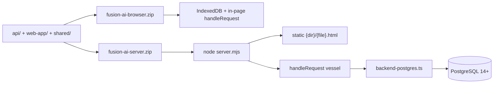
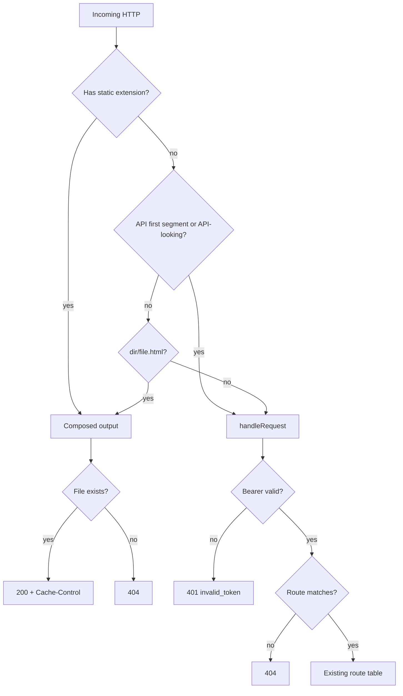
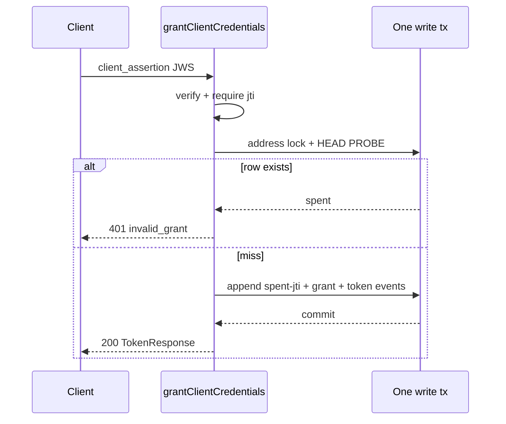

# Postgres Backend — Design (superseding 2026-08-12)

Date: 2026-08-13
Author: Fusion-AI / Grok Build
Status: Draft

Supersedes:
`docs/superpowers/specs/2026-08-12-postgres-backend-design.md`

Does **not** supersede If-Match D1–D12:

- `docs/superpowers/specs/2026-08-05-optimistic-locking-if-match-unification-design.md`
  and its merged amendments

**Does supersede work-order W1** (bind verb and “no join
document” only). W2–W10 remain law (SoT coupling, embed
rules as amended by this file’s embed covenant):

- `docs/superpowers/specs/2026-08-05-work-order-instance-sot-coupling-design.md`
  and its merged amendments

**W1 superseded, because** binding is a fact
`{instance_id, record_type_id}` (immutable foreign ids
under this file’s embed covenant). Absence of the row IS
absence of the bind. Create-only PUT is spent-address
(rebind 409). POST 204 was an event-op wearing a fact’s
name. Claim/release collapse to PUT/DELETE on
`work-orders/:id/claim` is **this spec’s addition**, not a
silent W-override — W1–W10 lock bind, not claim verbs.

**W-number voice.** Work-order SoT stays W1–W10. Items
inherited from the superseded 2026-08-12 Postgres spec are
**Postgres-W14** (column etag), **Postgres-W19**
(`pg_notify` in-tx), and **Postgres-W21** (`schema_marker`
in import). Do not write bare “W14” for the column hash.

Review lineage (absorbed, not appended): raccoon concurrency
critique
(`~/.claude/plans/go-to-church-state-vivid-raccoon.md`) and
grok cross-spec critique
(`~/.claude/plans/go-to-church-state-postgres-backend-critique.md`).
Decisions below are law. Implement from this file.

## Overview

The app is a standalone browser product: `api/` runs in the
page, IndexedDB is the store, and `./build` emits one static
ZIP. Domain state derives from the message plane — two tables
(`requests`, `responses`) holding stored HTTP message pairs.

This spec is the implementation authority for the Postgres
backend and the server tier: BYTEA wire storage, indexes, the
fourth `StorageBackend`, render-at-write for STREAM GETs, the
Node process, the A1–A6 deploy-blocker dispositions, the dual
ZIP, testing, and the yank. Postgres starts empty. There is no
data migration.

Two prior defects in the 2026-08-12 spec are closed here, not
left as options: wire `ETag` / `If-Match` stay the document-pair
**response id** (If-Match D4); the UNIQUE `follows` /
`replaces_response_id` column is dropped (If-Match D5/D6).
Content-hash lives only in column `responses.etag` as the
`/versions/<etag>` path token.

This ship is a **demo server**: live passwords, refresh tokens,
authorization codes, and `client_assertion` JWS sit verbatim in
BYTEA; there is no SSE; revocation lags until access `exp`
(≤ 15 min). Re-gating the snapshot plane does not make it a
production posture.

## Background & Motivation

`ARCHITECTURE.md` § Server-tier deploy blockers names six
remaining seams (A1–A6). Each is inert while the store is the
page-runner's IndexedDB. Each becomes a live exposure the
moment the browser is an untrusted client. Most documented
deferred items land **with** the tier, not after it.

The 2026-08-12 spec chose the right storage argument (BYTEA,
no-extraction, keyed reads, dual-ZIP-then-yank) and then
contradicted two approved locking specs, classified only a
slice of the GET surface, and described the client split as
"the same `ClientFacadeAdapter`." This document keeps the
storage argument and writes the rest as implementable law.

Live facts this document is written against (re-verified
2026-08-13):

- Wire `ETag` is the quoted pair id (`strongEtagOf` /
  `attachEtag` in `api/message-pair.ts`). Instance GET
  advertises it (`api/api.ts`). Locked flow GET still
  advertises `Response-ID` (If-Match S1 has not landed).
- `If-Match` compares to `head.pairId` (`api/api.ts`,
  `api/routes.ts` transition). Column `responses.etag` is
  `bodyEtagOf` (sha256 of body base64 or `''`) and is
  **unrelated** to the wire ETag (`SCHEMA.md`).
- UNIQUE `responses.follows` is the 412 race backstop
  (`api/db.ts` `TABLE_INDEXES`). `UniqueConstraintError` maps
  to 412 in `handleRequest`.
- `ClientFacadeAdapter` is `GuardedDbAdapter &
  LatencySimulation`. Page verbs call `handleRequest`.
  `init.ts` mints an anonymous JWT. `shared.ts` imports
  `api/api.ts` and `access-token.ts`.
- `BOOTSTRAP_ROUTES` is four snapshot routes, bearer-exempt,
  including `DELETE /snapshots/schema`.
- Pair pin: `EXPECTED_PAIR_COUNT = 1498` /
  bootstrap 12 (`tests/mock-data-pairs.test.ts`).

## User decisions

Locked from 2026-08-12 (not reopened):

1. **One comprehensive spec.** Schema, server split, security
   fixes, and build tooling in one document. No data
   migration: Postgres starts empty and seeds via existing
   bootstrap / mock-data pair formation, operator-invoked.
2. **Dual ZIPs until stable, then the yank.** `./build` emits
   a browser ZIP and a server ZIP until Postgres is proven;
   then IndexedDB, localStorage backends, the browser ZIP,
   and the dev-tier postures are deleted. The browser ZIP
   keeps today's posture (IndexedDB, in-page `handleRequest`,
   demo auth). It does not keep pre-break stored bytes or
   `/history` paths — Phase A is a cross-tier covenant break.
3. **postgres.js behind our adapter.** No library vocabulary
   outside the adapter. Tagged-template parameterization
   only. `sql.unsafe` exists only inside the adapter, and
   only for boot-time DDL assembled from compile-time
   constants (zero user input).
4. **Extended seam.** Equality-only `getWhere` gains
   composite, ordered-head, prefix-range, and body-containment
   reads. A verbatim port scales with the whole database; the
   extended seam scales with the slice.
5. **Message storage is the entire canonical wire message** —
   headers included — as BYTEA of `serializeWire` octets.
   JSONB rejected. TEXT rejected (Latin-1 wire in UTF-8 TEXT
   cannot round-trip non-ASCII through `parseWire`).
6. **Single GETs stream stored bytes.** Collection GET stays
   a JSON array of GET-shaped entities, id-lex ASC.
7. **Render-at-write.** Every write, in its own transaction,
   stores exactly the response body today's GET derive would
   serve for each STREAM address it affects. Instances stay
   PROJECT (per-caller ACL). Work-orders stay FOLLOW-ON.
8. **Work-order deep dive is a follow-on session.** This spec
   records the covenant, locks the re-verb, and classifies
   the inbox as not-STREAM. The conversion wave does not
   pretend to convert work-orders.
9. **No-extraction.** The backend stores what its caller
   sends. The one sanctioned extraction is the GIN body
   expression index on **responses**.
10. **`/history` → `/versions`**, plus per-version fetch at
    `GET <family>/:id/versions/<etag>` on every PUTable
    family. Path token is the **column** etag
    (Postgres-W14 content hash), not the live advertised
    `ETag`.
11. **Env names call the thing the thing:** `POSTGRES_URL`,
    `JWT_HMAC_SIGNING_KEY`, `HTTP_SERVER_PORT`.
12. **Password hashing upgrades to scrypt** at the server
    tier (Node platform primitive), PHC self-describing,
    upgrade-on-login.

### Amendments (2026-08-13)

Authoritative over any conflicting 2026-08-12 letter,
including Postgres-W4, Postgres-W14-as-advertised-ETag,
and the `replaces_response_id` UNIQUE.

1. **KD1 — Keep If-Match D4. Retreat Postgres-W14 to
   column + versions.** Live `ETag` / `If-Match` stay the
   head document-pair response id. Column `responses.etag`
   becomes the Postgres-W14 content hash and is used only
   as the `/versions/<etag>` path token. Write responses
   advertise `ETag: "<pairId>"` and `Response-ID:
   <pairId>`. One dialect. Raccoon "etag-resolved
   If-Match" is Option B with a hop and is rejected.
2. **KD2 — Honor If-Match D5/D6. Drop UNIQUE follows /
   replaces.** No `follows` column. No
   `replaces_response_id` column. Race backstop is
   `assertHeadMatchesIfMatch` on the transaction view.
   Predecessor is hoisted `If-Match` on the request when
   present. Advisory locks do not replace D5. 23505 on
   PRIMARY KEY is a loud 500. There is no 23505 → 412 path.
3. **KD3 — A4 is a spent-jti pair family, not a GIN fact.**
   `PUT authentication/assertion-jtis/:jti` (internal
   synthesized pair, not a public route) with body `{ exp }`.
   Create-only: first write stores; replay of the address is
   spent. Absence of the row is "not spent." `jti` is
   required at `verifyClientAssertion` / `claimsFault`. Do
   not write assertion `jti` onto `TokenResponse`. Fail-
   closed: a row that exists is spent until a named janitor
   deletes it (janitor is future work).
4. **KD4 — `*_uri_id` indexes are permanent.**
   `resolveOwningOrganization` and `resolveGlobalOwner` are
   prefix-agnostic `uri_id` lookups on the write-authorizer
   and miss paths. § H retains those miss paths. The indexes
   stay.
5. **KD5 — Complete, correct GET catalog.** Every live GET
   is classified below. Flows are not a trio GET. Members GET
   stamps trio and not `organization_id`. Invitation write
   gate is pending-only (first successful terminal op wins);
   list derive is kind priority. `GET objectives/history` is
   bulk trio history, not FOLLOW-ON. Work-order collection
   stays FOLLOW-ON and is not STREAM.
6. **KD6 — Client graph is not "same
   `ClientFacadeAdapter`."** Verb helpers become a fetch
   facade. `decodeAccessToken` / `principalFromToken` move to
   `shared/` (decode only). Anonymous JWT is dropped;
   `sessionIsAuthenticated` means a token is held. Org
   exchange / refresh / `session-credentials` localStorage is
   a named XSS residual. Two esbuild entries. Metafile test
   forbids `SIGNING_KEY_MATERIAL` and `backend-indexeddb` in
   the server-ZIP client bundle.
7. **KD7 — Origin dispatch is written.** Pages are
   `{dir}/{file}.html`. API is `/{resource}`. Extension split
   plus API-looking-path posture: 401 before 404 for
   unauthenticated callers. No 304 in v1. Hashed-asset
   `Cache-Control` is the one HTTP cache this design ships.
8. **KD8 — Render-at-write: REST vs cache.** A document PUT
   whose response **is** the GET representation is HTTP.
   Operation writes that append a synthesized parent pair are
   a derived cache beside the op ledger. Discipline, not a
   schema property: no op may change a STREAM GET without
   rewriting that GET. Invitations stay ASSEMBLE; they leave
   the op→parent class. `hasUndoHistory` is omitted from the
   stored GET body and computed at read from the chain.
   Collection SQL reads **response** `message_body`. Trio GET
   is lifecycle-current under genesis-wins-under-skew.
   Shape evolution: pre-customer reseed now; a re-render
   primitive is named future work. `getCollectionBody` is
   head-ids-first. HEAD PROBE / versions chain use latest
   **2xx PUT/DELETE**.
9. **KD9 — Snapshots and locks.** `getSnapshot` is
   REPEATABLE READ. `putSnapshot` takes the exclusive import
   lock. Global advisory-lock order is pinned. 40P01 is a
   typed loud 500; the backend does not auto-retry. Dedup-
   bypass is `REPLAY_EXEMPT_ROUTE_PATTERNS`. 52-bit advisory
   keys: collisions only serialize unrelated work.
10. **KD10 — Security residuals at full strength.** A3
    ledger holds live access/refresh tokens, `authorization`
    headers, **passwords**, usernames, authorization codes,
    and full `client_assertion` JWS. A6 is production web
    login (`postPasswordLogin` sends no `code_challenge`).
    Server ZIP rejects authorize without S256, full stop.
    Do not invent `client_assertion` on authorize; it stays
    on the token grant. A5 is "remove the exemption + seed
    below HTTP." 401s do not leak verification internals.
    Body cap 1 MiB → 413. In-process auth limiter: 5
    token/authorize attempts per `socket.remoteAddress` per
    minute → 429. Ignore `X-Forwarded-For`. Do not key on
    identity. This is a demo server.
11. **KD11 — Operability.** One mint process until a mint
    realm exists. `./test-postgres` stays outside
    `./validate`; CI is obligated to run it. scrypt is not
    used for mock seed. A8 emits `pg_notify`, no SSE; the
    staleness residual is written into TEST-PLAN. postgres.js
    in `devDependencies`, bundled into `server.mjs`. DDL
    CHECKs are tighter than JS validators. PostgreSQL floor
    is 14+. Boot asserts `server_encoding = UTF8`. Phase A
    adds a bytes-in digest seam. Drop `requests_body` GIN
    until a named request-body `@>` probe exists. The
    parameterized acceptance suite must be **built** in
    Phase C.
12. **KD12 — Work-order follow-on honesty.** This file
    supersedes work-order W1 (bind verb + “no join
    document”). Binding is create-only PUT. Claim/release
    PUT/DELETE is this spec’s addition. W2–W10 stay law.
    Follow-on **executes** the locked re-verb; it does not
    re-ask the verb. Phase B does not convert the inbox.

## Goals & Non-Goals

**Goals**

- One message-plane schema in Postgres that stores the same
  octets both tiers speak after Phase A.
- A fourth `StorageBackend` behind the existing seam, with
  keyed reads that kill family-scan-for-one-document.
- STREAM GETs that serve stored response bodies current as of
  the write that last changed them, behind parity pins.
- A Node process that serves composed pages and the API on
  one origin, with A1–A6 disposed as named in this file.
- Dual ZIP, then a yank that deletes the browser data tier.

**Non-goals**

- Data migration of any kind.
- SSE `/notifications` (A8 emits only).
- RUM / Server-Timing (A9).
- Cross-party delegation (A7 stays 403).
- `/snapshots/export` and `/snapshots/pristine` (B4/B5).
- Versioned record-type snapshots (B7); work-order abandon
  (B8).
- Overturning If-Match D4/D5/D6.
- Converting work-orders in Phase B.
- A mint realm / multi-process `nowUtc()`.
- Token-at-rest hashing (named future).
- A re-render primitive for stored GET shape evolution
  (named future; pre-customer reseed is the now posture).

## Key Decisions

Each decision is binding. Rationale is the shortest honest
one.

### KD1 — Keep If-Match D4 (Postgres-W14 column-only)

**Law.** Wire `ETag` and `If-Match` carry the head document-
pair **response id** (quoted: `strongEtagOf`). This spec does
not supersede If-Match D4. Column `responses.etag` is the
Postgres-W14 content hash: sha256 hex of that stored
response's `serializeWire` octets with the `ETag` and
`Date` fields omitted. The column is the path token for
`GET <family>/:id/versions/<etag>` (noun-scoped via
`responses_version_etag`). Live advertised `ETag` is not a
versions address (already true for instances).

Write responses advertise both:

```
ETag: "<pairId>"
Response-ID: <pairId>
```

One dialect. Collection GET does not advertise `ETag` in v1
(no 304; see KD7). Simple-class document GET does not gain
an `ETag` just because versions exist (If-Match D7: simple
class stays LWW).

**Why.** Today's If-Match gate compares pair ids
(`api/api.ts`, `api/routes.ts`). Postgres-W14-as-advertised-
ETag 412s every locked write forever. Mixing dialects
(hash on GET, pair id on If-Match) is the same defect.
Raccoon etag-resolved If-Match is Option B with a lookup
hop; it is valid only if D4 is superseded. Phase A is
already the blast radius. Do not add a second platform
cut.

`SCHEMA.md`'s current etag wording ("sha256 of body bytes
(or empty; `bodyEtagOf`)" / "hashes base64 text") dies
with this column-meaning change. SCHEMA.md is updated at
implementation to: column etag = Postgres-W14 content
hash; wire ETag = pair id.

Phase B render-at-write changes stored response bodies, so
every `/versions/<etag>` token minted in Phase A dies at
B. Recovery is reseed until a re-render primitive exists.
Do not promise stable version tokens across B.

Cross-references: If-Match D4; work-order SoT (instance ETag
is the same pair-id validator).

### KD2 — Honor If-Match D5/D6. Drop UNIQUE follows/replaces

**Law.** Do not keep-and-rename `follows` →
`replaces_response_id` UNIQUE. That is the disposition D5
explicitly rejected ("Renaming UNIQUE follows under a new
column name").

- Race backstop = `assertHeadMatchesIfMatch(view, {
  uriPrefix, uriId, expectedPairId })` on the transaction
  view, before `appendMessagePair`. Mismatch → 412, zero
  rows stored.
- Predecessor = hoisted `If-Match` on the request message
  when present (`ifMatchFromPair`). R8 recovery
  (`revisionEtagForInstancePatch`) moves to the message
  plane (If-Match amendments A1).
- No `follows` / `supersedes` / `replaces_response_id`
  column. `headPairIdAt` is deleted (nothing walks
  `Supersedes`; provenance-only).
- `UniqueConstraintError` → 412 in `handleRequest` is
  deleted. 412 comes only from the assert.
- 23505 on PRIMARY KEY → typed error, loud 500 (mint bug).
- Advisory address locks serialize some gates (instance
  create-only, spent-jti, invitation first-terminal,
  claim/binding follow-on). They are not the If-Match
  claim. A trio/simple first-write lock, if taken when
  the pre-tx head is absent, only serializes; the loser
  is LWW 200, not 409 (If-Match D5/D7).

**Why.** The 2026-08-12 spec restored the column the If-Match
spec spent a design cycle removing. Two approved documents
cannot both be law. If-Match landed first and is more
specific. Postgres advisory locks are a serialization aid
for read-check-write gates; they do not prove "I hold the
current head."

If-Match S1 (flows hard-cut to `ETag` / `If-Match`) and S3
(in-tx assert + column drop) land in Phase A. S1 has not
landed in live code (`IF_RESPONSE_ID_HEADER` still exists;
flow GET still sets `Response-ID` only). Phase A includes
that cut.

### KD3 — A4 is a spent-jti pair family

**Law.** Spent assertion `jti` is a pair family, not a JSON
fact on the token response and not a GIN `@>` probe.

- Address: `/authentication/assertion-jtis/:jti/`
  (`uri_id` = the assertion `jti`).
- Stored body: `{ "exp": <assertion exp, unix seconds> }`.
- Writer: the grant that accepted the assertion, as a
  synthesized create-only pair (token-event /
  flow-tag precedent). **Not** a public HTTP route.
- First write stores. Any prior pair at the address is
  spent → grant maps to 401 `invalid_grant` (RFC 7523
  uniqueness; grant-first: mint nothing). Byte-identical
  resend of the **grant** is a different question (replay
  exemption on `authentication/token`); the spent-jti
  address itself is create-only.
- Absence of the row is "not spent."
- `claimsFault` / `verifyClientAssertion` **require**
  `jti`: present, string, non-empty, charset
  `^[A-Za-z0-9_-]+$` (base64url without padding; no `/`,
  so `uri_id` stays a single segment). Omit → assertion
  invalid.
- `verifyClientAssertion` success result includes `jti`
  and `exp` so the grant can form the pair without
  re-parsing.
- Do **not** write assertion `jti` onto `TokenResponse`
  (`{ access_token, refresh_token, token_type, expires_in }`
  in `api/authentication.ts` `mintPair`).
- Fail-closed expiry: if the row exists, the `jti` is
  spent, even when `exp < now`. A named janitor that
  deletes expired spent rows is future work. Do not treat
  an expired row as a miss (that re-opens replay for the
  remainder of `exp` skew / clock fault).
- Concurrency: the grant takes the **address lock** on
  this address, then HEAD-PROBES inside the lock. On
  miss, the spent-jti pair, the grant pair, and the
  token-event pairs **commit in one transaction** under
  that lock. Probe miss + append + mint are one atomic
  unit. If the tx aborts, nothing is spent and nothing
  is minted. On hit (spent), the grant maps to 401
  `invalid_grant` and mints nothing — no append. No
  third lock class. No GIN.

**Why.** Today `jti` is not required and is not returned
(`api/client-assertion.ts` `claimsFault` / result type).
Writing `jti` onto the token response either publishes a
misleading field (stored ≡ served) or splits stored from
served (fights render-at-write). A GIN probe of committed
grant bodies cannot be unique under no-extraction; two
concurrent replays both miss and both mint (raccoon B2).
A spent address is the house pattern (instance genesis,
flow tags).

Grant wire for a spent `jti` is 401, not 409. 409 is the
internal spent-address fact. The grant surface stays
grant-first (one 401 class; mint nothing).

### KD4 — `*_uri_id` indexes are permanent

**Law.** Keep `requests_uri_id` and `responses_uri_id`.

Permanent readers:

1. `resolveOwningOrganization` (`api/derive-states.ts`) —
   prefix-agnostic `responses.getAllWhere('uri_id',
   entityId)` on the ownership / miss path.
2. `resolveGlobalOwner` (`api/derive-states.ts`) — same,
   plus a role-grant body fallback; used by
   `assertWritableInOrganization` (`api/write-authorizer.ts`)
   and `missedReadError`.

§ H retains those miss paths. Head-probe-else-404 is an
existence oracle and is forbidden. Retirement "once the six
by-id sites ride composite reads" is unearnable.

Other live `uri_id` readers (`headPairIdAt`; WO entity-
scoped scans; invitation-by-id; `authorizationCodeSpent`)
either die with `Supersedes`, move to composite / route
probes, or stay FOLLOW-ON. They do not justify dropping
the indexes.

### KD5 — Complete, correct GET catalog

**Law.** The conversion wave is scheduled from the catalog
in § H. A wave that "converts every STREAM family at once"
converts only rows classified STREAM. Unclassified is not
STREAM. Work-orders are FOLLOW-ON. Invitation lists are
ASSEMBLE. `GET objectives/history` is CHAIN (bulk trio
history), not FOLLOW-ON.

Live corrections against the 2026-08-12 table:

- **Flows are not a trio GET.** `FLOWS_WIRING` is
  `lifecycle: 'trio'` so a generic walk would 404 a
  deleted flow, but live GET is hand-written
  (`deriveFlow` / `deriveFlows`). `flowEntityOf` stamps
  `organization_id`, `graph`, and approximate
  `hasUndoHistory`. It does **not** stamp `state` /
  `state_at` / `state_event_id`. (The 2026-08-12 table
  and the grok critique both missed `organization_id`;
  live code stamps it.)
- **Members GET** stamps the lifecycle trio via
  `memberParentOf` and does **not** stamp
  `organization_id` (global parent).
- **Invitation write gate** is pending-only: accept /
  decline / revoke proceed only when
  `currentInvitationState` is `'pending'` (latest `(at,
  id)` of invitation lifecycle events). First successful
  terminal op wins; later ops 409. **Derive**
  (`invitationOpStateFor`) is kind priority: acceptance
  → decline → revocation (`INVITATION_OP_KINDS`). The
  two agree under the gate's mutual exclusivity. There
  is no `GET /invitations/:id` detail route
  (`invitationsRequest` in `api/invitations-domain.ts`).
- **Default-org GET** is ASSEMBLE: SET default, else
  PRIMARY membership organization, else null
  (`identityDefaultOrganization`). Not latest-event-only.

### KD6 — Client graph surgery

**Law.** The server-ZIP client is not a `ClientFacadeAdapter`.
That type **is** the database (`GuardedDbAdapter &
LatencySimulation`). Fetch cannot grow `transaction()` /
`getAllWhere()` without exposing the store over HTTP.

Surgery:

1. Verb helpers (`GET` / `GETWithEtag` / `PUT` /
   `PUTWithEtag` / `PATCH` / `PATCHWithEtag` / `DELETE` /
   `POST`) become a `fetch` facade in
   `web-app/app/adapters/http-facade.ts`. Same
   `RequestContext` vessel. Same HTTP-verb adapter
   naming. No import of `api/api.ts`.
2. `decodeAccessToken` and `principalFromToken` move to
   `shared/` (decode only). The page cannot verify without
   the key. `verifyAccessToken` / `mintAccessToken` /
   `SIGNING_KEY_MATERIAL` stay in `api/access-token.ts`
   and are imported only by the server bundle.
3. **Anonymous JWT is dropped.** `postSessionSeed` and
   `mintSessionToken(ANONYMOUS_ID)` are deleted on the
   server-ZIP entry. `sessionIsAuthenticated` is "a
   session token is held" (`sessionToken !== undefined`).
   **`getSessionToken` becomes optional** (returns
   `string | undefined`) or a sibling
   `readSessionToken(): string | undefined` is added and
   every boot caller uses it. Live `getSessionToken()`
   throws if unset (`init.ts`). Callers that must not
   throw after the drop:
   - `web-app/app/core.ts` (boot exchange; refresh)
   - `web-app/app/adapters/shared.ts`
     (`sessionContext`, `installAndScope`,
     `refreshCredentials`)
   - `web-app/app/channels.ts` (already gates on
     `sessionTokenIsSeeded`; then
     `principalFromToken(getSessionToken())`)
   - `web-app/app/layout.ts` (gates on
     `sessionIsAuthenticated()`)
   - `web-app/auth/index.ts` (`postPasswordLogin` today
     builds a context with the anonymous seed — after
     the drop, login uses a no-token
     `createRequestContext` and does not call
     `getSessionToken`)
   Unauthenticated until password-loop or client-
   credentials. Landing (`requiresAuth: false`,
   `requiresSchema: false`) and auth pages make no API
   calls that need a bearer. App pages redirect to
   `/auth/index.html`. The server refuses to listen
   without `schema_marker` unless a seed flag ran, so
   the landing page does not probe
   `GET /snapshots/schema`.
   **Snapshots page.** Live `page-registry.ts`
   `snapshots` is `requiresAuth: false` and
   `requiresSchema: false`; `adapters/snapshots.ts`
   calls `GET`/`DELETE snapshots/schema`. After A5
   those routes are admin + bearer. Server-ZIP
   registry: `requiresAuth: true`. UI is admin-gated
   (member 403). Named in PRs D2/D3.
4. Org exchange, refresh, and `session-credentials`
   localStorage remain. XSS → refresh token survives A1.
   Named residual. Token-at-rest hashing is future.
5. Two esbuild entries. Metafile test forbids
   `SIGNING_KEY_MATERIAL` and `backend-indexeddb` in the
   server-ZIP client bundle. That gate stays. Tree-
   shaking is not a mechanism.

Browser ZIP keeps today's graph (including anonymous mint)
until the yank.

### KD7 — Origin dispatch

**Law.** One Node process, one origin, `node:http`.

| Path shape | Handler |
|---|---|
| Has a static extension (`.html`, `.js`, `.css`, `.svg`, `.map`, `.ico`, `.woff2`, `.png`, `.txt`) | Static file from the composed output. Unknown file → 404. |
| No extension, first segment is an API segment (below) | `handleRequest`. Unauthenticated → 401 before 404 (the unauthenticated-route-ordering covenant). |
| `{dir}/{file}.html` page path | Static HTML. |
| No extension, not an API segment, not a page | Treat as API-looking → 401 before 404 if unauthenticated; authenticated → 404. |

API first segments (live `route(` + side channels):
`members`, `ai-members`, `human-members`, `identities`,
`identity-pii`, `identity-tokens`,
`identity-token-revocations`, `identity-providers`,
`authentication`, `ideas`, `projects`, `flows`,
`work-orders`, `objectives`, `memberships`,
`current-member`, `organizations`, `invitations`,
`snapshots`. Nested record-types live under
`/organizations/:id/record-types/...` and are reached via
the organizations facade or the registered nested patterns.

Hashed assets (content-addressed bundle names):
`Cache-Control: public, max-age=31536000, immutable`.
HTML: `Cache-Control: no-store`. API:
`Cache-Control: no-store`.

**No 304 in v1.** `If-None-Match` is unnamed today. Pair-id
ETags ship on instance GET and (after S1) locked flow GET.
The server does not evaluate them for conditional GET.
Residual, not a silent gap. A 304 path is future work.

### KD8 — Render-at-write is REST or a named cache

**Law.**

- Document PUT whose stored response body **is** the GET
  representation is HTTP. That is not a cache.
- An operation write that changes a STREAM GET must append
  a synthesized parent pair in the **same transaction** so
  the streamed GET stays current. That synthesized pair is
  a **derived cache** beside the op ledger. "No second
  copy" is true only if no op may change a STREAM GET
  without rewriting that GET. That is a discipline, not a
  schema property. Miss a call site and GET lies until the
  next parent write. Parity pins are the invalidation
  test.
- **Invitations leave the op→parent class.** There is no
  invitation detail GET. Both lists (`GET /invitations`,
  `GET /invitations/sent`) stay ASSEMBLE from grant
  documents + op presence + name/email joins. No
  synthesized parent. Matches "derive from the ledger."
  Avoids list/detail divergence.
- **`hasUndoHistory` is not a STREAM fact.** It is a cheap
  approximation (`api/types.ts`: pair count > 1; known
  false positive after undo-to-genesis). Omit it from the
  stored GET body. Stamp it at read from the 2xx
  PUT/DELETE pair count at that address (`COUNT(*) > 1`).
  Detail and collection both stamp. Callers
  (`web-app/app/adapters/flow-queries.ts`,
  `web-app/flows/detail.ts`, `flow-operations.ts`,
  `flow-export.ts`) keep the field on the wire; it is
  just not frozen into the stored body.
- **Collection SQL reads response `message_body`.**
  Today's derive reads **request** bodies
  (`requestBodyOf` in `api/derive-documents.ts`). After
  conversion that flip is intended. Implementers who port
  `deriveDocumentsAt` into SQL get the wrong column. Say
  this next to `getCollectionBody`.
- **Trio GET is not "copy the PUT body."** It is
  lifecycle-current under genesis-wins-under-skew
  (`ideaEntityOf` + `currentLifecycleEvent`). The
  renderer runs over an in-memory chain = existing 2xx
  PUT/DELETE pairs at the address **plus** the pair being
  written. Pair formation stays pre-tx (IndexedDB auto-
  commit: no crypto inside `transaction()`). Locked
  writes: in-tx `assertHeadMatchesIfMatch` makes the
  pre-tx head the still-current head, so the pre-tx
  render is valid. Simple LWW: last writer wins; a stale
  pre-tx render is the same race LWW already accepts.
- **Shape evolution.** Stored heads serve old shapes;
  collections can mix shapes. Now (pre-customer): reseed
  (Phase-A precedent). A re-render primitive is named
  future work, not built.
- **`getCollectionBody` is head-ids-first** (do not
  evaluate `message_body` per version row). SQL in § G.
- **HEAD PROBE and versions chain fetch** use the live
  predicate: latest **2xx PUT/DELETE** (join `requests`
  for `method`), matching `getCollectionBody` and
  `documentPairsAt`. Spell it. A 4xx or op row is not
  head.
- **Every STREAM row names a mapper and its writers.**
  Collection SQL and single GET serve that mapper's
  output, never today's stored `successBody`. Auth
  grants write STREAM token events via
  `formTokenEventPair` — they are writers of that
  address, not "no STREAM parent." Renderer groups and
  the per-row table live in § H. Phase B splits by
  those groups (PR B3a–B3f).
- **Phase B invalidates version tokens.** Postgres-W14
  hashes the stored wire. Phase A stored bodies are
  still today's `successBody`. Phase B writes GET-
  shaped bodies. Every `/versions/<etag>` token minted
  in A changes at B. Recovery is reseed until a re-
  render primitive exists.

### KD9 — Snapshots and locks

**Law.**

- `getSnapshot`: one transaction at **REPEATABLE READ**.
  postgres.js default is READ COMMITTED (per-statement
  snapshots) → torn export (response without request)
  that then fails the deferred-FK re-import.
- `putSnapshot`: take the exclusive import lock, then
  delete-all + bulk insert both tables + stamp
  `schema_marker`, one transaction (Postgres-W21).
  Concurrent appends cannot interleave.
- **Advisory lock order, global, pinned:**
  1. Import / exclusive snapshot lock, if any.
  2. Dedup lock (key from `message_hash`), if this write
     is hash-deduped.
  3. Address lock (key from `uri_prefix || uri_id`), if
     this write is gated.
  A gated hash-deduped write takes (2) then (3). Never
  the reverse. Never take (3) then (2).
- 40P01 (deadlock) → typed error, loud 500. Retry is the
  caller's. The backend does not auto-retry.
- Dedup-bypass class is `REPLAY_EXEMPT_ROUTE_PATTERNS`
  (`api/message-pair.ts`):
  `identity-tokens/:jti/rotation`,
  `authentication/token`, `authentication/authorize`.
  Not "auth grants" as a vibe.
- 52-bit keys: first `ADVISORY_KEY_HEX_DIGITS = 13` hex
  digits of sha256 (52 bits; fits signed bigint without
  the sign bit). Collisions only serialize unrelated
  work. Do not claim uniqueness. Do not use `hashtext`.

### KD10 — Security residuals at full strength

**Law.** Align A3 with `ARCHITECTURE.md` 382–386. The
verbatim ledger holds:

- live access tokens and refresh tokens (grant response
  bodies, `mintPair`)
- `authorization` headers (hoisted,
  `HOISTED_HEADER_NAMES`)
- **passwords** and usernames (password-loop authorize
  stores the request body)
- authorization codes (authorize response `code`)
- full `client_assertion` JWS (token request body)

Database read access is session theft **and** password
theft. Token-at-rest hashing stays future. A3 RE-GATE is
"snapshots become admin-only + seed below HTTP." It is
not "credentials are safe." Shipping a multi-user server
in this posture is a **demo server**.

A6: soft PKCE is production web login
(`postPasswordLogin` sends no `code_challenge`). There is
no public/confidential field on
`ClientRegistrationEntity` (`grant_types`,
`redirect_uris`, `jwks`, `aud`, `status`). **Server ZIP
rejects authorize without S256, full stop.** Do not
invent `client_assertion` on `/authentication/authorize`.
Today the assertion lives only on
`/authentication/token` (`grantClientCredentials`). No
live authorize caller sends one. If a confidential
authorize path is wanted later, specify the body, verify
steps, and a test — not in this spec.
`client_assertion` stays on the token grant (A4 spent-
jti). The web app always sends S256 PKCE (one client
path; harmless on the browser ZIP, which still accepts
omission until the yank).

A5: `BOOTSTRAP_ROUTES` is four snapshot routes, bearer-
exempt, including unauthenticated wipe
(`DELETE /snapshots/schema`). `ROUTE_POLICY` already has
admin on `/`. Snapshots are absent from `MEMBER_VERBS`.
A5 is "remove the exemption + seed below HTTP," not
"invent an admin realm."

401s: do not leak verification internals on the wire. Log
the reason. Wire classes:

- Bearer / access-token gate → `{ "error":
  "invalid_token" }` (covers missing bearer, bad
  signature, expired, anonymous, malformed).
- Failed `client_assertion` → `{ "error":
  "invalid_client" }` (no concatenated `verdict.reason`).
- Grant credential faults (bad password, spent
  assertion, unknown code) → `{ "error":
  "invalid_grant" }`.

Today `handleRequest` puts `authenticateRequest`'s reason
string on the wire (`bad signature`, `expired`, …) and
`grantClientCredentials` concatenates
`'invalid client_assertion: ' + verdict.reason`. That
dies on the server ZIP. Browser ZIP may keep today's
strings until the yank (composition, not `if (isServer)`
in the gate: each artifact's init passes its 401
renderer).

Access tokens stay valid until `exp` (≤
`ACCESS_TTL_SECONDS` = 900) after revocation. Named
covenant. Part of "database read = session theft."

Body cap: `REQUEST_BODY_MAX_BYTES = 1_048_576` (1 MiB).
Over → 413, no parse. Auth throttle (scrypt is 128 MiB
per hash): in-process token bucket,
`AUTH_ATTEMPT_LIMIT = 5` token/authorize attempts per
**connection address** per
`AUTH_ATTEMPT_WINDOW_MS = 60_000`. Over → 429. The
`node:http` adapter reads `socket.remoteAddress` only.
**Ignore `X-Forwarded-For` and every forwarded header**
until a named proxy covenant exists (a trusted-forward
default is a spoofable bypass). Do not key the bucket
on a parsed identity — authorize may not have one yet,
and a guessed username would be a user-enum oracle.
Single-replica covenant (KD11): in-process is
sufficient. No distributed limiter in this spec.

### KD11 — Operability

**Law.**

- **One mint process** until a mint realm exists.
  `nowUtc()` (`api/types.ts`) is per-process module
  state. Two Node processes mint colliding or backward
  `at` and corrupt latest-wins. `POOL_MAX = 10` in one
  process is fine. A load-balanced pair is not. Ops
  constraint, not a footnote.
- `./test-postgres` stays outside `./validate` (fast
  default gate). **CI is obligated to run it.** Isolation:
  `CREATE SCHEMA` + `search_path` per run.
- scrypt is **not** used for mock seed.
  `seedHumanCredentials` is `Promise.all` over every
  human (`api/mock-data.ts`). Tests already inject
  `testHashPassword` (`tests/mock-seed.ts`). Keep that
  injection. Do not flip `CURRENT_PASSWORD_HASH` for
  mock seed. Operator `--seed-mock-data` hashes
  **serially** with scrypt
  (`SEED_PASSWORD_HASH_CONCURRENCY = 1`) so 128 MiB × N
  does not OOM.
- A8: emit `pg_notify` inside the write transaction
  (Postgres-W19). No SSE. Write the UX residual into
  TEST-PLAN's new server section: two browsers on one
  database look stale until navigation; BroadcastChannel
  is same-origin same-browser only. Do not file that as
  a regression. Do not invent SSE in this spec.
- postgres.js in `devDependencies`, bundled into
  `server.mjs`. README names the exception to "zero
  runtime dependencies."
- DDL CHECKs are tighter than JS validators
  (`uri_prefix` leading `/`; `id` charset
  `^[0-9A-Za-z]{22}$`). Hand-edited snapshots that import
  today die on Postgres. Say that next to the loud-
  reject story. Postgres is right.
- PostgreSQL floor is **14+**. SQL-standard function
  bodies landed in PG14, not 15. No other reason for 15.
- Boot assert `server_encoding = UTF8`. `convert_from`
  targets the database encoding. `message_body()` is
  declared `IMMUTABLE` because it is a pure function of
  its BYTEA argument under that encoding; the boot
  assert is what makes the declaration honest.
- `shared/digest.ts` has no bytes-in entry point
  (`sha256Hex` UTF-8-encodes a JS string). Phase A adds
  `sha256HexOfBytes(octets: Uint8Array): Promise<string>`.
  `message_hash` hashes BYTEA octets through that seam,
  not `TextEncoder` of a Latin-1 string.
- `Octets.toLatin1` / `fromLatin1` are per-char loops
  (`shared/http-message/octets.ts`). `TextEncoder` is
  wrong for 0x80–0xFF (UTF-8). `TextDecoder('latin1')`
  is correct BYTEA → string. Prefer batched
  `String.fromCharCode` or `TextDecoder('latin1')` when
  the wire is the hot path. The wire codec is
  production-unexercised; the `é` pin is load-bearing.
- **Drop `requests_body` GIN** until a named request-
  body `@>` probe exists. Authorize `code` is on the
  **response**. Do not pay two GINs for one reader.
  `responses_body` stays (code, `chain_id`,
  `identity_id`, `organization_id`, `attribute_id`,
  graph node ids).
- Route CHECK `^[a-z0-9:/-]+$` is safe for every live
  `route('…')` (hyphens, no underscores). The near-miss
  is snake_case FAMILY vocab (`record_instances`,
  `ai_members`) leaking into the `route` column, not
  digits. The column stores route patterns
  (`ideas/:id`), never `notFoundTable` names.
- Parameterized acceptance suite: only
  `tests/backend-read-isolation.test.ts` and
  `tests/backend-getwhere-parity.test.ts` are factory-
  parameterized today (memory + localStorage; IndexedDB
  never looped). "Run the pinned suite against Postgres"
  requires **building** the parameterized suite. That is
  Phase C scope, not a pretence it exists.

### KD12 — Work-order follow-on honesty

**Law.** This file **supersedes work-order W1** (bind
verb and “no join document” only). W2–W10 remain law.

- **Bind (W1 superseded).** `work-orders/:id/binding` is
  a create-only PUT document
  `{instance_id, record_type_id}`. Those two ids are
  immutable foreign ids under this file’s embed
  covenant. Absence of the row IS absence of the bind.
  Rebind 409 is spent-address. POST 204 was an event-op
  wearing a fact’s name — rejected here for Uniformity
  with instance genesis and spent-jti.
- **Claim/release (this spec’s addition).** Collapse to
  one sub-resource `work-orders/:id/claim`: PUT = claim,
  DELETE = early release (tombstone), GET = claim facts,
  404 when unclaimed. W1–W10 do not lock claim verbs;
  do not write this as a silent W-override.
- **Transition stays POST** (W3). If-Match on a value-
  bearing transition preconditions the **bound instance**
  head (named RFC deviation in the SoT spec), never a
  document-pair ETag on the work-order address.
- Work-order ops stay in the op→parent class **for the
  follow-on**, not for Phase B. Phase B must not
  synthesize a WO parent.
- Workbox already consumes `instanceId` / `recordTypeId`
  overlay plus inbox fields from `flowGraph`. Binding is
  an N+1 on `GET work-orders`. Two whole-plane WO scans
  still exist (`deriveWorkOrderLifecycle`,
  `deriveWorkOrderHistories`).
- Phase B converts only catalogued STREAM families. The
  inbox collection stays unclassified-as-STREAM until
  the follow-on lands.
- Follow-on **executes** this locked re-verb. It does
  not re-ask bind or claim verbs. It still settles
  expiry mechanics, embed-at-list vs sub-resource
  fetch, and the history shape (charter items 3–5).

## Deferred-work dispositions

A1–A6 map 1:1 onto `ARCHITECTURE.md` § Server-tier deploy
blockers. A7–A12 are this spec's yank-checklist numbers,
not remaining blockers.

### Tier A (A1–A6 — remaining deploy blockers)

| Item | Disposition |
|---|---|
| A1 client-shipped HMAC key | IN. Key → `JWT_HMAC_SIGNING_KEY` env; mint/verify server-side only. Server-ZIP client graph is KD6. Two esbuild entries; metafile test forbids `SIGNING_KEY_MATERIAL` and `backend-indexeddb`. Wire format, HS256, caller signatures unchanged. |
| A2 in-band credential reveal | IN. Deleted on the server ZIP. Operator boot-flag seeding prints credentials to the terminal, once, never HTTP. |
| A3 plaintext credential ledger | RE-GATE, honestly. Snapshot surface admin-only; messages stay verbatim. Residual at full strength (KD10): passwords, usernames, codes, tokens, assertions, `authorization` headers. Database read = session + password theft. Token-at-rest hashing is future. This is a demo server. |
| A4 client_assertion jti replay | IN as KD3. Spent-jti pair family. Require `jti`. Do not GIN-probe grant bodies. Do not write `jti` onto `TokenResponse`. |
| A5 auth-free BOOTSTRAP_ROUTES | IN. Remove the bearer exemption on the server ZIP. `ROUTE_POLICY` already has admin on `/`. Seed below HTTP via operator flags. Browser ZIP keeps the demo exemption until the yank deletes the plane. |
| A6 soft-optional PKCE | IN. Server ZIP rejects authorize without S256, full stop. `client_assertion` stays on the token grant. Web app always sends S256. |

### Adjacent (A7–A12 — yank checklist)

| Item | Disposition |
|---|---|
| A7 delegation ledger | Already mitigated: cross-party token exchange is 403 until a ledger exists. Residual stays 403. |
| A8 LISTEN/NOTIFY | TARGET-STATE in `API-TREE.md` (LISTEN/NOTIFY, **not** SSE). Backend emits `pg_notify` inside the write transaction (Postgres-W19). No listener. UX residual in TEST-PLAN. |
| A9 RUM sink / Server-Timing | Not a deploy blocker. Measurement design § F. Module boundary exists; nothing is built. |
| A10 longitudinal measurement | IN AS OBLIGATION: `./measure --record` at pre-split baseline, server first-light, post-yank. |
| A11 DbAdapter migration seam | REALIZED: `backend-postgres.ts` is the fourth backend. |
| A12 lost binary-stonebraker plan | RESOLVED: this spec is the authority. No `API-TREE.md` re-point. |

### Tier B

| Item | Disposition |
|---|---|
| B1 no migration primitive | Idempotent boot DDL (`CREATE ... IF NOT EXISTS`; `CREATE OR REPLACE FUNCTION`). No migration framework until a third schema change demands one. Reset = drop + reseed. |
| B2 IndexedDB orphan stores | Browser-tier residual; dies with the tier at the yank. |
| B3 PII erasure residuals | Posture unchanged: hard delete ports as one Postgres tx; already-exported snapshot files stay a named residual; export becomes admin-gated. |
| B4 /snapshots/export | Stays future; admin-gated `GET /snapshots/schema` serves export. |
| B5 /snapshots/pristine | Stays deferred; bootstrap covers the minimal seed. |
| B6 single-user acceptances | TEST-PLAN.md gains a server-tier section (zero coverage today). Real multi-user concurrency is tested for the first time, with the A8 staleness residual named so it is not filed as a regression. |
| B7 versioned type snapshots | Domain feature; stays future. |
| B8 work-order W5 no-abandon | Domain gap; untouched. |
| B9 API.md §5 chronology | Docs-only; stays deferred. |

## Design

### A. Architecture

Two build outputs from one source tree.



- **Browser ZIP** — today's posture and features: composed
  pages, `api/` in the page, IndexedDB store, demo-tier
  auth, anonymous JWT seed. Not today's stored bytes or
  `/history` paths after Phase A.
- **Server ZIP** — one Node process serves the composed
  static pages **and** the API on one origin (no CORS
  surface). The same `api/` spine runs against Postgres via
  the fourth `StorageBackend`. The browser bundle inside
  this artifact is the KD6 fetch facade.

The server does not get a new API layer: a thin `node:http`
adapter turns each incoming request into the same vessel
`handleRequest` consumes today. Two load-bearing divorce
points: `node:http` → vessel, and seam → postgres.js.

Endgame (the yank): delete the IndexedDB and localStorage
**storage backends**, the in-page `api/` dispatch
composition, the browser ZIP, `BOOTSTRAP_ROUTES`, and the
demo signing constant. Keep the memory backend (test tier)
and localStorage theme/sidebar (UI state was never the data
tier).

### B. Storage-format covenant

Cross-tier, prerequisite. Both tiers store the same octets
after Phase A.

- The `message` column holds the entire canonical wire
  message (`serializeWire` output: start-line, sorted
  lower-cased fields, derived Content-Length framing, body)
  as BYTEA of those octets. In-app wire form is a Latin-1
  binary string (one JS char per octet;
  `shared/http-message/wire-codec.ts`). Codec:
  - write: Latin-1 wire → one byte per `charCodeAt` →
    BYTEA.
  - read: BYTEA → Latin-1 string (`TextDecoder('latin1')`
    or batched `fromCharCode`) → `parseWire`.
  `parseWire` frames the body by JS string length as byte
  count (`frameBody`). Feeding it UTF-8 TEXT mis-frames on
  the first non-ASCII character. BYTEA avoids that.
- `message_hash` is SHA-256 of the BYTEA octets, via
  `sha256HexOfBytes` (new; `shared/digest.ts`). Do not
  `TextEncoder` the Latin-1 string (that UTF-8-encodes
  bytes 0x80–0xFF). Every hash value changes once.
  `canonicalJson` write-path call sites become
  `serializeWire`; `parseJson` derive call sites that read
  stored messages become `parseWire`. Mock-data pair count
  **1498 holds** while all hash values re-baseline.
- Stored bodies are JSON-only via three code locks — not
  "the media registry is JSON-only" (it admits form and
  text):
  1. `JSON_MEDIA_TYPE` is the only type passed to
     `withBody`.
  2. `putBody` overwrites content-type.
  3. Request bodies are object-typed at the gate
     (`parseObjectBody` in `api/request-auth.ts`).
  Phase A tightens `WriteResponseSpec.successBody` from
  `unknown` to `Record<string, unknown>`
  (`api/routes.ts`). A string return today silently stores
  base64 and would die at the GIN.
- The stored wire is always Content-Length framed (chunked
  is parse-side only). The body region is everything after
  the first CRLFCRLF — a unique boundary (compact JSON
  bodies and header values cannot contain a raw CRLF).
- **Chain fields.** `Supersedes` is deleted system-wide
  (field, wire header, `headPairIdAt`). Provenance-only;
  `deriveDocumentsAt` never walks it. `follows` is deleted
  (KD2). Predecessor lives in hoisted `If-Match` when
  present. `HOISTED_HEADER_NAMES` drops
  `IF_RESPONSE_ID_HEADER` with S1; `IF_MATCH_HEADER`
  stays. From the first production ledger the hoist set is
  append-only (If-Match D10).
- The requests seam row gains two app-sent fields, both
  known at pair formation: `route` (the gate's matched
  route pattern; synthesized, auth, and seed pairs name
  their shapes) and `method`. Validators, snapshot format,
  and the IndexedDB tier take the same shape — one
  covenant break, never a second.
- Phase A invalidates every pre-break IndexedDB origin and
  every previously exported snapshot (house precedent:
  SCHEMA.md timestamp-width pin). Import rejects them
  loudly. Boot detect: schema marker present and rows
  missing `route` → refuse and point at reseed / Settings
  wipe. Hand-edited snapshots that pass today's JS
  validators but fail DDL CHECKs also die on Postgres
  (tighter CHECKs; Postgres is right).

### C. Schema (DDL)

PostgreSQL **14+** (SQL-standard function bodies). All text
columns `COLLATE "C"`: byte order IS the codebase's orders
(id-lex, zulu-lexical `at`), and a C-collated btree serves
`LIKE 'x%'` as a range scan. `at` stays TEXT. Digits 1–3 of
the six-digit fraction are UTC clock milliseconds; digits
4–6 are the same-ms sequence counter, busy-advance on
overflow (`nowUtc`). Do not describe the whole tail as a
counter. `timestamptz` would renormalize `.000000` tails
and destroy the mint. Ids and timestamps are app-minted (no
sequences, no `now()`). Strict-monotonic `at` is per-
process state; one mint process (KD11).

```sql
CREATE TABLE IF NOT EXISTS requests (
    id text COLLATE "C" PRIMARY KEY
        CHECK (id ~ '^[0-9A-Za-z]{22}$'),
    uri_prefix text COLLATE "C" NOT NULL
        CHECK (left(uri_prefix, 1) = '/'
           AND right(uri_prefix, 1) = '/'),
    uri_id text COLLATE "C" NOT NULL,
    at text COLLATE "C" NOT NULL CHECK (at ~
        '^\d{4}-\d{2}-\d{2}T\d{2}:\d{2}:\d{2}\.\d{6}Z$'),
    requester_identity_id text COLLATE "C" NOT NULL,
    message_hash text COLLATE "C" NOT NULL
        CHECK (message_hash ~ '^[0-9a-f]{64}$'),
    message bytea NOT NULL,
    route text COLLATE "C" NOT NULL
        CHECK (route ~ '^[a-z0-9:/-]+$'),
    method text COLLATE "C" NOT NULL
        CHECK (method ~ '^[A-Z]+$')
);

CREATE TABLE IF NOT EXISTS responses (
    id text COLLATE "C" PRIMARY KEY
        CHECK (id ~ '^[0-9A-Za-z]{22}$')
        REFERENCES requests (id)
        DEFERRABLE INITIALLY DEFERRED,
    uri_prefix text COLLATE "C" NOT NULL
        CHECK (left(uri_prefix, 1) = '/'
           AND right(uri_prefix, 1) = '/'),
    uri_id text COLLATE "C" NOT NULL,
    at text COLLATE "C" NOT NULL CHECK (at ~
        '^\d{4}-\d{2}-\d{2}T\d{2}:\d{2}:\d{2}\.\d{6}Z$'),
    status integer NOT NULL
        CHECK (status BETWEEN 100 AND 599),
    etag text COLLATE "C" NOT NULL
        CHECK (etag ~ '^[0-9a-f]{64}$'),
    message_hash text COLLATE "C" NOT NULL
        CHECK (message_hash ~ '^[0-9a-f]{64}$'),
    message bytea NOT NULL
);

CREATE TABLE IF NOT EXISTS schema_marker (
    only boolean PRIMARY KEY CHECK (only)
);

CREATE OR REPLACE FUNCTION message_body(message bytea)
RETURNS jsonb
IMMUTABLE STRICT PARALLEL SAFE LANGUAGE sql
RETURN CASE
    WHEN position(E'\r\n\r\n'::bytea IN message) = 0
        THEN NULL
    WHEN substring(message FROM
         position(E'\r\n\r\n'::bytea IN message) + 4)
         = ''::bytea
        THEN NULL
    ELSE convert_from(
         substring(message FROM
         position(E'\r\n\r\n'::bytea IN message) + 4),
         'UTF8')::jsonb
END;
```

Column notes:

- Every column is app-sent. There is **no** nullable
  predecessor column. Genesis is the absence of a prior
  2xx PUT/DELETE at the address, not a NULL.
- `etag` is the Postgres-W14 content hash (KD1). App-computed at
  pair formation from the response wire with `ETag` and
  `Date` omitted. Retires today's `bodyEtagOf` meaning
  (same covenant break as the hash re-baseline). Live
  advertised `ETag` does not use this column. Collection
  and live-instance ETags (pair id on the wire) do not
  use this column.
- The pair FK (`responses.id REFERENCES requests`) makes
  the response→request half of the 1:1 pair balance
  structural. An orphan request row remains representable;
  the reverse stays test-asserted. DEFERRABLE INITIALLY
  DEFERRED: checked at COMMIT, so the PII hard-delete
  loop's per-row delete order and snapshot import's bulk
  order stay free. Named tier divergence: a torn snapshot
  imports silently on IndexedDB and fails on Postgres —
  Postgres is right.
- CHECKs are new tightenings, not mirrors of the JS
  validators. `id ~ '^[0-9A-Za-z]{22}$'` is mint practice
  (`crypto-safe-base62.ts`). `uri_prefix` JS validators
  require only a trailing `/`; the DDL also requires a
  leading `/`. Both match actual stored values
  (`messageAddress`). Route CHECK admits no underscore.
  Hyphens pass. Not internal defense: the datastore is an
  edge.
- `schema_marker` is a presence bit, matching the
  IndexedDB `__schema__` row `{ id: 'schema' }`
  (`SCHEMA_STORE` / `SCHEMA_MARKER_ID` in
  `api/backend-indexeddb.ts`). No `created_at`.
  `hasSchema()` = row exists. On Postgres the marker
  stamps **inside** the import transaction
  (Postgres-W21). Table existence is not schema
  existence.
- `message_body()` is the one sanctioned extraction
  (§ E). NULL for bodyless messages so the expression
  index never throws on 204s and bodyless tombstones.
  A non-empty body that fails `::jsonb` throws at INSERT
  via the expression index. Any future non-JSON media
  type revisits the remaining GIN first.
- `CREATE OR REPLACE FUNCTION` — Postgres has no
  `CREATE FUNCTION IF NOT EXISTS`. Same signature keeps
  the function identity so the dependent expression
  index survives a second boot (B1).
- No pgcrypto in core DDL. The hash-verify query
  (`digest(message, 'sha256')` vs `message_hash`) is
  documented ops tooling where pgcrypto is available,
  never a CHECK.

### D. Indexes

```sql
CREATE INDEX IF NOT EXISTS requests_address
    ON requests (uri_prefix, uri_id, at, id);
CREATE INDEX IF NOT EXISTS responses_address
    ON responses (uri_prefix, uri_id, at, id);
CREATE INDEX IF NOT EXISTS requests_route
    ON requests (route, uri_prefix);
CREATE INDEX IF NOT EXISTS requests_uri_id
    ON requests (uri_id);
CREATE INDEX IF NOT EXISTS responses_uri_id
    ON responses (uri_id);
CREATE INDEX IF NOT EXISTS requests_replay
    ON requests (message_hash);
CREATE INDEX IF NOT EXISTS responses_version_etag
    ON responses (uri_prefix, uri_id, etag);
CREATE INDEX IF NOT EXISTS responses_body
    ON responses
    USING gin (message_body(message) jsonb_path_ops);
```

No `responses_replaces_key`. No `requests_body` GIN.

Each index maps to catalogued reads:

- `*_address` — family-slice reads (leading-column
  equality); ordered head selection (`ORDER BY at DESC,
  id DESC LIMIT 1`); collection heads (`DISTINCT ON
  (uri_id)`). The `(at, id)` reduction becomes the
  index's job.
- `requests_route` — whole-plane discovery scans and the
  two `deriveStateFieldValueReferrers` `getAll`s become
  `WHERE route = $1`, with per-organization narrowing as
  a `uri_prefix` range inside the route.
- `*_uri_id` — **permanent** (KD4). Seam fidelity for
  `getWhere('uri_id', …)` and the two prefix-agnostic
  ownership readers.
- `requests_replay` — the replay fast-path and the in-tx
  dedup re-check. Non-unique on purpose: replay-exempt
  routes legitimately carry duplicate hashes.
- `responses_version_etag` — noun-scoped
  `GET <family>/:id/versions/<etag>` lookup. Not unique:
  N matches serve latest `(at, id)`.
- `responses_body` GIN — body-fact probes via `@>`
  (authorize-response `code`, `chain_id`, `identity_id`,
  `organization_id`, `attribute_id`, graph node ids).
  `jsonb_path_ops` because every query is containment.
  Named cost: one GIN updates on every response append.

### E. The no-extraction principle

The backend stores what its caller sends. Postgres never
parses column values out of the message. The app knows
every machinery value at pair formation (`route`, `method`,
`etag`, address) and sends it explicitly. An extraction
expression in DDL is a second wire parser, in a second
language, that must stay bit-compatible with
`shared/http-message` forever.

The one sanctioned extraction is the GIN body expression
index on **responses**. `message_body()` encodes exactly
one RFC-level framing fact — the body starts after the
first CRLFCRLF — plus Postgres's own JSON parser. It never
encodes library serialization internals, and it stores
nothing: stored bytes and served bytes are always the
app's own.

A4 does **not** add a second extraction. Spent `jti` is a
pair address (KD3).

### F. The Postgres backend

`api/backend-postgres.ts` — the fourth `StorageBackend`, a
constructor preset over the same `BackedDbAdapter` as the
other three. Node-only. postgres.js lives entirely inside
this backend plus a thin client adapter. No library
vocabulary escapes. `sql.unsafe` only for boot DDL from
compile-time constants.

- **Transactions.** `transaction(tables, mode, fn)` maps
  to a real `BEGIN ... COMMIT`. Default isolation: READ
  COMMITTED. `getSnapshot` opens REPEATABLE READ (KD9).
  A thrown body rolls back. IndexedDB auto-commit does
  not exist here, but the pre-tx crypto discipline is
  **retained**: one write-path shape across tiers, short
  transactions. Statement timeout
  `STATEMENT_TIMEOUT_MS = 30_000` (mirrors
  `IDB_OP_TIMEOUT_MS`).
- **Typed-error mapping** keeps `handleRequest` tier-
  blind. Discriminate by constraint name; never switch
  on SQLSTATE alone:

  | Condition | Typed error | Wire |
  |---|---|---|
  | 23505 on PRIMARY KEY | new typed mint-bug error | loud 500 |
  | 23505 on any other unique (none shipped) | new typed error | loud 500 |
  | 22P02 (bad body at GIN) | new typed covenant error | 500 |
  | 42P01 | `MissingTableError` | recovery |
  | 23503 (torn pair at commit) | new typed error | loud 500 |
  | 23514 (CHECK) | new typed error | loud 500 |
  | 40P01 (deadlock) | new typed deadlock error | loud 500; no auto-retry |
  | timeout / connection loss | typed timeout error | surfaced |

  There is no 23505 → 412 path. 412 is
  `assertHeadMatchesIfMatch` only.

- **Concurrency.** Two `pg_advisory_xact_lock` keys plus
  the import lock, all 52-bit (KD9). Order is law.

  1. Import lock (key from sha256 of the named constant
     `SNAPSHOT_IMPORT_LOCK_NAME = 'fusion.snapshot.import'`):
     first statement of `putSnapshot`.
  2. Dedup lock (key from sha256 of
     `'fusion.dedup.' || message_hash`): first statement
     of a hash-deduped append. Replay-exempt routes skip
     it.
  3. Address lock (key from sha256 of
     `'fusion.address.' || uri_prefix || uri_id`): first
     statement of every gated write; the gate is then
     re-read inside the lock. Gate class:
     - instance create-only PUT (spent-address → 409)
     - spent-jti create-only (spent → grant 401)
     - invitation first-terminal (pending-only; loser
       409 / idempotent no-op on same kind)
     - work-order claim and binding create-only
       (follow-on)
     - trio/simple first write **only when the pre-tx
       head is absent**: the lock serializes; the
       second writer sees a head and is a **LWW 200
       update**, not 409 (If-Match D5/D7). Do not
       invent a spent check on simple/locked genesis.
     Plain appends and replay-exempt grants skip it.
     The 412 CAS path is the in-tx head assert (KD2),
     not this lock.

- **Notifications (Postgres-W19).**
  `backend-postgres.ts` emits
  `pg_notify('fusion_events', payload)` inside the write
  transaction. Postgres delivers on commit and swallows
  on rollback. The injected `DbLifecycle.postNotification`
  sink is not used on this backend; IndexedDB keeps the
  post-commit BroadcastChannel sink. Payload bound:
  `PG_NOTIFY_PAYLOAD_MAX_BYTES = 8000`. If the serialized
  `NotificationEvent` would exceed it, emit
  `{"kind":"full"}` instead of a scoped id list (cap, not
  chunking). A8's emit-only seam; no listener ships.

- **Snapshots.** `getSnapshot` reads both tables in one
  REPEATABLE READ tx, same JSON shape as today.
  `putSnapshot` validates, takes the import lock, then
  one tx: delete-all + bulk insert + stamp
  `schema_marker`. Genuinely atomic — closes the
  localStorage mid-write quota gap and the post-commit
  marker crash window (`api/db-backed.ts` stamps after
  commit today).

Pool constants: `POOL_MAX = 10`,
`POOL_ACQUIRE_TIMEOUT_MS = 5000`.

### G. The extended seam

Two faces. `Tx` is the primitive (`getWhere` and the new
SQL shapes). App code reads through `EntityStore` over
those primitives. Each new read is named on `EntityStore`;
`Tx` gains the matching SQL.

| New read | Face | SQL shape | Serves |
|---|---|---|---|
| `getAllAt(prefix, uriId)` | both | equality on both columns | fetch-then-filter sites |
| `getHeadAt(prefix, uriId)` | both | + live predicate + `ORDER BY at DESC, id DESC LIMIT 1` | HEAD PROBE |
| `getAllByRoute(route[, prefixRange])` | both | route probe + optional range | discovery scans + SFV `getAll`s |
| `getAllWhereBody(containment)` | both | `message_body(message) @> $1` on **responses** | parse-and-filter body facts |
| `getCollectionBody(prefix, filters)` | `EntityStore` | head-ids-first SQL below | STREAM collection GET |
| `existsAt(prefix[, uriId])` | both | `SELECT EXISTS` | presence probes |
| `getByEtag(prefix, uriId, etag)` | both | address + column `etag` | noun-scoped version fetch |

**Live predicate** (HEAD PROBE, versions chain,
`getCollectionBody` heads): latest row per `uri_id` among
responses whose paired request `method` is `PUT` or
`DELETE` and whose `status` is 200..299, ordered by
`(at, id)` DESC. DELETE heads are dropped from live
collections and from HEAD PROBE (a DELETE head is
absence). Spell this at every call site. A 4xx or POST-op
row is not head.

`getCollectionBody` — head ids first, then
`message_body` of those response rows only. Element is
the GET-shaped entity (the stored **response** body),
id-lex ASC. Filters AND into the inner `WHERE`.

```sql
SELECT COALESCE(
    jsonb_agg(body ORDER BY uri_id),
    '[]'::jsonb)
FROM (
    SELECT h.uri_id, message_body(r.message) AS body
    FROM (
        SELECT DISTINCT ON (r.uri_id)
            r.uri_id,
            r.id,
            q.method
        FROM responses r
        JOIN requests q ON q.id = r.id
        WHERE r.uri_prefix = $1
          AND q.method IN ('PUT', 'DELETE')
          AND r.status BETWEEN 200 AND 299
        ORDER BY r.uri_id, r.at DESC, r.id DESC
    ) h
    JOIN responses r ON r.id = h.id
    WHERE h.method <> 'DELETE'
) live;
```

Members roster, `identity-pii`, `GET /organizations`, and
both invitation lists are assembled joins — out of this
function's scope (see § H).

A one-pass SQL collection read is a per-statement
consistent snapshot. Today's adapter covenant warns that
two awaited reads on one ctx are not. The server tier
upgrades that quietly.

During dual-tier these methods get IndexedDB
implementations (JS filtering inside the store — same
semantics, not faster). The seam stays one interface;
derives stay the shared implementation until § H's
conversion retires them per family.

### H. Render-at-write and the GET catalog

The name: the app renders the GET answer at write time.
Not a Postgres materialized view. No view objects exist.

**REST vs cache (KD8).** Document PUT → stored response
body is the GET entity: HTTP. Op → synthesized parent
pair: a derived cache whose validity is the discipline
"every STREAM-affecting write rewrites that GET in the
same transaction."

**Covenant.** The stored response body of a STREAM write
is the servable GET answer for its address, computed as
today's derive would over a chain that includes the pair
being written (genesis-wins-under-skew for trio
families). Streaming a stored write body that is merely
today's `successBody` (the PUT request shape) is not
today's GET — trio families would lose `state` /
`state_at` / `state_event_id` / (where stamped)
`organization_id`; flows would lose `graph`. Parity pins
that "fixed" the stream to match a weaker body would be
Test Weakening.

**Renderer algorithm (one voice):**

1. Pre-tx: fetch the address chain (2xx PUT/DELETE).
2. Build a provisional `DocumentPair` from this write's
   request body, minted `at` / `id`, and method.
3. Run the family's `entityOf` / lifecycle walk over
   (existing pairs + provisional). This **is** the
   reference derive, called with the extra pair.
4. That entity is `successBody`. `formWritePair` hashes
   it (crypto stays pre-tx).
5. In-tx: take locks in KD9 order; `assertHeadMatchesIfMatch`
   when the write claims a predecessor; create-only spent
   check when applicable; `appendMessagePair`.

Undo already synthesizes a document pair
(`postFlowUndoOp`). This generalizes that pattern.

**Embed covenant.** A stored GET body embeds only facts
owned by its own address plus IMMUTABLE foreign ids —
never another address's mutable truth (a member's display
name), never a clock judgment. Today's bodies already
comply (adapters join display names client-side via
`memberName`). Follow-on charter item 4 uses this rule.

**`hasUndoHistory`.** Omitted from the stored body (KD8).
Read path stamps it from `COUNT(*) > 1` of 2xx PUT/DELETE
pairs at the flow address (cheap HEAD/CHAIN; the address
index serves it). Do not freeze the approximation.

**Write-side obligation.** Every write that changes a
STREAM GET leaves that GET's stored body current, same
transaction. Document PUTs run the renderer — they are
not free.

The op→parent class, exact (Phase B + follow-on):

- `work-orders/:id/claim`, `/release`, `/transition`,
  `/binding` — **FOLLOW-ON**. Do not convert in Phase B.
- Invitations `/acceptance`, `/decline`, `/revocation` —
  **removed** (KD8). Lists stay ASSEMBLE.
- Shipped precedent: `flows/:id/undo` already appends the
  op pair plus an updated `flows/:id` document pair in
  one tx. Phase B keeps that and runs the flow renderer
  on the synthesized document pair (`graph` from the
  restore target; no `hasUndoHistory` in the body).
- NOT in the class: instance PATCH (PROJECT);
  invitation ops (ASSEMBLE); spent-jti (own address).
  Auth grants, rotation, and revocation **are** writers
  of STREAM token-event addresses (`formTokenEventPair`).
  Create POSTs that already append op + document pairs
  run the renderer on every STREAM half they append.

**Keyed-read principle.** No family scan may serve a
single-document answer. Surviving read-side derives take
exactly three keyed shapes:

- HEAD PROBE — `(uri_prefix, uri_id)` + live predicate +
  `ORDER BY at DESC, id DESC LIMIT 1`.
- CHAIN FETCH — same filter, the document's full 2xx
  PUT/DELETE history, DESC.
- BODY PROBE — GIN `@>` on a **response** body fact.

Family-shaped fetches remain only where the answer is
family-shaped: STREAM collection GET and bulk CHAIN
(`GET objectives/history`; WO bulk history is FOLLOW-ON).
This kills: single-entity GETs paying full-family scans;
history routes fetching the family then filtering to one
id; flow undo fetching the whole flows family; organization-
enumeration walks (`resolveFlowGraphOwner` over every
organization's `/flows/` prefix; `deriveStateFieldValueReferrers`
`getAll()`). Those become route / GIN / composite probes.
`fenceRequest` does not enumerate organizations.

**Keyed-read miss posture.** Happy path: head probe only.
Miss path: retain `missedReadError` (foreign 403 / absent
404 via `resolveGlobalOwner`). The `uri_id` indexes stay
(KD4). Head-probe-else-404 is forbidden.

**Where reduction lives now.** On the Postgres read path
the JS reductions dissolve into machinery: the head
probe's `ORDER BY ... LIMIT 1` and the collection's
`DISTINCT ON` do what `latestByKey` did; the lifecycle
walk IS the `/versions` chain fetch. JS reduction remains
on the IndexedDB tier during dual-ZIP, inside write-time
rendering, and in the auth-plane security reducers (fail-
closed custom comparators). After the yank, `latestByKey`
on the STREAM read path is dead code.

#### Renderer groups (Phase B schedule)

Collection SQL and single GET serve the named mapper's
output, **not** today's stored `successBody`. That split
is load-bearing for identity-tokens (`identityTokenEntityOf`
is id-last; `formTokenEventPair` / WRITE_RESPONSE_SPECS
store id-first; `tests/drift-identity-tokens.test.ts`
forbids treating those as the same bytes) and for
organizations (`organizationEntityOf` is the same
id-last shape).

**G1 — Trio documents.** Mapper = wiring `entityOf` with
lifecycle-current under genesis-wins-under-skew.

| Address | Mapper | Writers (same tx) |
|---|---|---|
| `ideas/:id` | `ideaEntityOf` | `postIdeaDocumentOp`; conversion `ideaPair` |
| `projects/:id` | `projectEntityOf` | `postProjectDocumentOp`; conversion `projectPair` |
| `objectives/:id` | `objectiveDocumentEntityOf` | `postObjectiveDocumentOp`; `postObjectiveCreationOp` document half |
| `members/:id` | `memberDocumentEntityOf` → `memberParentOf` | `postMemberDocumentOp`; `postAiMemberCreationOp` / `postAiMemberEditOp`; `postHumanMemberCreationOp` / `postHumanMemberEditOp` (member half) |
| record-types `/:id` | `recordTypeEntityOf` | `postRecordDocumentOp`; `formRecordWritePairs` + `postRecordWriteOp` |

**G2 — Flow graph (not a trio GET).** Mapper =
`flowEntityOf` **minus** `hasUndoHistory` (read-time
stamp). Writers: `postFlowDocumentOp`;
`postFlowCreationOp` document half; `postFlowUndoOp`
synthesized document pair.

**G3 — Stateless wiring spread.** Mapper = wiring
`entityOf` (id + body, or id-last validate).

| Address | Mapper | Writers |
|---|---|---|
| `ai-members/:id` | `aiMemberDocumentEntityOf` | `postAiMemberDocumentOp`; create/edit ops (detail half) |
| `human-members/:id` | `humanMemberDocumentEntityOf` | `postHumanMemberDocumentOp`; create/edit ops (detail half) |
| `identities/:id` | `identityDocumentEntityOf` | `postIdentityDocumentOp`; `postIdentityCreationOp`; human create/edit (identity half) |
| `memberships/:id` | `membershipDocumentEntityOf` | `postMembershipDocumentOp`; `acceptInvitation` membership document |
| `organizations/:id` | `organizationEntityOf` | `organizations/:id` PUT (inline). Mapper is id-last; today's successBody is id-first. |

**G4 — Event-append (id-last GET).** Mapper must be the
stored response body after B.

| Address | Mapper | Writers |
|---|---|---|
| `identity-tokens/:id` | `identityTokenEntityOf` | `formTokenEventPair` from `issueTokenPair`, `rotateRefreshJti`, `revokeTokenChain`, and PUT `identity-tokens/:id` |
| `identity-token-revocations/:id` | `tokenRevocationEntityOf` | PUT `identity-token-revocations/:id` |
| `identity-providers/:id` | `identityProviderEntityOf` | `postIdentityProviderDocumentOp` |

**G5 — Facets.**

| Address | Mapper | Writers |
|---|---|---|
| `identities/:id/pii` | `piiEntityOf` | `postIdentityPiiDocumentOp` / `replacePiiSlot` |
| `identities/:id/registration` | `registrationEntityOf` | `postClientRegistrationDocumentOp`; DELETE tombstone |

**G6 — Nested joins / scores / tags / attributes.**

| Address | Mapper | Writers |
|---|---|---|
| `ideas/:id/submissions` | inline in `deriveIdeaSubmissions` (extract as `ideaSubmissionEntityOf`) | `postIdeaSubmissionOp` |
| `projects/:id/flows` | `projectFlowEntityOf` | `postFlowCreationOp` join half; PUT `projects/:id/flows/:pfid` |
| `flows/:id/work-orders` | `flowWorkOrderEntityOf` | `postWorkOrderCreationOp` join; `postFlowWorkOrderDocumentOp` |
| `flows/:id/records` + `/:frid` | `flowRecordEntityOf` | `postFlowRecordDocumentOp` |
| `flows/:id/tags/:name` | `flowTagEntityOf` | `postFlowTagDocumentOp` (PUT and DELETE) |
| `.../attributes` + `/:id` | `nestedAttributeWireOf` | `formRecordWritePairs`; attribute PUT |
| `objectives/:id/revisions` | `objectiveRevisionEntityOf` | `postObjectiveCreationOp` revision half; PUT `.../revisions/:rid` |
| project scores | `scoreEntityOf` | `postBaselineScoreDocumentOp`; `postActualScoreDocumentOp`; conversion `baselinePairs` |

Seed paths (`api/mock-data.ts`) call the same ops — they
inherit the renderer. No second seed mapper.

#### GET catalog (complete)

Every live GET. Side channels included. Classes:

- **STREAM** — stored response body is the GET entity
  (after the family's renderer). Collection = one-pass
  `getCollectionBody` (plus read-time `hasUndoHistory`
  stamp for flows). Phase B wave.
- **PROJECT** — stored full state; per-caller ACL
  projection at read. Permanent for instances.
  Credentials `withoutSecret` is a fixed projection
  (not per-role) — classified PROJECT because the stored
  body is not the wire body.
- **ASSEMBLE** — join / filter / name enrichment at
  read. Not converted.
- **CHAIN** — versions index (today's `/history`
  payload, renamed). Not a single stored body.
- **DUMP** — whole-plane snapshot.
- **FOLLOW-ON** — work-order surface. Not Phase B.

Dashboard / workbox / flow-stats are not API routes.

**Members / roster**

| Pattern | Class | Notes |
|---|---|---|
| `GET members` | ASSEMBLE | `deriveMembers`: membership join. Not a prefix slice. |
| `GET members/:id` | STREAM G1 | `memberParentOf`. No `organization_id`. |
| `GET members/:id/history` | CHAIN | `deriveMemberStates` filter; empty → `EntityNotFoundError` (global). Becomes `/versions`. |
| `GET ai-members` | STREAM G3 | `aiMemberDocumentEntityOf` collection. |
| `GET ai-members/:id` | STREAM G3 | `aiMemberDocumentEntityOf`. |
| `GET human-members` | STREAM G3 | `humanMemberDocumentEntityOf` collection. |
| `GET human-members/:id` | STREAM G3 | `humanMemberDocumentEntityOf`. |
| `GET current-member` | ASSEMBLE | Actor's member parent. |

**Identity spine**

| Pattern | Class | Notes |
|---|---|---|
| `GET identities` | STREAM G3 | `identityDocumentEntityOf` collection. |
| `GET identities/:id` | STREAM G3 | `identityDocumentEntityOf`. |
| `GET identities/:id/pii` | STREAM G5 | `piiEntityOf`; self-only gate. |
| `GET identity-pii` | ASSEMBLE | PII rows fenced by memberships (`deriveIdentityPiiRows`). |
| `GET identities/:id/credentials` | PROJECT | `credentialEntityOf` then `withoutSecret`. Live miss: empty derive → `[]`; foreign owner after a non-empty derive → 403 `ForeignOrganizationError`. Do not convert collection-foreign to `[]`. |
| `GET identities/:id/credentials/:cid` | PROJECT | `withoutSecret`. Live miss: foreign 403 / absent 404. |
| `GET identities/:id/registration` | STREAM G5 | `registrationEntityOf`; kind-gated. |
| `GET identities/:id/default-org` | ASSEMBLE | Side channel. Live reduction (`identityDefaultOrganization` in `api/authentication.ts`): SET default (`currentDefaultOrganizationFor` on the identity's default-org ledger), else PRIMARY membership organization (earliest join `at`, lex id on tie), else null. Same reduction a flat token uses. Do not invent a latest-event-only STREAM. |
| `GET identity-tokens` | STREAM G4 | `identityTokenEntityOf` collection (id-last). |
| `GET identity-tokens/:id` | STREAM G4 | `identityTokenEntityOf`. |
| `GET identity-token-revocations/:id` | STREAM G4 | `tokenRevocationEntityOf`. |
| `GET identity-providers` | STREAM G4 | `identityProviderEntityOf` collection. |
| `GET identity-providers/:id` | STREAM G4 | `identityProviderEntityOf`. |

**Organizations**

| Pattern | Class | Notes |
|---|---|---|
| `GET organizations` | ASSEMBLE | Reachable organizations ∩ memberships. |
| `GET organizations/:id` | STREAM G3 | `organizationEntityOf` (id-last). |

**Ideas / projects**

| Pattern | Class | Notes |
|---|---|---|
| `GET ideas` | STREAM G1 | `ideaEntityOf` collection. |
| `GET ideas/:id` | STREAM G1 | `ideaEntityOf`. |
| `GET ideas/:id/history` | CHAIN | Trio history DESC; empty → `missedReadError('ideas')`. |
| `GET ideas/:id/submissions` | STREAM G6 | `ideaSubmissionEntityOf` (extract from `deriveIdeaSubmissions`). |
| `GET projects` | STREAM G1 | `projectEntityOf` collection. |
| `GET projects/:id` | STREAM G1 | `projectEntityOf`. |
| `GET projects/:id/history` | CHAIN | Trio history; `missedReadError('projects')`. |
| `GET projects/:id/flows` | STREAM G6 | `projectFlowEntityOf`. |
| `GET projects/:id/objective-baseline-scores` | STREAM G6 | `scoreEntityOf`. |
| `GET projects/:id/objective-actual-scores` | STREAM G6 | `scoreEntityOf`. |

**Flows** (not a trio GET)

| Pattern | Class | Notes |
|---|---|---|
| `GET flows` | STREAM G2 | `flowEntityOf` minus `hasUndoHistory`; read-time stamp. |
| `GET flows/:id` | STREAM G2 | Same. Locked GET advertises pair-id `ETag` after S1. |
| `GET flows/:id/history` | CHAIN | Trio **history** exists even though GET does not stamp trio. |
| `GET flows/:id/work-orders` | STREAM G6 | `flowWorkOrderEntityOf`. |
| `GET flows/:id/records` | STREAM G6 | `flowRecordEntityOf`. |
| `GET flows/:id/records/:frid` | STREAM G6 | `flowRecordEntityOf`. |
| `GET flows/:id/tags/:name` | STREAM G6 | `flowTagEntityOf`. Body `{ flow_response_id }`. |

`GET flows/:id/versions` is retired (no route; comments at
the undo / versions block). Phase A lands a 404 pin
**before** the rename, then flips it to the pair-chain
route in the registering commit. Old = a stored version-
row table; new = the pair chain. Succession named at the
pin site. There is no test today that this address is 404.

**Work-orders — FOLLOW-ON (not Phase B)**

| Pattern | Class | Notes |
|---|---|---|
| `GET work-orders` | FOLLOW-ON | Stateless document + per-row `workOrderBindingFor` N+1. Inbox main collection. Unclassified-as-STREAM. |
| `GET work-orders/:id` | FOLLOW-ON | Same overlay. |
| `GET work-orders/history` | FOLLOW-ON | Bulk; `field_values` inline; whole-plane `getAll` today; always 200. |
| `GET work-orders/:id/history` | FOLLOW-ON | Per-id; empty → `missedReadError('work_orders')`. |

**Record-types / attributes / instances**

| Pattern | Class | Notes |
|---|---|---|
| `GET organizations/:id/record-types` | STREAM G1 | `recordTypeEntityOf` collection. |
| `GET organizations/:id/record-types/:record-type-id` | STREAM G1 | `recordTypeEntityOf`. |
| `GET .../record-types/:id/history` | CHAIN | Trio history; `missedReadError('record_types')`. |
| `GET .../attributes` | STREAM G6 | `nestedAttributeWireOf`; parent type 404 first. |
| `GET .../attributes/:attribute-id` | STREAM G6 | `nestedAttributeWireOf`. |
| `GET .../instances` | PROJECT | `projectReadableValues` + list-row `etag` = pair id. |
| `GET .../instances/:instance-id` | PROJECT | Same; live `ETag` = pair id (`attachEtag`). |
| `GET .../instances/:id/history` | PROJECT + CHAIN | `{ at, etag: pairId, values }` DESC; project values. Gains `version` (column etag) as the `/versions/<etag>` token. |

**Objectives**

| Pattern | Class | Notes |
|---|---|---|
| `GET objectives` | STREAM G1 | `objectiveDocumentEntityOf` collection. |
| `GET objectives/:id` | STREAM G1 | `objectiveDocumentEntityOf`. |
| `GET objectives/:id/history` | CHAIN | Trio history; `missedReadError('objectives')`. |
| `GET objectives/history` | CHAIN | Bulk trio `StateEntity[]`, always 200. **Not** FOLLOW-ON. Register before `objectives/:id`. |
| `GET objectives/:id/revisions` | STREAM G6 | `objectiveRevisionEntityOf`. |

**Memberships / invitations / snapshots**

| Pattern | Class | Notes |
|---|---|---|
| `GET memberships` | STREAM G3 | `membershipDocumentEntityOf` collection. |
| `GET memberships/:id` | STREAM G3 | `membershipDocumentEntityOf`. |
| `GET invitations` | ASSEMBLE | Invitee's rows + org name + inviter name. No detail GET. |
| `GET invitations/sent` | ASSEMBLE | Admin pending list + invitee email. |
| `GET snapshots/schema` | DUMP | Whole-plane dump. Admin-gated on the server ZIP (A5). |

**Auth** — `authentication/token` and
`authentication/authorize` are POST-only registrations
(405 on GET). Spent-jti is not a public GET.

**The wave.** STREAM families convert **by renderer
group** (G1 then G2 … G6), each group behind parity
pins: write-side mapper == the current derive over the
same store before that group's derive retires from the
**read** path. Not one PR. Two carve-outs stay out of
the wave:

1. **Instances — PROJECT, permanently.** Per-attribute
   `read_roles` project each caller's view of `values`.
   One stored body cannot serve two differently-roled
   callers. Stored revision bodies stay full state.
2. **Work-orders — FOLLOW-ON.** The wave executes only
   after the follow-on session supplies the work-order
   design. The inbox collection remains not-STREAM.

ASSEMBLE, CHAIN, DUMP are not "STREAM with footnotes."
CHAIN becomes `/versions` in Phase A (path + optional
`version` field) without requiring render-at-write of a
single body.

**Re-verb mandate** (W1 superseded for bind; claim/
release is this spec’s addition; follow-on **executes**,
it does not re-ask — KD12):

- **Bind.** Create-only PUT
  `{instance_id, record_type_id}`. Absence of the row IS
  absence of the bind. Rebind 409. POST 204 retired.
- `claim` + `release` collapse into one document sub-
  resource `work-orders/:id/claim`: PUT = claim, DELETE =
  early release (tombstone), GET = the claim facts, 404
  when unclaimed — the absence of the row IS the absence
  of the claim. This is new relative to W1–W10.
- Claims expire. First DOMAIN time-lapsing state (auth-
  code TTL already compares stored `at` to the clock).
  Stored bodies carry FACTS ONLY — holder and expiry —
  never judgments. "Claimed now" is a read-time
  comparison. PUT contention 409s only against a live
  unexpired head.
- `binding` is create-only PUT (W1 superseded). Rebind
  409. No DELETE (no-unbind).
- `transition` stays POST: a genuine process (graph
  gates, If-Match coupling to the **instance** head, set /
  clear effects), not a fact.
- Invitations stay POST event ops. Write gate is
  pending-only. Lists stay ASSEMBLE. No synthesized
  parent.

### I. Versions unification

`/history` renames to `/versions` across the nine
lifecycle routes and the instance value-history. Path
rename first; payload stays today's shape plus one added
field.

**Added field.** Each versions-index row gains `version`:
the column `etag` (Postgres-W14 content hash) of the
document pair that recorded that event. That is the path
token for
`GET <family>/:id/versions/<version>`. Instance history
keeps `etag` = pair id (If-Match dialect, D4 / D9) and
adds `version` beside it. Do not overload the two.

**Wire ETag (KD1).** Advertised `ETag` is the pair id
where a concurrency validator already exists (instances
now; locked flows after S1). Column `etag` is the content
hash. `Response-ID` stays the locator (`responses.id`).
Integrity of stored octets is `message_hash`. Date is
re-spoken fresh on every serve and is omitted from the
column-hash preimage (a Date in the preimage would churn
the token).

Algorithm is sha256 — the house digest. SHA-3 is rejected
(WebCrypto has none).

Live instance GET hashes nothing for the advertised tag:
it attaches the pair id. The stored column hashes the
FULL-STATE stored wire. Those values differ. A client
cannot take a live instance `ETag` and fetch
`.../versions/<that>` — named, not a bug. The versions
index's `version` field is the token that works.

**Phase B invalidates version tokens.** Phase A stores
today's `successBody` and hashes that wire. Phase B
stores mapper output. Every `/versions/<etag>` minted
in A is a miss after B. Recovery is reseed until a re-
render primitive exists. Do not promise stable tokens
across B.

**Per-version fetch.**
`GET <family>/:id/versions/<etag>` on every PUTable
family — a suffix on that noun, never a global lookup.
Authorization is the standard fence on the noun. Lookup:
among responses at this `uri_prefix` + `uri_id`, the row
whose `etag` column matches. 0 matches → miss table.
1 match → serve the GET-shaped body (STREAM) or project
(instances). N matches → latest `(at, id)`.

Miss table:

- address match + etag hit → serve
- row exists at this etag but foreign organization → 403
- no row / wrong noun → 404 (via `missedReadError` when
  the noun is organization-nested and the id is known
  elsewhere)

Instances: resolve the stored revision, then
`projectReadableValues` — identical to today's value-
history route.

Work-order event histories stay FOLLOW-ON (own shapes).
Invitation lists have no versions index.

**`flows/:id/versions` succession.** Phase A: 404 pin
first (old table-backed address, zero callers, no test
today). Same commit that registers the pair-chain route
flips the pin and names the succession at the pin site.

### J. Server runtime + dispatch

One Node process, one origin, `node:http`. The adapter
feeds the same `handleRequest` vessel. Strict-monotonic
`at` minting is module-level per-process state. This shape
is a covenant: horizontal scale-out is a future decision
(a mint realm), not an accident. `POOL_MAX = 10` in one
process is fine. A load-balanced pair is not.

Boot, fail-fast: validate env → connect pool (fail loud)
→ assert `server_encoding = UTF8` → idempotent DDL → if
no `schema_marker` and no seed flag, refuse to listen →
listen.

| Env | Meaning |
|---|---|
| `POSTGRES_URL` | connection string; required |
| `JWT_HMAC_SIGNING_KEY` | JWT HMAC material; required (A1) |
| `HTTP_SERVER_PORT` | listener port; required |

Secrets enter through the vessel at initialization,
immutable for the process life, never logged, never
defaulted. TLS is the deployment front door's job; the
process speaks HTTP on its port.

- **Operator seeding:** `--seed-bootstrap` /
  `--seed-mock-data` boot flags seed an empty database
  and print credentials to the operator terminal, once
  (A2). They refuse loudly when rows exist — no silent
  wipe path below HTTP. No HTTP seeding path exists on
  this tier. Mock-data password hashing is serial
  scrypt on this path (KD11).
- **Every I/O bounded:** `STATEMENT_TIMEOUT_MS = 30_000`;
  request header/body timeouts; a per-request deadline.
  `REQUEST_BODY_MAX_BYTES = 1_048_576` → 413.
  `POOL_ACQUIRE_TIMEOUT_MS = 5000`.
  `DRAIN_TIMEOUT_MS = 10_000` on SIGTERM.
- **Auth limiter:** `AUTH_ATTEMPT_LIMIT = 5` per
  **connection address** (`socket.remoteAddress` only)
  per `AUTH_ATTEMPT_WINDOW_MS = 60_000` on
  `authentication/token` and `authentication/authorize`.
  429. Ignore `X-Forwarded-For`. In-process. Single
  replica.
- **Snapshots page (server ZIP):**
  `requiresAuth: true`; admin-gated UI. Member 403.
  Unauthenticated 401. Not a sidebar guest page.
- **Structured logs:** one line per request — RFC-3339
  zulu `at`, standard level, request id, method, path,
  status, latency ms. Query strings are stripped
  (authorization-code redirect may carry `?code=`).
  Fault detail to logs; the wire keeps the fixed opaque
  500 body and the fixed 401 classes (KD10). No secret,
  credential, or PII value is ever logged. Do not copy
  `access-token.ts`'s stale "localStorage" sentence into
  new prose.
- **Static serving:** KD7. Hashed-asset `Cache-Control`
  is the one cache this design ships.
- **Failure posture:** impossible states crash loud; the
  supervisor restarts. SIGTERM → stop accepting, drain
  in-flight within `DRAIN_TIMEOUT_MS`, close the pool,
  exit 0.



### K. Security fixes

Tier posture is **composition**, not conditionals: each
artifact's init passes its auth configuration into the
spine. No `if (isServer)` in gate code. The browser ZIP
knowingly keeps its documented dev-tier posture until the
yank.

1. **A1 — signing key leaves the client.**
   `SIGNING_KEY_MATERIAL` is replaced by
   `JWT_HMAC_SIGNING_KEY` from env, injected at init.
   Mint and verify run only server-side. KD6 is the
   client graph. Browser ZIP keeps today's graph until
   the yank.

2. **A2 — in-band credential reveal deleted.** Seeding is
   operator flags; plaintext prints to the terminal once
   and never rides HTTP.

3. **A3 — credential ledger re-gated.** Stored messages
   stay byte-verbatim. Exposure closes via A5's gate.
   Residual at full strength (KD10). Shielded by the
   admin gate and Postgres access control. Token-at-rest
   hashing is named future work. Disposition table "A3
   RE-GATE" does not read stronger than this paragraph.

4. **A4 — jti replay closed (KD3).** Spent-jti pair
   family. Require `jti`. Address lock + create-only.
   Spent-jti pair, grant pair, and token-event pairs
   commit in **one transaction** under the address lock.
   Probe miss + append + mint are one atomic unit. Grant
   maps spent to 401 `invalid_grant` and mints nothing.



5. **A5 — BOOTSTRAP_ROUTES re-gated.** Bearer exemption
   for `snapshots/*` is removed on the server ZIP. Admin
   `ROUTE_POLICY` already covers `/`. Operator flags
   solve the no-identity-exists install problem. Wipe
   and import become admin actions.

6. **A6 — hard PKCE.** Server ZIP rejects authorize
   without S256, full stop. Do not put
   `client_assertion` on authorize. Assertion stays on
   the token grant. Web app always sends S256
   (`code_challenge_method=S256`, `code_verifier` on
   the token hop). Browser ZIP still accepts omission
   until the yank.

7. **Password hashing.** Server tier hashes with scrypt
   via `node:crypto`. Argon2id rejected (npm native
   dependency). Hash strings stay PHC self-describing.
   Add the scrypt verifier entry; flip
   `CURRENT_PASSWORD_HASH` on the **server** hasher
   injection; upgrade-on-login: a successful PBKDF2
   verify appends a rehashed scrypt credential document
   pair. Named constants:

   - `SCRYPT_LOG_N = 17` (N = 2^17)
   - `SCRYPT_R = 8`
   - `SCRYPT_P = 1`
   - `SCRYPT_MAXMEM_BYTES = 167772160` (160 MiB)

   N=2^17, r=8 needs 128·N·r = 128 MiB. Node's
   `crypto.scrypt` default `maxmem` is 32 MiB and
   **throws** without the raise. PHC:
   `$scrypt$ln=17,r=8,p=1$<b64url-salt>$<b64url-digest>`.
   Browser ZIP stays PBKDF2 (WebCrypto has no scrypt)
   until the yank. Hashers are injected at init per
   tier; `shared/password-hash.ts` stays the divorce
   point. Mock seed keeps `testHashPassword`. Operator
   seed hashes serially.

### L. Build tooling — the dual ZIP

Bare `./build` emits two artifacts (clean tree required,
as today):

- `fusion-ai-browser.zip` — today's posture and features
  (not pre-break stored bytes or `/history` paths).
- `fusion-ai-server.zip` — composed pages + a browser
  bundle whose adapters speak `fetch` via
  `adapters/http-facade.ts` + `server.mjs` (http adapter,
  Postgres backend, shared `api/` spine) — self-
  contained.

Two esbuild entries, one codebase. The server-ZIP client
entry does not import `api/api.ts`, `access-token.ts`
(except via `shared/` decode), or `backend-indexeddb`.
A1 is enforced by a metafile test, not by trust in tree-
shaking.

postgres.js enters `devDependencies` and is bundled INTO
`server.mjs`. The shipped artifact resolves zero packages:
deploy = unzip, set three env vars, `node server.mjs`.
README names the exception.

`./serve [port]` stays the browser tier. Running the
server locally is the deploy path; the Postgres test
suite boots it programmatically the same way.

The `generate-schema-svg --check` gate keeps working: the
schema of record stays `api/db.ts` + `api/types.ts`,
which gain the new fields as part of the covenant break.

### M. Testing

Governing split: `./validate` stays fast and dependency-
free — it never requires Postgres. `./test-postgres` owns
everything needing a live database (boots against
`POSTGRES_URL`, operator-supplied). Isolation: a fresh
schema per run (`CREATE SCHEMA` + `search_path`). It is a
deliberate invocation, never a silently-skipped test
inside `./validate`. **CI runs `./test-postgres`.**

In `./validate` (no Postgres):

- The existing suite, re-baselined once for the wire-
  format break (pair count 1498 absolute holds).
- Storage-codec pin: a body containing `é` store / read /
  hash round-trips on the memory backend (octets in,
  Latin-1 `parseWire` out, `message_hash` equals SHA-256
  of those octets via `sha256HexOfBytes`).
- Parity pins: per STREAM family, write-side renderer ==
  the reference derive over the same store (memory
  backend). Pins must not weaken to a weaker body.
- Versions surface: index shape (DESC, today's payload +
  `version`), `GET <family>/:id/versions/<etag>` hit,
  wrong-noun 404, foreign-org 403, instance historical
  `version` projected for a read-restricted caller, and
  the `flows/:id/versions` 404 pin landed then flipped
  with the succession named.
- If-Match: concurrent locked PUTs and instance PATCHes
  → statuses `[200, 412]`, exactly one new head, loser
  stores nothing — **without** a `follows` unique index.
  Locked missing-If-Match 428. R8 message-plane ETag
  recovery.
- Hasher self-description: PHC parse / dispatch, PBKDF2
  verify path, scrypt path with `maxmem`.
- Server-ZIP client metafile: `SIGNING_KEY_MATERIAL` and
  `backend-indexeddb` absent.
- A4: omitted `jti` fails verify; spent address 401s a
  second grant; racing two grants of one assertion → one
  winner; `TokenResponse` has no `jti` key.

In `./test-postgres` (live database):

- Seam conformance: a **new** parameterized acceptance
  factory (Phase C builds it) covering read isolation,
  transaction view, entity validation, snapshot round-
  trip (REPEATABLE READ: no torn export), and message-
  pair semantics, run against real Postgres. The `é`
  codec vector runs here too.
- Typed-error mapping against real SQLSTATEs, including
  23505-on-PK → 500, 40P01 → typed 500, 22P02 → typed
  500. There is no 23505-on-replaces → 412 test (the
  column does not exist).
- Real concurrency: racing identical appends → the dedup
  lock yields one stored pair; two locked writes citing
  one If-Match head → exactly one 412 via the in-tx
  assert; racing instance create-only geneses → exactly
  one 200 and one 409; racing spent-jti grants → one
  winner (one tx, one mint); racing invitation first-
  terminal accepts → one membership pair, loser 409 or
  same-kind no-op; racing trio/simple first writes →
  serialized LWW, **two 200s**, not 409;
  cross-organization writers stay isolated under
  concurrency. Import vs concurrent append: import lock
  wins exclusivity.
- Security compositions: anon → `/snapshots/*` 401,
  member 403, admin 200; authorize without S256
  rejected (no assertion exception); assertion-jti
  replay → 401; boot
  fails loud without `JWT_HMAC_SIGNING_KEY`; PBKDF2
  credential verifies AND the upgrade-on-login pair
  lands scrypt-self-described; body > 1 MiB → 413; sixth
  authorize in one minute → 429; 401 bodies are the
  fixed classes (no `verdict.reason` on the wire).
- Runtime: fail-fast boot, second boot converges
  (`CREATE OR REPLACE FUNCTION`), `server_encoding`
  assert, structured log line shape (no query string),
  fixed 500 body, SIGTERM drain completes then exit 0,
  seed flags refuse on a non-empty database, listen
  refused when `schema_marker` is absent and no seed
  flag.

TEST-PLAN.md gains a server-tier section: browser app
against the real server, auth flows end-to-end, snapshot
gating, and the first genuine multi-user case (two
browsers, two identities, one database) **with the A8
staleness residual named** so a stale second browser
until navigation is not a failed case.

### N. Measurement, rollout, and the yank

**Measurement (A10).** `./measure --record` at three named
milestones: pre-split baseline, server first-light (all
pages via `node server.mjs` against Postgres), post-yank.
The fetch/render phase split is the migration signal; the
harness gains a base-URL mode to measure a running server
origin. Budgets recalibrate after cutover — the network
is in the path, and the per-machine-class gate must say
so.

**Rollout — capability milestones**

| Phase | Lands | Gate |
|---|---|---|
| A | One storage covenant (A-cut) + If-Match S1/S3 + `/versions` | `./validate` green; **one reseed** |
| B | Render-at-write + keyed reads + STREAM groups G1–G6 | per-group pins; not work-orders |
| C | Postgres backend + parameterized suite + `./test-postgres` | seam green on live PG |
| D | Server runtime + A1–A6 + dual-ZIP + 413/429/401 | security tests; first-light `--record` |
| E | Work-order follow-on (separate session) | WO pins; **does not gate yank** |
| F | Yank after **D stability** | post-yank `--record` |

**Phase A is the blast radius.** Wire octets, hashes,
chain columns, `route`/`method`, and snapshot
invalidation are **one storage covenant**. Merge them
as one PR (A-cut) or as a stacked sequence that is
**not** independently mergeable without a reseed — say
so on every stacked PR. One reseed, not five. If-Match
S1 (header dialect + D3 428) can land before the cut
without a store break. `/history` → `/versions` is a
client-path break on top of the cut. The working
browser product takes the break first. Do not mix
ETag dialects: S1 lands before or with any GET that
advertises `ETag`. Phase B is a **second** version-
token break (reseed). Yank waits on D stability, not
on the work-order follow-on: FOLLOW-ON derives already
run on Postgres via `getAll()`.

**The yank checklist:**

- Delete: IndexedDB and localStorage storage backends and
  factories; in-page `api/` dispatch composition; demo
  signing constant; `BOOTSTRAP_ROUTES` and its exemption;
  browser-tier PBKDF2 **hashing** (verify survives for
  self-described stragglers); the browser ZIP.
- Keep, deliberately: the memory backend (test tier);
  localStorage theme/sidebar; scrypt + self-description;
  parity pins still earning retirement; `*_uri_id`
  indexes (KD4, not "retire when earned").
- Docs: closed seams move KNOWN → CLOSED in
  `ARCHITECTURE.md` § Server-tier deploy blockers;
  SCHEMA.md gains the DDL and the new etag wording;
  CLAUDE.md and README follow (README names the
  postgres.js exception). No `API-TREE.md` re-point.

**Residuals that survive, named:** A3's gated verbatim
credentials (passwords, codes, tokens, assertions,
`authorization` headers; token-at-rest hashing is
future); A7 delegation 403; A8 no listener (cross-machine
staleness until navigation); A9 RUM stays future; B3's
already-exported snapshot files; B7; work-order W5
no-abandon;
refresh token in `session-credentials` localStorage (XSS
survives A1); no 304; single mint process; demo-server
posture. B2's orphan stores die with the browser tier.
Content-hash advertised ETag via SHA-3 is rejected and
not residual.

## PR Plan

Two merge classes:

1. **Independently mergeable** — no store break.
2. **A-cut** — one storage covenant. Merge as **one PR**,
   or as stacked PRs that are **not** independently
   mergeable without a reseed. Each stacked PR’s
   description says “reseed; not mergeable alone.”

| PR | Title | Touches | Depends | Class |
|---|---|---|---|---|
| A1 | Bytes-in digest seam | `shared/digest.ts`, digest tests | — | Independent. `sha256HexOfBytes` only. |
| A2 | If-Match S1 + D3 428 | `message-pair.ts`, `api.ts`, `flow-mutations.ts`, `shared.ts`, If-Match tests | — | Independent. Flows advertise pair-id `ETag`; PUT only `If-Match`; delete `IF_RESPONSE_ID_HEADER` / `GETWithResponseId`. **Locked missing-If-Match → 428** (live is 412). Pins: 428 + header sweep. |
| S2 | If-Match D12 S2 Request-ID | `shared.ts` `createRequestContext`, flow save + instance patch loops | — | Independent. Free to interleave. Operation-scoped `X-Request-ID` minted at loop entry, echoed on every hop. Live `shared.ts` mints one id per page context — that is D8/S2 unfinished. This PR lands it. |
| A7 | 404-pin `flows/:id/versions` | history-route tests | — | Independent. Before A8. |
| A9 | Tighten `successBody` | `api/routes.ts` | — | Independent. `Record<string, unknown>`. |
| A-cut | Storage covenant | `db.ts`, `message-form.ts`, `message-pair.ts`, validators, seeds, snapshot gate, SCHEMA.md | A1, A2 | **One reseed.** Drop `follows`/`supersedes`; `assertHeadMatchesIfMatch`; R8 → message plane; delete UNIQUE → 412 and `headPairIdAt`; store `serializeWire`; `message_hash` via `sha256HexOfBytes`; Postgres-W14 column etag; `route`+`method`; loud-reject pre-break snapshots. Pair count 1498. **Not** five mergeable PRs. |
| A8 | `/history` → `/versions` | routes, family-registry, adapters, tests | A-cut, A7 | Client-path break. Add `version` field. Register `GET .../versions/<etag>`. Flip A7 pin. |
| B1 | Extended seam + IDB impls | `api/db.ts`, three backends | A-cut | `getAllAt` / `getHeadAt` / `getAllByRoute` / `getAllWhereBody` / `existsAt` / `getByEtag`. |
| B2 | Render-at-write machinery | pair formation, document PUT, undo | B1, A9 | Mapper algorithm. **Second version-token break** (reseed). |
| B3a | STREAM G1 trio | ideas/projects/objectives/members/record-types | B2 | `ideaEntityOf` et al. + named writers. |
| B3b | STREAM G2 flows | `derive-flows.ts`, undo, create | B2 | `flowEntityOf` minus `hasUndoHistory`. |
| B3c | STREAM G3 stateless | ai/human/identities/memberships/organizations | B2 | Wiring `entityOf`; `organizationEntityOf` id-last. |
| B3d | STREAM G4 events | tokens, revocations, providers | B2 | `identityTokenEntityOf` (id-last) including `formTokenEventPair`. |
| B3e | STREAM G5 facets | pii, registration | B2 | `piiEntityOf`, `registrationEntityOf`. |
| B3f | STREAM G6 nested | submissions, joins, tags, attributes, revisions, scores | B2 | Named G6 mappers. Invitations stay ASSEMBLE. WO untouched. |
| B4 | Keyed-read scans | derive-states, SFV, identity-spine, invitations | B1 | Kill `getAll()` on STREAM/ownership paths. WO scans stay until E. |
| C1 | Parameterized factory | new acceptance factory | — | Build the suite. Independent of A-cut. |
| C2 | `backend-postgres.ts` + DDL | backend, boot DDL | B1, A-cut | No `follows`. No `requests_body` GIN. |
| C3 | `./test-postgres` + CI | script, CI, README | C1, C2 | Schema-per-run. CI obligated. |
| C4 | Locks, isolation, notify | backend, tests | C2 | KD9; REPEATABLE READ; Postgres-W19/W21; 40P01; scoped 409 races. |
| D1 | `node:http` + KD7 | new server adapter | C2 | Dispatch; Cache-Control; no 304; 413; `remoteAddress` limiter. |
| D2 | A1 + KD6 + dual ZIP | access-token, init, shared, http-facade, build, metafile | D1 | Optional `getSessionToken` / `readSessionToken`. Drop anonymous JWT. Snapshots `requiresAuth: true`. Landing implication. |
| D3 | A2 A5 A6 + web PKCE | request-auth, authentication, adapters, seed flags, page-registry | D2 | Authorize without S256 rejected, full stop. Snapshots admin-gated UI. |
| D4 | Spent-jti family | client-assertion, authentication, tests | C2, D3 | Require `jti`; one tx with grant + token events; no `jti` on `TokenResponse`. |
| D5 | scrypt + upgrade-on-login | password-hash, server init, serial seed | D2 | Named constants. Tests keep cheap hasher. |
| D6 | 401 classes + throttle | gate, grants, limiter | D3 | Fixed 401 classes; 5/min per `remoteAddress`; 429. |
| D7 | TEST-PLAN server section | `TEST-PLAN.md` | D1 | Multi-user + A8 staleness residual. |
| D8 | first-light measure | measure harness | D2 | A10 obligation. |
| E1 | Work-order follow-on | WO routes, workbox, pins | B3f, D2, SoT W2–W10 | **Execute** locked re-verb (W1 already superseded here). Expiry, embed, history. Does **not** block F1. |
| F1 | Yank | backends, browser ZIP, BOOTSTRAP_ROUTES, docs | **D stability** | Checklist in § N. post-yank `--record`. FOLLOW-ON may still use `getAll` on Postgres. |

A2 may merge with A-cut’s S3 half if review wants one
bisectable If-Match story (If-Match D12). Digest (A1)
stays out of that cut.

## Follow-on session charter

A separate session, after this spec lands, owns the
work-order surface. Cross-reference
`2026-08-05-work-order-instance-sot-coupling-design.md`
and its amendments.

1. Deep-dive the surface (ten read shapes, two whole-plane
   scans, the collection GET's per-row binding N+1, the
   claim machine, workbox consumption — which fields
   consumers actually need).
2. **Execute** the locked re-verb. Do not re-ask it.
   Bind is create-only PUT (W1 superseded). Claim+release
   is PUT/DELETE/GET on `work-orders/:id/claim` (this
   spec’s addition). Transition stays POST (W3).
3. Settle expiry mechanics: stored `expires_at` per claim
   vs expiry derived from the claim pair's `at` plus a
   named TTL; holder-only transition/release rules.
4. Settle list embed vs sub-resource fetch under the § H
   embed covenant (facts + immutable foreign ids only —
   never a clock judgment). Bind keys are already legal
   embeds. This is a list-shape question, not a verb
   question.
5. Design work-order render-at-write + event-history
   shape; classify `GET work-orders` STREAM or ASSEMBLE
   behind parity pins. Yank does not wait for this.

## Out of scope

- Data migration of any kind — Postgres starts empty.
- The SSE `/notifications` surface (A8 emits only).
- RUM / Server-Timing (A9).
- Cross-party delegation (A7 stays 403).
- `/snapshots/export` and `/snapshots/pristine` (B4/B5).
- Versioned record-type snapshots (B7); work-order
  abandon (work-order W5 / B8).
- A 304 / `If-None-Match` path.
- A mint realm / multi-process `nowUtc()`.
- Token-at-rest hashing.
- A stored-GET re-render primitive.
- A spent-jti janitor.
- Doc edits outside implementation PRs. There is no
  `API-TREE.md` re-point.

## Alternatives Considered

### ETag dialect A (pair id) vs B (content hash)

- **A — keep D4 (chosen).** Advertised `ETag` / `If-Match`
  stay pair id. Column etag is Postgres-W14 for
  `/versions/<etag>`
  only. Fits "`Response-ID` stays the locator." Phase A
  blast radius stays one covenant (storage + chain
  columns), not two platform cuts.
- **B — overturn D4.** Advertised `ETag` and `If-Match`
  become the content hash. Rewrite the If-Match gate,
  instance PATCH, flow lock, and work-order transition
  together. Raccoon etag-resolved If-Match is B with a
  lookup hop.
- **Rejected mix.** Hash on GET, pair id on If-Match.
  412s every locked write.

Chosen A because D4 is approved, live, and shared with
the work-order SoT spec. B is a second cut for no product
gain.

### Keep-and-rename UNIQUE follows vs drop

- **Keep-and-rename** (`replaces_response_id` UNIQUE,
  23505 → 412). 2026-08-12 letter. Cheap race backstop.
  Explicitly rejected by If-Match D5.
- **Drop (chosen).** In-tx head assert. Predecessor =
  hoisted If-Match. One concurrency story platform-wide.
  Advisory locks serialize gates; they do not replace
  the assert.

Chosen drop because two approved specs cannot disagree
on the column, and D5/D6 already paid the design cost.

### A4 GIN-fact + advisory lock vs spent-jti family

- **GIN-fact (2026-08-12 W4).** Write `jti` onto the
  grant response body; probe `@>`. Pollutes
  `TokenResponse` or splits stored from served. No
  unique index under no-extraction. Concurrent replay
  race (raccoon B2). `jti` is optional today, so the
  probe never fires if omitted.
- **GIN-fact + third advisory lock (raccoon).** Closes
  the race. Still the wrong noun (a fact smuggled into
  an OAuth body). Still optional `jti`.
- **Spent-jti pair family (chosen).** Create-only
  address. Require `jti`. Address lock already in the
  gate class. No GIN. No OAuth pollution. Process-first.

### SSE now vs residual

- **SSE in Phase D.** Would make the first multi-user
  TEST-PLAN case look live. New surface, new client, new
  failure modes. Unbidden relative to "Postgres backend
  + server tier."
- **Emit `pg_notify`, no listener (chosen).** Matches
  `API-TREE.md` TARGET-STATE (LISTEN/NOTIFY, not SSE).
  Write the staleness residual into TEST-PLAN so two
  browsers looking stale is not a failed case.

## Open Questions

None. Product-owner calls that were still open between
the two critiques are decided above (KD1–KD12).

## Risks

| Risk | Severity | Mitigation |
|---|---|---|
| Phase A stalls the working browser product | High | One A-cut reseed; pair-count pin; loud snapshot reject. |
| Phase B churns version tokens | Medium | Named. Reseed until a re-render primitive exists. |
| Parity pins weaken to a weaker body | High | Pins compare renderer to the current derive, not to `successBody`. Review rejects any pin that drops trio / `graph`. |
| Missed STREAM writer after conversion | High | Renderer groups name every writer. Pins per group. WO not converted. |
| Two Node processes mint colliding `at` | High | Ops constraint: one replica. Do not load-balance. |
| scrypt × concurrent login / seed OOM | High | Auth limiter 5/min; operator seed serial; tests keep cheap hasher; `maxmem` named. |
| Implementer ports `deriveDocumentsAt` into SQL | Medium | § G and § H name the request-vs-response column flip next to `getCollectionBody`. |
| Hand-edited snapshots die on DDL CHECKs | Low | Named next to loud-reject. Postgres is right. Recovery is reseed. |
| XSS refresh token in localStorage | Medium | Named residual. A1 does not close it. Not silent. |
| Demo-server posture read as production | High | Disposition table and § K.3 say "demo server" at full strength. |
| 40P01 under import + append | Low | Typed 500; no auto-retry; lock order pinned. |
| `flows/:id/versions` flip without 404 pin | Medium | A7 before A8. Succession named at the pin. |

## Observability

- Structured request logs (KD11): `at`, level, request
  id, method, path (query stripped), status, latency ms.
- Fault detail in logs; opaque 500 on the wire; fixed
  401 classes on the wire.
- `page-performance.ts` stays the in-app instrument
  (A9 sink is future).
- `./measure --record` at the three named milestones.
- `pg_notify` payload is the existing
  `NotificationEvent` shape (or `{kind:"full"}` at the
  8000-byte cap). No subscriber in this spec.

## Cross-references

- `ARCHITECTURE.md` § Server-tier deploy blockers — the
  canonical KNOWN-seam list this spec closes or re-gates.
- `SCHEMA.md` — message-plane row shapes; etag wording
  dies with KD1; gains the DDL at implementation.
- `API-TREE.md` — TARGET-STATE `/notifications` is
  LISTEN/NOTIFY, not SSE. This spec does not re-point
  authority onto that file.
- `TEST-PLAN.md` § Protocol — gains the server section
  (B6, A8 residual).
- `docs/superpowers/specs/2026-08-05-optimistic-locking-if-match-unification-design.md`
  and `2026-08-07-if-match-unification-amendments-design.md`
  — D1–D12 remain law. This spec implements them; it
  does not overturn them.
- `docs/superpowers/specs/2026-08-05-work-order-instance-sot-coupling-design.md`
  and `2026-08-07-work-order-instance-sot-coupling-amendments-design.md`
  — W1 (bind verb / no join document) superseded here.
  W2–W10 remain law. Same pair-id ETag on instances.
- `docs/superpowers/specs/2026-07-12-page-performance-measurement-design.md`
  — fetch/render migration signal and the RUM seam.
- `docs/superpowers/specs/2026-07-11-clients-table-elimination-design.md`
  — identity/registration model A6 builds on.
- `docs/superpowers/specs/2026-08-12-postgres-backend-design.md`
  — superseded in full by this file.

## References

- Live code cited above, re-verified 2026-08-13:
  `api/message-pair.ts`, `api/routes.ts`, `api/api.ts`,
  `api/db.ts`, `api/family-registry.ts`,
  `api/request-auth.ts`, `api/authentication.ts`,
  `api/client-assertion.ts`, `api/access-token.ts`,
  `api/authorization.ts`, `api/write-authorizer.ts`,
  `api/derive-documents.ts`, `api/derive-flows.ts`,
  `api/derive-ideas.ts`, `api/derive-states.ts`,
  `api/derive-state-field-values.ts`,
  `api/derive-invitations.ts`, `api/derive-members.ts`,
  `api/derive-identity-tokens.ts`,
  `api/derive-identity-spine.ts`,
  `api/invitations-domain.ts`,
  `api/organization-requests.ts`,
  `api/backend-indexeddb.ts`, `api/db-backed.ts`,
  `api/document-family.ts`, `api/notifications.ts`,
  `shared/digest.ts`, `shared/http-message/wire-codec.ts`,
  `shared/http-message/octets.ts`,
  `shared/password-hash.ts`,
  `web-app/app/adapters/init.ts`, `shared.ts`,
  `authentication.ts`, `session-credentials.ts`,
  `tests/backend-read-isolation.test.ts`,
  `tests/backend-getwhere-parity.test.ts`,
  `tests/mock-seed.ts`.
- RFC 6749 / 6750 / 7523 / 9110 / 6585.
- Church of Code — Reliability, Security, Uniformity,
  Logic, Clarity, Idempotency, Simplicity, Atomicity.
